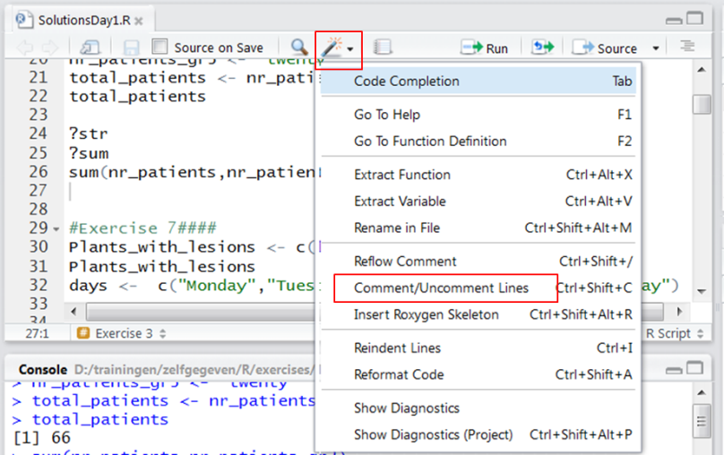
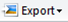
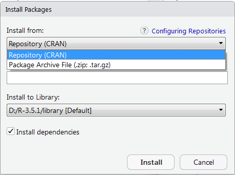

# What is R ?
{:.no_toc}

R is many things: a project, a language... 
As a **project**, R is part of the [GNU free software project](http://www.gnu.org). The development of R is done under the philosophy that software should be free of charge. This is good for the user, although there are some disadvantages: R comes with ABSOLUTELY NO WARRANTY. This statement comes up on the screen every time you start R. There is no company regulating R as a product. The R project is largely an academic endeavor, and most of the contributors are statisticians, hence the sometimes incomprehensible documentation. 
As a **computer language** it was created to allow manipulation of data, statistical analysis and visualization. It is not easy to learn the language if you haven't done any programming before but it is worth taking the time as it can be a very useful tool.  An enormous variety of statistical analyses are available and R allows you to produce graphs exactly as you want them with publication quality. 

### Good things about R
- It's free
- It works on Windows, Mac and Linux
- It can deal with very large datasets (compared to Excel)
- A lot of freedom: graphs can be produced to your own taste
- Supports all statistical analyses: from basic to very complex

### Bad things about R
- It can struggle with extremely large datasets
- Difficult if you don't have any programming experience 
- Open source: many people contribute thus consistency can be low
- Open source: documentation can be poor or written by/for experts
- Can contain  bugs and errors: packages that are widely used are probably correct, niche packages can contain errors, there is no central team assessing the quality of the code

# Installing R
R is available on the [CRAN website](https://cran.r-project.org/) (Comprehensive R Archive Network]. 
It can be installed on Linux, Mac and Windows. On the top of the CRAN page is a section with **Precompiled Binary Distribution**: R versions you can download as an .exe file (for Windows users) and are easy to install. What you download is the basic R installation: it contains the base package and other packages considered essential enough to include in the main installation. Exact content may vary with different versions of R.
As R is constantly being updated and new versions are constantly released, it is recommended to regularly install the newest version of R. 

# Installing RStudio
Although you can work directly in the R editor, most people find it easier to use [RStudio](https://www.rstudio.com/)  on top of R. RStudio is free and available for Windows, Mac and Linux. You need to have R installed to run Rstudio. 

# RStudio user interface
Watch this [video tutorial](https://www.youtube.com/watch?v=5YmcEYTSN7k) on the different components of the RStudio user interface and this [video tutorial](https://www.youtube.com/watch?v=o0Y478jOjGk) on how to use the RStudio user interface.

### The script editor
A script is a text file that contains all the commands you want to run. You can write and run scripts and you can also save them so next time you need to do a similar analysis you can change and re-run the script with minimal effort. An R project can contain multiple scripts. 
The script editor highlights syntax in scripts making it easy to find and prevent errors. It has many features that will help you write scripts e.g. autocompletion, find/replace, commenting. 

### Autocompletion
It supports the automatic completion of code, e.g. if you have an object named relfreq in your workspace, type rel in the script editor and it will show a list of possibilities to complete the name.


### Find and replace
Find and replace can be opened using Ctrl+F.

### Adding comments to scripts
In scripts you must include comments to help you remember or tell collaborators what you did. Comments are lines that start with a # symbol. This symbol tells R to ignore  this line. Comments are displayed in green.
You can comment and uncomment large selections of code using: **Comment/Uncomment Lines**



### Adding section headings to scripts
Add section headings to your scripts using the following format: #Heading Name####


At the bottom of the script editor you can quickly navigate to sections in your script. Especially in long scripts this is very useful.

### Creating a new script
Click **File** in the top menu and select **New File > R Script**.


Besides a simple R script, there are many other file types you can create: 
- [R markdown](http://rmarkdown.rstudio.com/) file: incorporate R-code and its results in a report 
- R Notebook: R Markdown file with chunks of code that can be executed interactively, with output visible beneath the code
- R Sweave file: incorporate R-code and its results in a Latex report

### Opening an existing script
Click **File** in the top menu and select **Open File**.

Scripts are opened as a tab in the script editor. You can open several scripts at the same time in RStudio. 

### Running a script
To run a script you select the code that you want to execute in the script editor and click the **Run** button at the top right of the script editor. 


The code will be executed in the console.

### Saving a script

If there are unsaved changes in a script, the name of the script will be red and followed by an asterisk. To save the script click the **Save** button: 

R scripts should have the extension .R 
Once it is saved the asterisk disappears and the name becomes black.

### The console
The  > symbol in the console shows that R is ready to execute code 
e.g. type 10+3 and press return
```
> 10 + 3
[1] 13
>
```
The result is printed in the console. 

It is recommended to write commands in a script rather than typing them directly into the console. Creating a script makes it easier to reproduce, repeat and describe the analysis. If you select commands in the script editor and press the **Run** button, you will see the commands appearing in the console as they are executed. 

If the > symbol does not reappear upon execution of a command it means that R has crashed or is still calculating. To terminate a command press Esc.

The console also has many [features that make life easier](https://support.rstudio.com/hc/en-us/articles/200404846-Working-in-the-Console) like autocompletion, retrieving previous commands.

### Environment
A list of all variables (numbers, vectors, plots, models...) that have been imported or generated. The variables that R creates and manipulates are called *objects*. 
To remove all variables that have been generated in the RStudio session:
```
> rm(list=ls())
```
ls() lists the objects in the current workspace and rm() removes them.

### History
An overview of the last 500 commands that were run in the console: see [how to use the history](https://support.rstudio.com/hc/en-us/articles/200526217-Command-History).

### Connections
An interface to easily [connect to databases](http://db.rstudio.com/) in R. 

### Files
The list of files and folders in the working directory. RStudio has a default working directory, typically your home folder.

### Changing the working directory
 Often you want to work in the folder that contains the data. In that case you can change the working directory. 
 Check which folder R is using as a working directory:
```
> getwd()
```
Change the working directory:
```
> setwd("D:/trainingen/zelfgegeven/R/")
```

> ###  Comment
>
> You need to use / or \\ in paths. Either will work but \ will not since R sees it as the character that represents a division. 
{: .comment}

Changing your working directory will make relative file references in your code invalid so you type this in the console **at the start of the analysis**.

Alternatively you can change the working directory in the **Files** tab, expand **More** and select **Set As Working Directory**.

> ###  Hands-on: Demo
>
> 1. Download the demo script for this lesson and open it in RStudio
> [`Demo_1.R`](http://data.bits.vib.be/pub/trainingen/RIntro/Demo_1.R)
> 2. From the demo script run the **Set working directory** section
{: .hands_on}

> ###  Hands-on: Exercise 1
>
> Set the working directory to the folder that contains the demo script that you have downloaded and check if it was changed. 
{: .hands_on}

To list the files in the working directory:
```
> list.files() 
```

### Plots
Plots that are generated by the code you run will appear here.
To save a plot click the **Export** button: 

### Packages
R is popular because of the enormous diversity of packages. R is essentially a modular environment and you install and load the modules (packages) you need. Packages are available at the [CRAN](https://cran.r-project.org/web/packages/available_packages_by_name.html) and [Bioconductor](http://www.bioconductor.org/packages/release/BiocViews.html) websites. 
Installing a package means that a copy of the package is downloaded and unzipped on your computer. If you want to know in what directory R stores the packages, type:

```
>.libPaths()
[1] "D:/R-3.6.0/library"
>
```
to see the default path where R stores packages. If you want to change this folder use the *destdir* argument of the install.packages() function:

```
> install.packages("car",destdir="C:/Users/Janick/R")
```
You only need to install a package once, as it is saved on your computer.

### Installing R packages
Watch this [video tutorial](https://www.youtube.com/watch?v=u1r5XTqrCTQ ) on how to install CRAN packages. 
When you have made changes to the right side of the Rstudio user interface (packages, files tab...), R is sometimes slow to show these changes. In that case hit the refresh button: 

Some packages are not available on the CRAN site. Download in compressed format (as a .zip or .tar.gz file) from the source site. To install: select **Install from Package Archive File (.zip; .tar.gz)** in the **Install Packages** window and R will put it in the appropriate directory. 



### Installing Bioconductor packages
Bioconductor is a set of R packages that provides tools for the analysis of high-throughput data, e.g. NGS data.
Make sure you have the BiocManager package installed:
```
> if (!requireNamespace("BiocManager")) 
install.packages("BiocManager") 
```
The if statement is checking if you already have the BiocManager package installed, if not then install.packages() will install it. BiocManager is a package to install and update Bioconductor packages. Once BiocManager is installed, you can install the Bioconductor core packages:
```
> BiocManager::install()
```
To install additional Bioconductor packages e.g. **GenomicFeatures** you type the following command:
```
> BiocManager::install("GenomicFeatures")
```
Overview of all available Bioconductor [packages](https://www.bioconductor.org/packages/release/BiocViews.html#___Software) and [workflows](https://www.bioconductor.org/packages/release/BiocViews.html#___Workflow).

### Installing packages from GitHub
Git is a free and open source version control system. Version control helps software developers manage changes to code by keeping track of every change in a special database. If a mistake is made, the developer can turn back the clock and compare earlier versions of the code to fix the mistake. 
There is an install_github() function in the devtools packageto install R packages hosted on GitHub:
```
> install.packages("devtools") 
> library(devtools)
> devtools::install_github("statOmics/MSqRob&copy;MSqRob0.7.6")
```

### Loading packages
 Each time you want to use a package you have to load it (activate its functions). Loading a package is done by selecting it in the list of installed packages or by typing the following command:
```
> library("name_of_package")
```
If R responds:
```
Error in library(car) : there is no package called 'car'
```
or similar, it means that the car package needs to be installed first.

> ###  Hands-on: Demo
>
> Run commands of the **Installation** section of the demo script
{: .hands_on}

### Help
You can find a lot of documentation online: e.g. the [getting help section](https://www.r-project.org/help.html) of the R website. R documentation is not easily accessible nor well-structured  so it can be a challenge to consult the help files of R packages online. By far the most user-friendly interface for searching the R documentation is the [Rdocumentation website](https://www.rdocumentation.org/).
Additional useful links:
- [Documentation of RStudio](https://support.rstudio.com/hc/en-us/categories/200035113-Documentation) 
- [Quick R by DataCamp](https://www.statmethods.net/about/sitemap.html): loads of basic and advanced tutorials
- [R-bloggers](https://www.r-bloggers.com/): R-news and tutorials contributed by bloggers
- [Rseek](https://rseek.org/): Google specifically for R.
- [Google's R style guide](https://google.github.io/styleguide/Rguide.xml): Programming rules for R designed in collaboration with the entire R user community at Google to make R code easier to read, share, and verify.

Access the R documentation in RStudio using commands: help() or ?

> ###  Hands-on: Demo
>
> From the demo script run the **Get help** section
{: .hands_on}

### Viewer
Views HTML files that are located on your computer.

[All RStudio keyboard shortcuts](https://support.rstudio.com/hc/en-us/articles/200711853-Keyboard-Shortcuts)

# Expressions in R
R can handle any kind of data: numerical, character, logical... 

### Character data
Character data like "green", "cytoplasm" must be typed in between **single or double quotes**:
```
> x <- "Hello"
```
To use quotes in the text escape the quotes:
```
> x <- "say \"Hello\""
```
Names of packages, files, paths on your computer, urls are all text data and need to be typed in between quotes. Names of variables do not. 

### Booleans
Boolean values are **TRUE** and **FALSE** without quotes because they are Booleans not text. 

> ###  Comment
>
> R is case sensitive: true and false are not recognized as Booleans. They have to be written in capitals.
{: .comment}

### Missing values
Missing values are represented by **NA** (Not Available) without quotes. 
Impossible values (e.g., dividing by zero) are represented by the symbol NaN (Not A Number).

### Arithmetic operators


Arithmetic operators follow the standard **order of priority**, with exponentiation the highest and addition and subtraction the lowest priority, but you can control the order with **parentheses**. Do not use brackets as these are for other purposes in R. 

### Logical operators
Logical operators can be used to selectively execute code based on certain conditions. They allow to create logical expressions (comparisons) that return TRUE or FALSE. 


Logical expressions may be combined using logical operators. The NOT operator (!) can be used to assess whether something is NOT the case. 

```
> x = 1
> y = 2   
> z = x > y      		is x larger than y? 
> z              			FALSE 
> u = TRUE
> v = FALSE 
> u & v          			u AND v: FALSE 
> u | v          			u OR v: TRUE 
> !u             			NOT u: FALSE
```
> ###  Hands-on: Exercise 2a
>
>    > ###  Question 
>    > What's the difference between x=2 and x==2 ? 
>    >
>    > > ###  Solution
>    > >  The = operator attributes a value to a variable (see next section), x becomes 2. 
>    > >  The == is a logical operator, testing whether the logical expression x equals 2 is TRUE or FALSE.
>    > {: .solution }
>    {: .question }
>
{: .hands_on }

> ###  Hands-on: Exercise 2b
>
> Check if the words UseR and user are equal. 
{: .hands_on}

> ###  R is case sensitive
>
> As exercise 2b showed R is indeed case sensitive.
{: .comment}

# Assigning variables
A variable allows you to save a value or an object (a plot, a table, a list of values) in R. 
A value or object is assigned to a variable by the assignment operator **<-**
It consists of the two characters < (less than) and - (minus): 
```
> v <- 4	now the value of variable v is 4
````
In most contexts the = operator can be used as an alternative:
```
> v <- 4 
> v = 4 
give the same result: a variable called v with value 4
```
After R has performed the assignment you will not see any output, as the value 4 has been saved to variable v. You can access and use this variable at any time and print its value in the console by running its name:
```
> v
[1] 4
```
You can now use v in expressions instead of 4
```
> v * v
[1] 16
```
You can re-assign a new value to a variable at any time: 
```
> v <- "a cool variable"
> v
[1] "a cool variable"
```

R is not very fussy as far as syntax goes. Variable names can be anything, though they cannot begin with a number or symbol. Informative names often involve using more than one word. Providing there are **no spaces** between these words you can join them using dots, underscores and capital letters though the Google R style guide recommends that names are joined with a dot. 

### Using operators to create variables
You can combine variables into a new one using operators (like + or /).

### Using functions to create variables
A function is a piece of code that performs a specific task. 
Functions are called by another line of code that sends a request to the function to do something or return a variable. The call may pass *arguments* (inputs) to the function. In other words a function allows you to combine variables (arguments) into a new variable (returned variable).
There are lots of built in functions in R and you can also write your own. Even the base package supplies a large number of pre-written functions to use. Other packages are filled with additional functions for related tasks.
Calling a function in R has a certain syntax:
**output <- function(list of arguments)** 
For example: 
```
> p <-  ggplot(mtcars,(aes(wt,mpg))
```
In this example **ggplot()** is the **function**. The brackets () are always needed. Before a function can start the actions and calculations  it encodes, it needs prior information: **input** data and parameter settings. These are called the **arguments** of the function. In this example the arguments are:
- **mtcars**: a table containing the input data
- **aes(wt,mpg)**: defines the two columns of the table you want to plot: weight (wt) along the X-axis and miles/gallon (mpg) along the Y-axis.

To see the arguments of a function you can use **?** or **help()**:
```
> ? ggplot 
> help(ggplot)
```
This opens the documentation of the function in the **Help** tab including an overview of the arguments of the function. At the bottom of the documentation page you find examples on how to use the function.
The function generates a plot so the plot **p** is the **output** of the function.  

> ###  Hands-on: Demo
>
> From the demo script run the **Assigning variables** section
{: .hands_on}


> ###  Hands-on: Exercise 3a
>
> 1. Create a variable called patients with value 42
> 2. Print the value of patients divided by 2
> 3. Create a variable called patients_gr2 with value 24
> 4. Print the total number of patients
>    > ###  Solution
>    >
>    >  > ```
>    >  > patients <- 42
>    >  > patients/2
>    >  > patients_gr2 <- 24
>    >  > total_patients <- patients + patients_gr2
>    >  > total_patients
>    >  >```
>    {: .solution}
>    > ###  Question
>    >
>    >  What will happen when you run this code ?
>    > ```
>    >  "patients" <- 42
>    >  "patients"/2
>    >  ```
>    {: .question}
{: .hands_on}

> ###  Hands-on: Exercise 3b
>
> Check the arguments of the mean() function. 
>    > ###  Solution
>    >
>    >  ```
>    >  ?mean
>    >  ```
>    {: .solution}
{: .hands_on}

The mean() function has many arguments and each argument has a default value. To use the default values simply do not specify these arguments in the function call. You only have to specify the arguments for which you want to use a value other than the default.
To show the **examples** section instead of the full documentation page:
```
> example(min) 
```

> ###  Hands-on: Exercise 3c
>
> Calculate and print the sum of patients and patients_gr2 using the sum() function.
>    > ###  solution: answer
>    >
>    >  ```
>    >  sum(patients,patients_gr2)
>    >  ```
>    {: .solution}
>    > ###  Question
>    >
>    >  Replace the sum() function with the mean() function. What happens ?
>    >    > ###  solution: answer
>    >    >  Look at the help of the sum() function. What's the first argument ? 
>    >    >  Compare with the first argument of the mean() function
>    >   {: .solution}
>    {: .question}
>    > ###  Question
>    >
>    >  Will the code below work ?
>    >  ```
>    >  sum (patients,patients_gr2)
>    >  ```
>    {: .question}
>    > ###  Question
>    >
>    >  Will the code below work ?
>    >  ```
>    >  sum ( patients , patients_gr2 )
>    >  ```
>    {: .question}
{: .hands_on}

Sometimes functions from different packages have the same name. In that case use **package::function** to specify the package you want to use, e.g. ggplot2::ggplot() where ggplot2 is the name of the package and ggplot() is the name of the function.

> ###  Hands-on: Extra exercise 3d
>
> Create a variable patients_gr3 with value "twenty" and print the total number of patients
>    > ###  Solution
>    >
>    >  ```
>    >  patients_gr3 <- "twenty"
>    >  patients + patients_gr3
>    >  ```
>    {: .solution}
{: .hands_on}

> ###  Hands-on: Extra exercise 3e
>
> 1. Create variable x with value 5
> 2. Create variable y with value 2
> 3. Create variable z as the sum of x and y and print the value of z
> 4. Print x - y
> 5. Print the product of x and y and add 2 to it
>    > ###  Solution
>    >
>    >  ```
>    >  x <- 5
>    >  y <- 2
>    >  z <- x+y
>    >  z
>    >  x-y
>    >  x*y+2
>    >  ```
>    {: .solution}
{: .hands_on}

> ###  Hands-on: Extra exercise 3f
>
> What is the difference between 
> correctLogic <- TRUE  
> incorrectLogic <- "TRUE"
{: .hands_on}

> ###  Hands-on: Extra exercise 3g
>
> Is there a difference between 
> name <- "Janick" 
> name <- 'Janick'
> name <- Janick
{: .hands_on}
