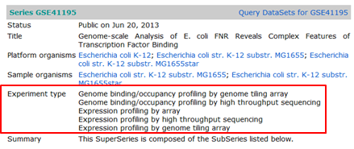
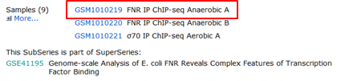

## Downloading a data set for the ChIP-Seq training

### Download the data from GEO

For the ChIP-Seq training, we are going to use the data set that is described in the article of Myers et al., 2013 [6]. The data consists of reads from ChIP enriched genomic DNA fragments that interact with FNR, a well-studied global transcription regulator of anaerobiosis. As a control, reads from fragmented genomic DNA were used.

NGS datasets are (usually) made freely accessible, by depositing them into specialized databases. Sequence Read Archive (SRA) located in USA and hosted by NCBI, and its European equivalent European Nucleotide Archive (ENA) located in England hosted by EBI both contains raw, unprocessed reads.

Processed reads from functional genomics datasets (transcriptomics, genome-wide binding such as ChIPSeq,...) are deposited in Gene Expression Omnibus (GEO) or its European equivalent ArrayExpress. 
The article contains the following sentence at the end of the Materials and Methods section:
"All genome-wide data from this publication have been deposited in NCBI’s Gene Expression Omnibus (GSE41195)."
In this case GSE41195 is the identifier that allows you to retrieve the dataset from the NCBI GEO (Gene Expression Omnibus) database.

GEO hosts processed data files from experiments related to gene expression studies, based on NGS or microarrays. The files of NGS experiments can include alignments, peaks and/or counts.

Go to the [GEO page](http://www.ncbi.nlm.nih.gov/geo/)

> ###  Download the data of the experiment with GEO ID GSE41195 
>
> - Type the ID in the search box on the GEO home page
> - Click Search
>   
> - This redirects you to the GEO record of the full experiment consisting of microarrays, tiling arrays and a ChIP-Seq experiment.
>  
> - In the Experiment type section you can see that this GEO record indeed reports a mixture of expression analysis and ChIP-Seq experiments.
Scroll to the bottom of the page:
     
> 4. You can see that the ChIP-Seq data have their own GEO ID: GSE41187
> 5. Click the ChIP-Seq data ID: GSE41187.
This brings us on the GEO record of the ChIP-Seq experiment.
In the GEO record scroll down to the Samples section:
>   
> For time's sake, we will focus in the training on a single sample: FNR IP ChIP-seq Anaerobic A
> 6. Click the GEO ID GSM1010219 of the sample that we will use in the training
> This brings us to the GEO record of the sample.
> 7. Scroll to the bottom of GEO record of the sample to the Relations section:
>  
>  GEO only contains processed data, no raw data. The raw data is stored in the SRA database. In the Relations section you can find the SRA identifier of this data set. For the training we would like to have a fastq file containing the raw data.
> 8. Copy the SRA identifier
{: .hands_on }

### Download the data from ENA at EBI

Although direct access to the SRA database at the NCBI is doable, SRA does not store sequences in a FASTQ format. So, in practice, it's simpler (and quicker!!) to download datasets from the ENA database (European Nucleotide Archive) hosted by EBI (European Bioinformatics Institute) in UK. ENA encompasses the data from SRA.

SRA identifiers are also recognized by ENA so we can download the file from EBI.

Go to the ENA website at [EBI](http://www.ebi.ac.uk/)

> ###  Download the data with SRA ID SRX189773
> 
> - Type the ID in the search box on the EBI home page
> - Click the **search icon**
    This returns two results: a link to the record of the experiment and a link to the record of the run:
>
>   
> - Click the first result (red)
>   
>   The table at the bottom of the page contains a column called Fastq files (ftp)
> - Click the link in this column to download the data in fastq format
{: .hands_on }

For the training you do not have to download the data, it's already on the GenePattern server.

To download the replicate and the control data set, we should redo the same steps starting from the GEO web page of the ChIP-Seq experiment (click the sample ID of the FNR IP ChIP-seq Anaerobic B and the anaerobic INPUT DNA sample). The fastq file of the control sample is also available on the GenePattern server.
