## Quality control of the data of the ChIP-Seq training

Use FASTQC inside GenePattern to get basic information on the data (read length, number of reads, global quality of the datasets).

Read the GenePattern tutorial for more details on how to use GenePattern.
The data is already present on the GenePattern server. When you open a tool in GenePattern, you will find the **Add Paths or URLs button** in the **input files** section: 

Click the button and expand BITS trainingdata Chipseq: 

The fastq file of the control data set is also available in the shared data folder (SRR576938.2.fastq)

> ###  Generate and view the FASTQC report of SRR576933.2.fastq in GenePattern 
>
> - Search for **FASTQC** in the **Modules** section and open the parameter form.
> - Use the fastq file from the Shared Data folder as input file.
> - Leave the other parameters at their default values.
> - Run FASTQC
> FASTQC will generate a zip file and a html file. You can open the HTML report in your browser: 
> - Click the name of the output file at the bottom of the page.
> - Select **Open Link**
>   
{: .hands_on }

The only parameter you might want to change in if you work on your own data is the contaminants file. It contains a long list of known adapter sequences (see the Documentation in GenePattern). If for some reason the adapters you used are not in the list, you have to provide them as a fasta file. 

###  How many reads does the file contain?  

  
Check the answer.

This is one of the results of the Basic statistics module in FASTQC (red): 

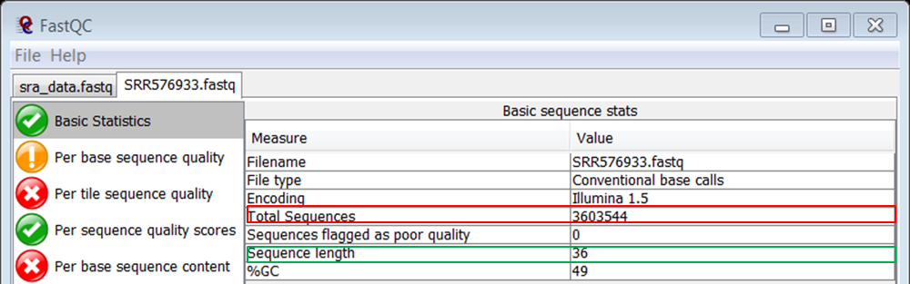

Knowing that it is recommended for ChIPSeq to have around 30 million reads, the number of reads in this fastq file seems very low. 

{: .question }

###  Should we be concerned about the low number of reads in the sample?  

  
Check the answer.

No it's not a problem because the sample comes from E. coli. This bacterium has a very small genome so 3 million reads will still generate high coverage. However, if this was a human or mouse sample the number of reads would be way too low and we would indeed be concerned. 

{: .question }

###  What is the length of the reads?  

  
Check the answer.

This is one of the results of the Basic statistics module in FASTQC (green): 

Again, you see that the data set consists of very short reads although this data set is very recent. This is because it has been shown that elongating the reads does not improve your results in ChIP-Seq analysis. It will just cost you more money.

{: .question }

###  Are there any positions with low sequence quality?  

  
Check the answer.

This is shown in the Per base sequence quality module in FASTQC:

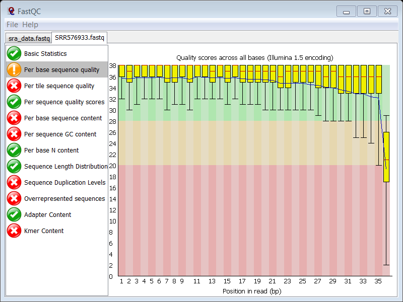

The overall sequence quality is good, although it drops sharply at the last position, but this is normal in Illumina data, so this feature is not raising hard concerns.

{: .question }

###  What could be the cause of the failure in the per base sequence content plot?  

  
Check the answer.

The content of the 4 nucleotides is far from constant over all positions: 

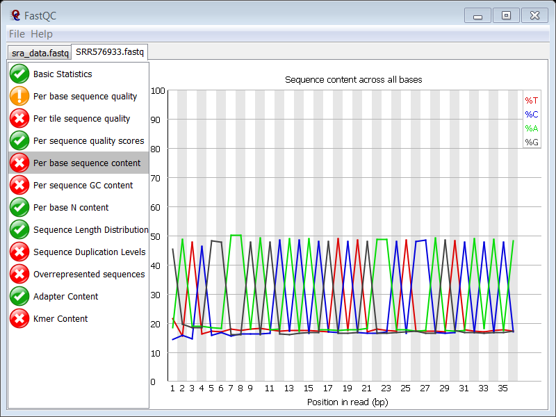

This typically point the presence of adapter or other contaminating sequences in your reads. 

{: .question }

###  Which FASTQC module allows you to confirm this suspicion?  

  
Check the answer.

The **Overrepresented sequences** module will show if your read file is enriched in known contaminants.

{: .question }

###  What does this module tell you?  

  
Check the answer.

The **Overrepresented sequences** module shows a high percentage of adapter sequencess (29% !).

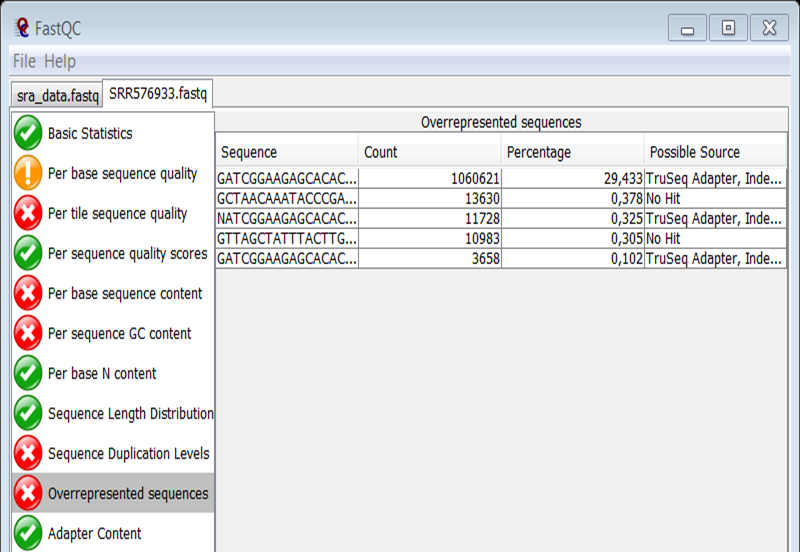

Again you see that adapter contamination is a frequently occurring problem of Illumina NGS data.

{: .question }

###  What about sequence duplication levels?  

  
Check the answer.

There is sequence duplication. Adapter contamination will be partly responsible for the high duplication levels (the blue peaks at the far right of the plot) but the main cause lies in the technique itself. Typically, after ChIP, you end up with a very small initial amount of DNA (antibodies are not that effective, many cleanup steps in the protocol,...) and you have to do PCR to get your library up to a proper size for sequencing. So naturally, you expect many clones of the same DNA fragment due to the small initial size of the library. 

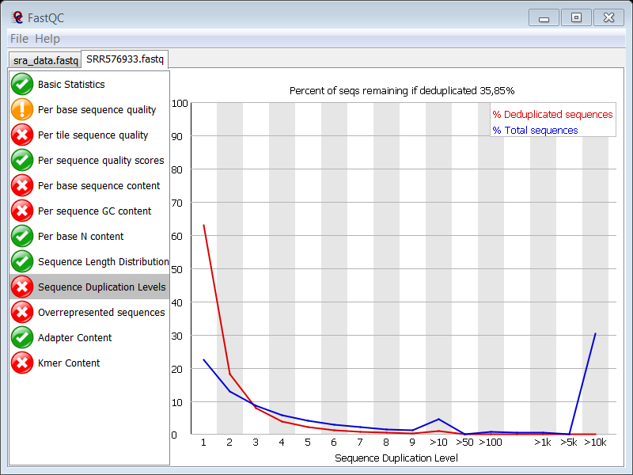

{: .question }

Now do the same for the control data set: **SRR576938.2.fastq**.

In theory one expects that regions with high read count in the ChIP sample represent the regions that were enriched by the immunoprecipitation, i.e. the regions that were bound to the protein. However many studies have shown that the read count is affected by many factors, including GC content, mappability, chromatin structure, copy number variations... To account for these biases, a control sample is used consisting of fragmented genomic DNA that was not subjected to immunoprecipitation or that was precipitated using a non-specific antibody.

###  How many reads does the control data set contain?  

  
Check the answer.

This is one of the results of the **Basic statistics** module in FASTQC. You see that the control data set contains the double amount of reads as the ChIP data set.

The ChIP and control samples are usually sequenced at different depths, generating files with different total number of reads. This means that these two samples have to be made comparable later on in the analysis by normalization (see ChIP-Seq training).

{: .question }

###  What is the length of the reads in the control data set?  

  
Check the answer.

This is one of the results of the **Basic statistics** module in FASTQC. You see that the control data set contains reads of 36 bases just like the ChIP data set.

{: .question }

###  Are there any positions with low sequence quality?  

  
Check the answer.

This is shown in the Per base sequence quality module in FASTQC: 

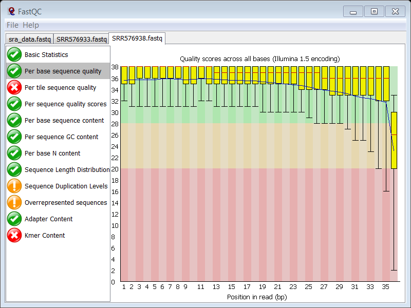

The overall sequence quality is good, although it drops sharply at the last position, but this is normal in Illumina data, so this feature is not raising hard concerns.

{: .question }

###  Why did the per base sequence quality plot raise a failure in the ChIP sample and not in the control?  

  
Check the answer.

In the slides you can see that the thresholds for a warning are: 

- end of box < 10
- median < 25

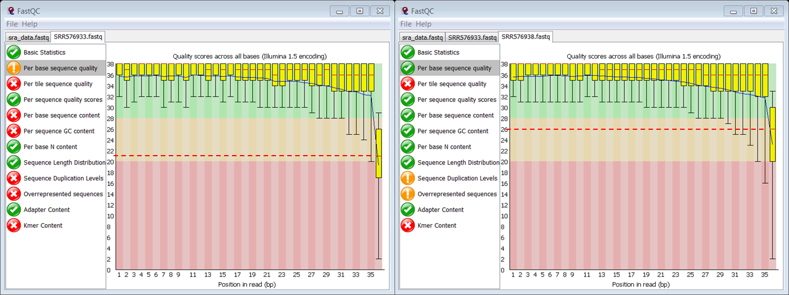

On the figure you see that the culprit is the median:

- In the ChIP sample the median Phred score of the last position is 21 (so below 25) raising a failure
- In the control sample the median Phred score of the last position is 26 (so above 25)

{: .question }

###  Which FASTQC module gives a failure?  

  
Check the answer.

The **Per tile sequence quality** module. The quality of one of the tiles is consistently different from the rest of the tiles

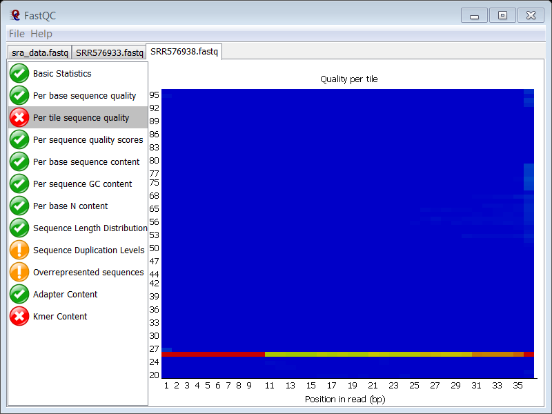

{: .question }

###  Is this also the case in the ChIP sample?  

  
Check the answer.

Yes, you see exactly the same problem in the ChIP sample. Since both samples were probably loaded on the same lane, it seems normal that you see the same problem in the ChIP sample.

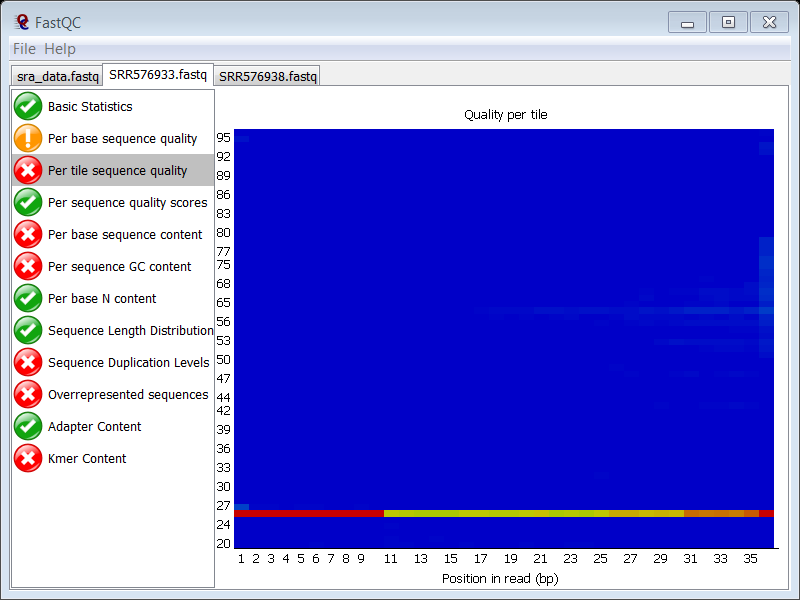

{: .question }

###  Why does the Sequence duplication levels modules give a failure in the control sample?  

  
Check the answer.

The duplication levels in the control data set are high. 

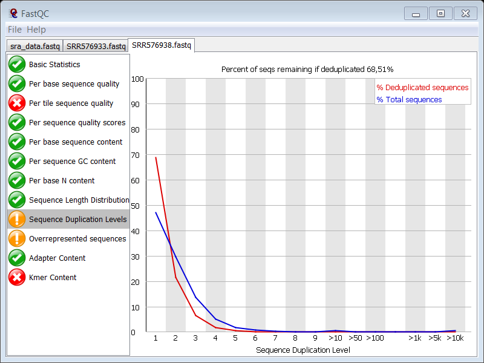

There are a high number of sequences with low duplication levels which could be due to high coverage. Remember that you are working with E. coli which has a small genome.

{: .question }

### Estimation of coverage

Knowing your organism size is important to evaluate if your data set has sufficient coverage to continue your analyses, e.g. for the human genome (3 Gb), 10 million reads are considered sufficient.

###  What is the size of the genome of the E. coli K-12 strain substr. MG1655??  

  
Check the answer.

- Go to the [NCBI website](http://www.ncbi.nlm.nih.gov/)
- Select the **Genome** database to search in
- Type **Escherichia coli** in the search term box
- Click **Search**

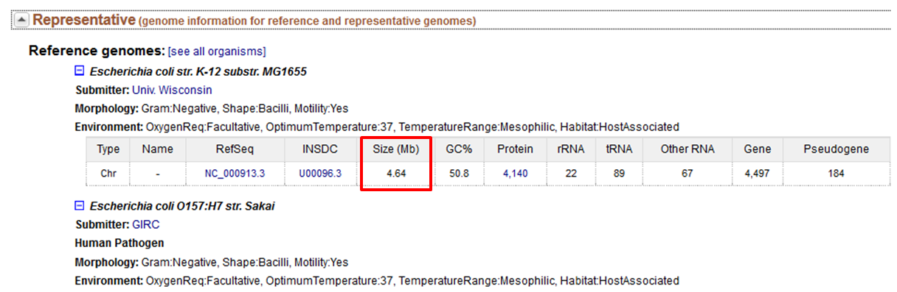

The genome is 4.64 Mbase. 

{: .question }

The FASTQC report has shown that the fastq files of the ChIP and control sample contain 3.6 and 6.7 million reads respectively. As you aim for 10 million reads for 3 Gb in human, we can assume that these data sets contain enough reads for proper analysis. 