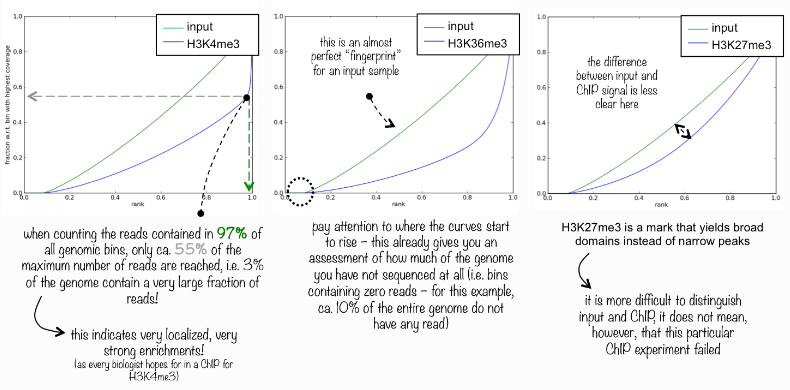

For visualization with deepTools we need a bam file in which the order of the reads is determined by genomic location. We have created such a bam file in the peak calling step using the SortSam tool from the Picard suite.
The bam file still contains duplicate reads (=reads that map to exactly the same position in the genome). Such reads represent technical duplicates often caused by biased PCR amplification during the library prep or by fragments coming from repetitive elements in the genome... Since we are going to quantify the reads (we look for regions that are enriched in the ChIP sample) these technical duplicates will distort the quantifications. So they should be removed from the .bam file
Additionally an index file should be created to allow for fast and easy access to the sorted and processed .bam file.

> Which tool from the Picard suite can be used to mark/remove duplicates?
> Picard MarkDuplicates can be used to remove duplicates. 

> Remove duplicates and index the .bam files?  
> - Use the sorted .bam files as input files
> - Indicate that the files are sorted according to coordinates
> - Remove the sequencing duplicates, duplicates generated by PCR
> - Create an index file

MarkDuplicates generates an error but you can ignore the error. Open the metrics.txt file that is generated by MarkDuplicates.

> How many duplicates were found in the ChIP sample?  
> 
 

Now we will plot a Lorenz curve with DeepTools to assess the quality of the ChIP. It answers the question: “Did my ChIP work?” Did the antibody-treatment enrich sufficiently so that the ChIP signal can be differentiated from the background signal in the control sample? This is a valid question since around 90% of all fragments in a ChIP experiment will represent the genomic background. 

For factors that enrich well-defined, narrow regions, the plot can be used to assess the strength of the ChIP, but the broader the enrichments, the less clear the plot will be. Vice versa, if you do not know what kind of signal to expect, the plot will give you an indication of how careful you have to be during downstream analyses to separate biological noise from meaningful signal.

The tool randomly samples genome regions (bins) of a specific legth in indexed BAM files, calculates the sum of all reads that map in a bin. These sums are sorted according to their rank and a profile of cumulative sums is plotted.

> Which tool from the DeepTools toolset are you going to use for this? 
> Run DeepTools [plotFingerprint](http://deeptools.readthedocs.io/en/latest/content/tools/plotFingerprint.html) to draw the Lorenz curve.

> Create a Lorenz curve for the ChIP sample 
> - You have to provide both the .bam and the .bai file as input! 
> - The **nsamples** parameter represent the number of bins that is sampled from the genome. It has to be smaller than the genome size divided by the size of the bins (default 500nt). The size of the *E. coli* genome is 4639675 nt. So we will set this parameter to 9000.
> - Other parameters can be kept at default settings

An experiment with perfect uniform distribution of reads along the genome (without enrichment) and infinite sequencing coverage should generate a straight diagonal line. A very specific and strong ChIP enrichment will be indicated by a prominent and steep rise of the curve towards the highest rank. This means that a big chunk of reads from the ChIP sample is located in few bins.
Below you see a few examples on how to interpret this curve:

 

**What do you think about the fingerprint plot that was generated on the *E. coli* data?**
