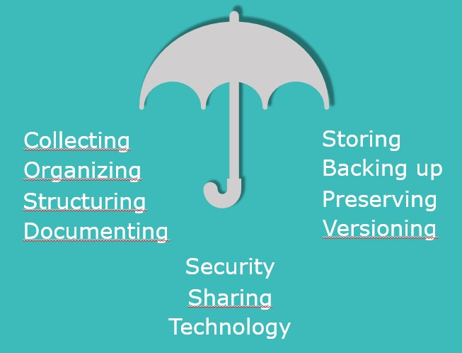

---
layout: tutorial_hands_on

title: Introduction to Research Data Management
questions:
- What is data in a research context?
- What is Research Data Management (RDM)?
- What are the benefits of RDM?
- What is FAIR data?
- What does Open Science entail?
- Is there a framework for research data?
- What are specific funder requirements?
- What is a Data Management Plan (DMP)?
objectives:
- understanding what data, RDM and DMP are
- Understanding what FAIR data is
- Understanding the framework for research data
- Understanding that funders sometimes have specific requirements
- Discover funders' data management templates
- Knowing what a DMP is
time_estimation: 45M
subtopic: introduction
key_points:
- Importance of access, re-use of research data
contributors:
- abotzki
- gbonamie

---

## Lessons and Topics in this Section
- L What is data?
  - T Introduction
  - T What Is the Typical Lifecycle of Research Data?
  - T What Is Research Data Management (RDM)?
  - T What Are the Benefits of RDM?
  - T Questionnaire - Rate Your Data Management
- L FAIR data
  - T Introduction
  - T Exercise: Identify FAIR data
  - T How to achieve FAIR data
  - T OPEN Data
  - T FAIR vs OPEN
  - T Open Science
- L Research Data Frameworks
  - T University Policies
- L Funder requirements
  - T Introduction
  - T European Commission - Horizon 2020
  - T FWO
- L The Data Management Plan (DMP)?
  - Introduction
- L RDM Support
  - T Contact Details

## What is Data?

### Introduction
Before we talk about data management, it is important that we start on the same page.

**Data is any information collected or generated for the purpose of analysis, in order to generate or validate scientific claims.** This could take the form of surveys, measurements, code, images, documents, etc. It can be qualitative/quantitative, structured or unstructured, digital or analogue, raw or processed, experimental or observational, derived or compiled, and so on. Research data can mean a lot!

### What Is the Typical Lifecycle of Research Data?

https://www.youtube.com/embed/OL_Vd9dd-AQ

Here's a representation of the active management of research data throughout the data lifecycle.

(Adapted from 'Introduction to RDM' by Research Department University Library (Book Tower), UGent, licensed under CC-BY 4.0)

This course follows this course as closely as possible in chapters such as
- Preparing a DMP
- Organizing and Documenting DATA
- Storing Data and Data security
- Sharing and Preserving DATA

### What Is Research Data Management (RDM)?

https://www.youtube.com/embed/bbsLmy3Njv4

**Research Data Management** refers to any action that takes care of data before, during and/or after research. It is *the compilation of many small practices that make your data easier to understand, less likely to be lost, and more likely to be usable during a project or ten years later* (Briney 2015)

### What Are the Benefits of RDM?
In this short video Prof. dr. Chantal Kemner explains the importance of good data management for Utrecht University.

https://www.youtube.com/embed/f48l4Uca9nA

Managing your data effectively is crucial to the success of your research. This doesn't only apply to the immediate context of your thesis or publications. Managing your data is a practice that will benefit you throughout your research career. The following list gives an overview of what benefits are evident:
- Access, Re-use & Recognition
- Efficiency
- Quality & Security
- Compliance
- Career Recognition

Each of these will be elaborated in the following topics in this lesson.

### Questionnaire - Rate Your Data Management

Think about your own research project right now. Please rate your current data management practices: how easily can you find all the data relating to your publications?

You can be honest: your rating is private and in this course we will be sharing some advice and techniques to help you improve your data management.

[ays_poll id=9]

## FAIR Data

### Introduction
FAIR stands for **Findable, Accessible, Interoperable, and Reusable**. The FAIR data principles act as an international guideline for the result of high-quality data management.

With the increase in volume, complexity and creation speed of data, humans are more and more relying on computational support for dealing with data. The principles were defined with the focus on machine-actionability, i.e. the capacity of computational systems to find, access, interoperate and reuse data with none or minimal human intervention.

#### F – Findable

By using correct metadata to describe the data, it will be findable. By using a persistent identifier the data can be found by computer systems automatically.

#### A – Accessible

The data should be accessible for the long term. Even when underlying data is not accessible, the describing metadata should remain available.

#### I – Interoperable

The data can be used and combined with other datasets. To achieve this, the data should be stored in generic file types, not in software specific file types.

#### R – Reusable

The options for reuse should be stated clearly in a licence. Without a licence there is no certainty about the options for reuse and creator rights are implicit.

### Exercise: Identify FAIR
<iframe src="https://elearning.bits.vib.be/wp-admin/admin-ajax.php?action=h5p_embed&id=80" width="853" height="381" frameborder="0" allowfullscreen="allowfullscreen"></iframe>

### How to achieve FAIR data

In general, having a good data management plan will lead to FAIR data. In the case of privacy-sensitive data, it is possible to meet the criteria, but not to share the data openly. In this case you can make sure that a well-described dataset can be found online, while preventing the underlying data to be downloaded and used without permission.

If you anonymise your data, presuming the data is of limited sensitivity and you are very sure the data cannot lead back to the persons involved, you can share your data openly.

The FAIR Guiding Principles were put together and published in Scientific Data (Mark D. Wilkinson et al., 'The FAIR Guiding Principles for Scientific Data Management and Stewardship,' Scientific Data 3 (March 15, 2016): 160018.).

<iframe src="https://elearning.bits.vib.be/wp-admin/admin-ajax.php?action=h5p_embed&id=33" width="958" height="397" frameborder="0" allowfullscreen="allowfullscreen"></iframe>

Not having FAIR research data is very expensive. 'The cost of not having
FAIR research data costs the European economy at least €10.2bn every year' ([Cost-benefit analysis for FAIR research data](https://op.europa.eu/en/publication-detail/-/publication/d375368c-1a0a-11e9-8d04-01aa75ed71a1/language-en))

#### Additional Resources

- [How to make your data fair?](https://www.openaire.eu/how-to-make-your-data-fair) by OpenAire
- [FAIR Data: What it means, how we achieve it, and the role of RDA](https://www.slideshare.net/sjDCC/fair-data-what-it-means-how-we-achieve-it-and-the-role-of-rda)
- [Turning FAIR into Reality](https://ec.europa.eu/info/sites/info/files/turning_fair_into_reality_0.pdf)

### OPEN Data
Opendatahandbook.org defines open data as *data that can be freely used, re-used and redistributed by anyone - subject only, at most, to the requirement to attribute and sharealike.*
Opendefinition.org says that *open data can be freely used, modified and shared by anyone for any purpose.*

Have a look at the following figure

As matter of principle, adhere to the habit of making your **as open as possible, as closed as necessary.**

### FAIR vs OPEN
FAIR and Open are not synonyms. FAIR does not mean data have to be open. Data can be both, one, or neither. Check both figures below to get an idea of the difference:

<iframe src="https://elearning.bits.vib.be/wp-admin/admin-ajax.php?action=h5p_embed&id=81" width="853" height="302" frameborder="0" allowfullscreen="allowfullscreen"></iframe>

### Open Science

'Open Science is the practice of science in such a way that others can collaborate and contribute, where research data, lab notes and other research processes are freely available, under terms that enable reuse, redistribution and reproduction of the research and its underlying data and methods.'

(Source:[ FOSTER](https://www.fosteropenscience.eu/foster-taxonomy/open-science-definition)).

You have learned that good data management contributes to the findability, accessibility, interoperability and reusability of your research data. This does not necessarily mean that you should make your data openly available. But to open up data, you do need good data management from the earliest possible stage of your research project.

#### Dr. Daniel Oberski on Open Science

https://www.youtube.com/embed/fduDfgz15PY

**Additional Resources**

- [What is open science?](https://www.fosteropenscience.eu/learning/what-is-open-science/#/id/5ab8ea32dd1827131b90e3ac), an online course by fosteropenscience.eu
- [Online training material by the ORION project](https://www.orion-openscience.eu/publications/training-materials)
- [More information about the ORION MOOC for Open Science in the Life Sciences](https://www.orion-openscience.eu/news/201909/orion-mooc-open-science-life-sciences-coming-soon%C2%A0)
- Follow the self-paced ORION MOOC at the [Open Learn Create Platform](https://www.open.edu/openlearncreate/course/view.php?id=4633)

## Research Data Frameworks

### University Policies

For the Flemish universities, it is important that all researchers honour scientific standards, including the meticulous and ethical treatment of research data. This policy is intended to set out parameters to safeguard the quality, availability and accessibility of research data within any Flemish university. It provides a basis for evaluating compliance with laws, regulations and codes of conduct. The policy also clarifies the various roles and responsibilities of university staff in managing research data.

The highlights of the policy are:
- Archive (relevant and valuable) research data for a minimum of ten years;
- Store data in a structure that is suitable for long-term preservation and later consultation;
- Provide metadata to describe the data with sufficient clarity to ensure they are findable for further research;
- Make archived research data available for access and reuse at and outside VIB insofar as is reasonably possible;
- Each individual researcher / research leader is responsible to draw up a Data Management Plan (DMP) at the start of the research project and to follow up the agreements made in this plan;
- Scientific directors are responsible for the implementation and monitoring of the University policy framework and for drawing up additional faculty guidelines to this end if needed.

Links to the Policy Frameworks of the Flemish Universities:

- [Policy Framework from Ghent University](https://www.ugent.be/en/research/datamanagement/rdm-policy.pdf)

- [Policy Framework from KU Leuven](https://www.kuleuven.be/english/research/scholcomm/rdm/policy-plan-rdm-ku-leuven-2014)

- [Policy Framework from UHasselt](https://bibliotheek.uhasselt.be/sites/default/files/uploads/RDM/20180517_UH_RDM_PolicyPlan_NL.pdf)

- [Policy Framework from VUB](https://vub.sharepoint.com/sites/ORG-RandD/SitePages/RESEARCH-DATA-MANAGEMENT.aspx?web=1)

## Funder Requirements

### Introduction
More and more research funders explicitly require you to consider the management and publication of your research data, both during and after your research project. The European Commission and the Flemish funders [FWO](https://www.fwo.be/nl/het-fwo/organisatie/data-management-plan/) have explicit policies on research data management.

(from 'Preparing a DMP' by Research Department University Library (Book Tower), UGent, licensed under CC-BY 4.0)

### European Commission - Horizon 2020

The European Commission wants 'Horizon 2020 beneficiaries to make their research data findable, accessible, interoperable and reusable (FAIR), to ensure it is soundly managed. Good research data management is not a goal in itself, but rather the key conduit leading to knowledge discovery and innovation, and to subsequent data and knowledge integration and reuse.' Horizon 2020 is the biggest research and innovation program of the European Commission.

### FWO

FWO states that 'FWO has made data management a key element of its policy for all support channels provided by the FWO. The FWO expects researchers to pay due attention to this dimension before, during and for at least five years after their research.'

[FWO Overview Data Management Plan](https://www.fwo.be/en/the-fwo/organisation/data-management-plan/)

## The Data Management Plan (DMP)?

### Introduction
By now it should be clear that data needs to be properly managed throughout its lifecycle. The most effective way to do this is to create a Data Management Plan (DMP). This will take into account all the stages of the research data lifecycle. As outlined earlier, each individual researcher or research leader is responsible to draw up a data management plan. He or she should do this at the start of the research project. And during the research you should actively follow up on the agreements made in this plan.

As well as defending against misconduct accusations, some additional benefits of creating a data management plan include:

- Accessing your data more easily;
- Prioritising and balancing activities relating to research data collection and storage;
- Mitigating data loss;
- Reaching agreement between stakeholders about ownership of data;
- Reducing time and effort in the long term.
The good news is that this online training will take you through the necessary steps to create a plan during the subsequent modules.

### Questionnaire - Your Main Reason for Writing a DMP
We are very interested in your main reason to write a Data Management Plan. Give us your main reason and we will show you the responses of other researchers in this course.

[ays_poll id=10]

## RDM Support

### Contact Details

RDM Support provides all kinds of research data management assistance to researchers of VIB in all stages of their research. This can range from one-off individual advice to large-scale infrastructure coordination. You can find an overview of the contact details of the main host institutions for DMP related questions and guidance are as follows:

- AMS: Bart Cambré (bart.cambre@ams.ac.be)
- Hogere Zeevaartschool: Marc Vervoort (marc.vervoort@hzs.be)
- ITG: Ann Verlinden (averlinden@itg.be)
- KU Leuven: RDM.ub@kuleuven.be
- UAntwerpen: RDM-support@uantwerpen.be
- UGent: Myriam Mertens and Annik Leyman (rdm.support@ugent.be)
- UHasselt: Sadia Vancauwenbergh (rdm@uhasselt.be)
- Vlerick: Eva Cools (eva.cools@vlerick.com)
- VUB: dmp@vub.be
- VIB: bits@vib.be
