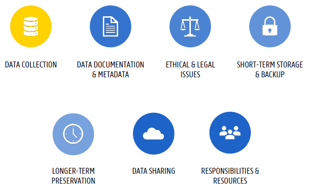
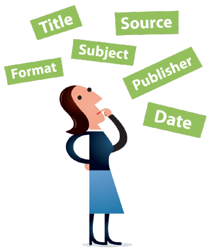
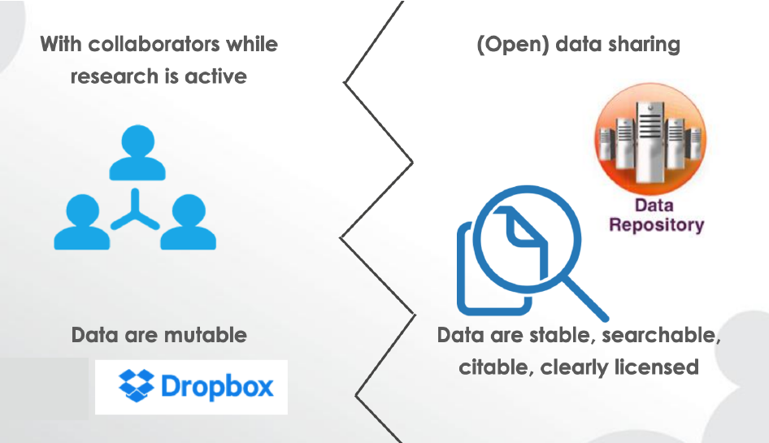
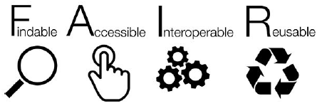
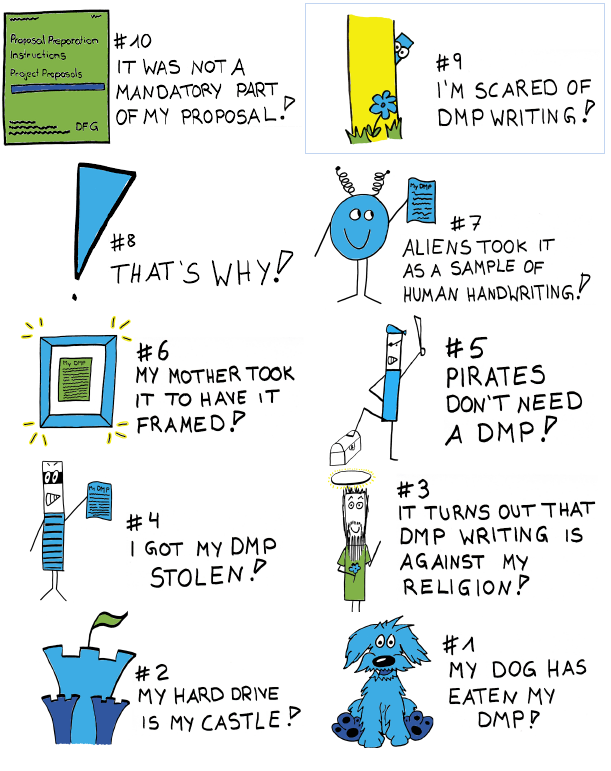

## Lessons and Topics in this Section
- L What to cover in your DMP?
  - T 7 Main Themes
  - T Theme 1 Data description
  - T Theme 2 Ethical and legal issues
  - T Theme 3 Data documentation and metadata
  - T Theme 4 Data storage and backup during the project
  - T Theme 5 Data preservation after the end of the projects
  - T Theme 6 Data sharing and Reuse
  - T Theme 7 Responsibilities
- L Data collection
  - T The Data Flow
  - T Discover Data
  - T Assess the Usefulness of Existing Data
- L Copyright and Intellectual Property Rights (IPR) Issues
  - T About Data Ownership
  - T Confidential or Privacy-Sensitive Data
- L Licences
  - T About Licences
- L Costs Involved with Managing Your Data
  - T introduction
  - T Data Management Cost Guide
- L Tools
  - T DMPOnline
  - T VIB Forms
  - Final Tips

## What to cover in your DMP?
This part is based on ‘Preparing a DMP’ by Research Department University Library (Book Tower), UGent, licensed under CC-BY 4.0.

In the introduction we mentioned funder's requirements. Most of them require you to write a Data Management Plan. A DMP outlines all key aspects of collecting, storing and managing research data during and after a project. For this they provide you with guidelines, forms, templates and examples. For more information you can check out the websites.

- [EC – Horizon 2020: guidelines](https://ec.europa.eu/research/openscience/index.cfm)
- [FWO template](https://www.fwo.be/media/1023898/fwo-dmp-templatedocx.docx)

Templates for a Data Management Plans (DMP) may vary from funder to funder, but they many common elements: 'Plans typically state **what [meta]data** will be created and **how**, and outline the plans for **sharing** and **preservation**, noting what is appropriate given the nature of the data and any **restrictions** that may need to be applied' [DCC](https://www.dcc.ac.uk/resources/data-management-plans)

(from ‘Preparing a DMP’ by Research Department University Library (Book Tower), UGent, licensed under CC-BY 4.0)

### 7 Main Themes
TODO Get some text here

### Theme 1 Data description
Here you get questions like:

- Will you generate/collect new data and/or make use of existing data?
- Describe the origin, type and format of the data (per dataset) and its (estimated) volume.

Here are a few tips:

- Only provide answers relating to research data (not publications, presentations, etc.)
̶  Remember: ‘research data’ come in many different forms!
̶  Break down and list your data types conveniently: e.g. by technique, purpose, phase...
̶  Provide enough details for outsiders to understand the sort of data involved:
  - content, digital/non-digital, raw/processed…
  - specify file formats (e.g. .csv, .txt, .docx…)
  - specify data source/collection methods (e.g. experimental, observational,
simulation… data)

### Theme 2 Ethical and legal issues
Here you get questions like:

- Will you use personal data?
- Are there any ethical issues concerning the creation and/or use of the data (e.g. experiments on humans or animals, or dual use)?
- Is there potential for tech transfer and valorization? Will IP restrictions be claimed for the data you created?
- Do existing 3rd party agreements restrict dissemination or exploitation of the data you (re)use?

**Will you use personal data?**
Bear in mind that **personal data** is any information relating to an identified or (in)directly identiable living individual. This means that names, occupations, addresses, dates of birth, phone numbers, voice recordings and the likes all qualify as personal data. As such, these are subject to the **General Data Protection Regulation (GDPR)**.

**Ethical issues concerning the creation and/or use of the data**
Answer these questions with yes if

- you need **permission from ethical committee** and/or **informed consent** for collecting & handling data (incl. archiving & sharing);
- you work with **sensitive data** (could cause harm if disclosed – e.g. to
endangered species, vulnerable sites/groups, national security, public
health…).

**Valorization, IP & third-party agreements**

- Restrictions on collecting, sharing, archiving & reusing data may be
applicable
- e.g. your research has commercial potential. Sharing may not be possible (to protect confidential knowhow), or only after embargo period (to seek patent protection first)
- e.g. you work with third-party data/collaborate with external partners. Check licenses/agreements to know what you can do.

### Theme 3 Data documentation and metadata
This concerns questions like:

- What documentation will be provided to enable understanding and reuse of the data collected/generated in this project?
- Will a metadata standard be used?

Later in this course you will learn more about data documentation. Suffice it here to say that documentation basically is any information needed to understand & reuse research data, and to reproduce your research – ideally following standards in your domain. In other words, this could be

- a codebook/data dictionary explaining variables
- a dataset structure, relation between files
- a study context
- protocols, methods, SOPs
- notes/annotations
- machine configurations
- the software used
- processing & analysis scripts
- consent information
- etc.

Ensure that it is clear what the study was about, what the variables in your data mean and what the codes mean if used. There should be no blind spots.

**Metadata** refers to a highly structured form of data documentation

- needed to search & find data (e.g. catalogues)
- also used to further describe/annotate data
- fixed set of elements, as defined by metadata ‘schema’
- use existing standards!
  - generic: e.g. [Simple Dublin Core](https://www.dublincore.org/specifications/dublin-core/usageguide/), [Datacite](https://schema.datacite.org/)
  - domain-specific: check via [fairsharing.org](https://fairsharing.org/), [RDA metadata directory](http://rd-alliance.github.io/metadata-directory), [DCC’s list of disciplinary metadata](http://www.dcc.ac.uk/resources/metadata-standards)

‘Metadata’ by Jørgen Stamp, attribution: digitalbevaring.dk, licensed under [CC-BY 2.5 DK](https://creativecommons.org/licenses/by/2.5/dk/deed.en_GB)

### Theme 4 Data storage and backup during the project
Questions here are

̶  Where will data be stored?
̶  How will the data be backed up?
̶  Is there sufficient storage & backup capacity during the project?
̶  What are the expected costs for data storage & backup during the project? How will these costs be covered?
̶  Data security: how will you ensure that the data are securely stored and not accessed or modified by unauthorised persons?

Make sure you have multiple copies in different places. If possible, have a automatic back-up system!

### Theme 5 Data preservation after the end of the projects
Questions here are

̶  Which data will be retained for the expected 5-year period after the end of the project?
̶  Where will these data be archived (= stored for the long term)?
̶- What are the expected costs for data preservation during these 5 years? How will the costs be covered?

While during your research your data will probably be stored on a hard drive or a network share, after your research it will be archived, meaning it is likely to be deposited in a digital repository. Deposit your data in a trusted external data repository

- preferably domain-specific (if available)
- general-purpose, e.g. [Zenodo](https://zenodo.org/), [Dryad](https://datadryad.org/), [OSF](https://osf.io/)
- find a suitable home via [re3data.org](https://www.re3data.org/). Have a look at the video below to see how it works

<iframe width="560" height="315" src="https://www.youtube.com/embed/cutUrqJqjp4" frameborder="0" allow="accelerometer; autoplay; encrypted-media; gyroscope; picture-in-picture" allowfullscreen></iframe>

Finally, bear in mind that archiving your data externally is not always possible, and sometimes data may need to be kept in-house!

### Theme 6 Data sharing and Reuse
Questions here are

̶ Are there any factors restricting or preventing the sharing of (some of) the data?
̶  Which data will be made available after the end of the project?
̶  Where/how will the data be made available for reuse?
̶  When will the data be made available?
̶  Who will be able to access the data and under what conditions?
̶  What are the expected costs for data sharing? How will these costs be covered?

Maybe this figure helps to explain this a little bit:

From ''[What you need to know to prepare a data management plan](http://helios-eie.ekt.gr/EIE/bitstream/10442/15546/1/20170615-OpenAIRE-Athene-Grootveld-final.pdf)’ by Marjan Grootveld, licensed under [CC-BY](https://creativecommons.org/licenses/by/4.0/)

Do share data via a data repository if possible. Do not share "upon request by email". In a repository like [Zenodo](https://zenodo.org/) data are findable, clearly licenced, and citable

### Theme 7 Responsibilities
This part deals with questions like

- Who will be responsible for data documentation & metadata?
- Who will be responsible for data storage & backup during the project?
- Who will be responsible for ensuring data preservation &
sharing?
- Who bears the end responsibility for updating & implementing this DMP?

By default, the PI bears end responsibility for the DMP & its implementation.Responsibility for day-to-day data management may be shared among project team members, and with institutional services (e.g. IT service), or it may be outsourced to others (e.g. data repository, external partner).

## Data Collection

By now you will have obtained some idea of what research data management is all about. Now we will have a more in-depth look into the different phases of your research by starting with data collection.

Data collection involves understanding the different types of data you collect. Depending on the nature of your research, there are different methods of collecting data and thus different types of data.

Your data may be physical (paper records or archival forms) or digital (database contents or Excel data). The source of your data may be external, you collect it yourself or you generate it from a machine.

When you write your data management plan you will need to take into account the type of data you collect, the source of the data, and how you will process and analyse your data.

You can watch the video below, provided by TU Delft, about data collection.

<iframe src="https://www.youtube.com/embed/AqnVrnVdv2Y" allowfullscreen="" allow="accelerometer; autoplay; encrypted-media; gyroscope; picture-in-picture" height="515px" style="display: inline-block;" width="800px" title=""></iframe>

Having a clear view of what data you will generate will enable you to plan its management. You can create an overview of the data you produce or collect by drawing the data in a workflow, or noting down in a table.

### The Data Flow
Describing your data can be done in several ways. Please watch the video below. Tessa Pronk will explain to you how to describe your data.

<iframe src="https://www.youtube.com/embed/KE2UpZY4wYA" allowfullscreen="" allow="accelerometer; autoplay; encrypted-media; gyroscope; picture-in-picture" height="515px" style="display: inline-block;" width="800px" title=""></iframe>

#### Exercise Order Elements in Your Data Flow

<iframe src="https://elearning.bits.vib.be/wp-admin/admin-ajax.php?action=h5p_embed&id=16" width="958" height="920" frameborder="0" allowfullscreen="allowfullscreen"></iframe>

### Discover data
Watch the screencast below. In this screencast, you will be guided through different ways to find data.

<iframe src="https://www.youtube.com/embed/AZMUKgM8X-A" allowfullscreen="" allow="accelerometer; autoplay; encrypted-media; gyroscope; picture-in-picture" height="515px" style="display: inline-block;" width="800px" title=""></iframe>

You have just learned that there are different places to find data. By actively searching the different places, you will get an understanding of the differences. Look at the different portals below. Some of them have been showcased in the screencast, some of them are additional.

- [Google](http://www.google.be) - add "database OR registry OR dataset OR archive OR statistics" to your search
- [Registry of Research Data Repositories re3data](https://www.re3data.org/) - find appropriate repositories holding interesting data
- [Elsevier Data Search](https://datasearch.elsevier.com/#/) - try out chip-seq drosophila
- [Google Dataset Search](https://datasetsearch.research.google.com/) - try out chip-seq drosophila. Google Dataset Search indexes [OmicsDI](https://www.omicsdi.org/), an index providing a knowledge discovery framework across heterogeneous omics data (genomics, proteomics, transcriptomics and metabolomics).   

### Assess the Usefulness of Existing Data

How useful is a dataset? Follow this short tutorial.

<iframe src="https://www.youtube.com/embed/t1SZutbCAxI" allowfullscreen="" allow="accelerometer; autoplay; encrypted-media; gyroscope; picture-in-picture" height="515px" style="display: inline-block;" width="800px" title=""></iframe>

In the previous activity, the lecture described four main points to check if you want to reuse existing data:

- Condition for reuse
- Context
- Trustworthiness
- Persistence

In the following quiz, take a closer look at the description or metadata of some datasets and assess the usefulness of these datasets yourself. As the description or metadata of datasets can be lacking in several different areas at the same time, it will be indicated per assignment on which of the four main points your focus should be.

<iframe src="https://elearning.bits.vib.be/wp-admin/admin-ajax.php?action=h5p_embed&id=15" width="958" height="217" frameborder="0" allowfullscreen="allowfullscreen"></iframe>

## Copyright and Intellectual Property Rights (IPR) Issues

### About Data Ownership
Copyright is a form of intellectual property right which arises automatically if an original work is created. Copyright may affect the way data may be stored, shared and reused. You should ask yourself who the copyright holder of your datasets is, especially when you use existing data or when you collaborate with external parties.

Here's a [brief guide to determining what consent is necessary to reuse someone else’s data](../../docs/01_Brief_Guide_To_Determining_Consent_To_Reuse_Data.pdf).

Officially VIB, as your employer, is considered the rights holder to the research data you create. You, as a researcher, have the primary responsibility for taking care of the data. Questions on data exploitation may be even more important than those of ownership. Who can use the data? Who can publish it? Who can provide it to third parties?  

We strongly recommend that you deal with the issues around data exploitation at an early stage of your research project. Write down agreements between yourself, your supervisor, project members and other interested parties in your Data Management Plan.

**Additional Resources**

- [Legal instruments and agreements](https://www.uu.nl/en/research/research-data-management/guides/legal-instruments-and-agreements)

### Confidential or Privacy-Sensitive Data
When your research project has received data under confidentiality or under legal privacy restrictions, you will have to identify and explain how you will deal with these restrictions in your data management plan (also see ‘[Learning Unit: Handle - Data security](../handle-security/tutorial.html)’).

## Licences

### About Licences
In order to publish your data and make it reusable, you require a licence. A licence creates clarity and certainty for potential users of your data. A licence is not an option for all data; some of it may be too confidential or privacy-sensitive to be published.

Licences such as the [Creative Commons](https://creativecommons.org/share-your-work/licensing-types-examples/) (CC) licences replace 'all rights reserved' copyright with 'some rights reserved'. There are seven standard CC licences. CC-BY is the most commonly used licence, in which attribution is mandatory when using data. You can also choose restrictions like non-commercial, no derivatives, or share alike. Creative Commons offers a [guide](https://creativecommons.org/choose/?lang=en) to help you determine your preferred licence.

In the last chapter of this course, you will learn more about licensing.

## Costs Involved with Managing Your Data

### Introduction
TODO: https://www.uu.nl/en/research/research-data-management/guides/costs-of-data-management

The costs of data management and sharing activities must be included into your research, in terms of time and resources needed.

### Data Management Cost Guide

When you plan your research you may not be able to oversee all costs involved. Nevertheless, it is useful to have an idea of possible costs at an early stage. You can use the Guide [Costs Overview](../../docs/01_UU_CostOverview.docx), which is a practical overview of possible costs per activity within each phase of the research process. Note: The Cost Guide offers cost indications and examples. These are not real prices.

#### Budget Your Data Management Costs

You are advised to budget the data management costs as separate data management costs. These costs are eligible for funding with funders like FWO and the European Commission, as long as the costs are invoiced before the end of the project.

#### Planning Can Save Time and Money

Planning an early start for certain activities within your research project can lower the costs for data management in the run of your project. You can save time by:

- Properly describing your data while collecting it, instead of doing it afterwards
- Choosing the right file format so that file conversion afterwards is not necessary
- Hiring an experienced data manager

Spending time to think about data activities beforehand can help prevent unexpected extra efforts and costs later on in your research project.

#### Check Current and Expected Costs for Your Research Data

You have just learned that in many parts of a research project there are data related costs. These costs depend on the type and volume of data you produce, analyse and store.

## Tools
In this part we will briefly cover two platforms you can use to write a DMP: DMPOnline and the VIB form.

### DMPOnline
Have a look at the video below for a general introduction on DMPOnline:

<iframe width="560" height="315" src="https://www.youtube.com/embed/kXuBC6HlO1g" frameborder="0" allow="accelerometer; autoplay; encrypted-media; gyroscope; picture-in-picture" allowfullscreen></iframe>

DMPonline is an international online service that guides you in creating a DMP by answering a series of questions about your research project. It allows you to create, share, store, and revise your data management plans online. You will be asked to complete different sections of your DMP as we go through the other modules. As a result you will have written your own data management plan at the end of this course.

With DMPonline you can:

- Write your plan and keep it up-to-date
  You can easily update your DMP throughout the lifecycle of a project
- Share plans online
  DMPonline allows collaborative access, so you can share your DMP with other researchers, within and outside of your university.
- Create multiple plans
  You can store different DMPs for different projects. And you can make a copy of a previous plan as the basis for writing a new one.
- Download plans
  You can download your DMP in a variety of formats.

We recommend that graduate researchers share their data management plans with their supervisor(s).

TODO tutorial: 20200505_DMP_webinar.pdf, 49-55?

### VIB Forms
TODO

### Final Tips
Here are some final tips:
- keep it simple, but be as specific as possible.
- if you don’t know yet, just say so (& update your plan later).
- not necessarily right/wrong answers, but justify decisions.
- familiarize yourself with RDM terminology & best practices
- also see it as an opportunity to inform us about
your RDM needs.

TOP 10 excuses for not having a DMP by [FranziMachtDas](https://twitter.com/FranziMachtDas), CC-6B0Y-SA 4.0
