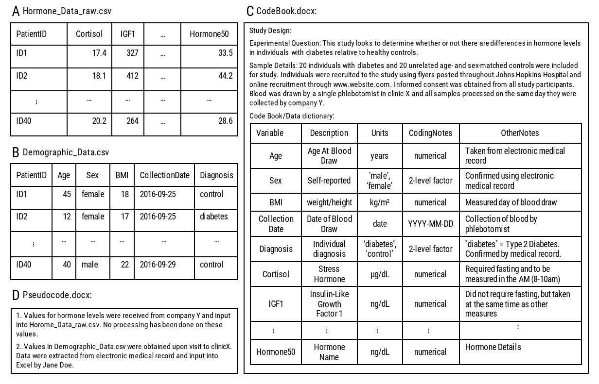
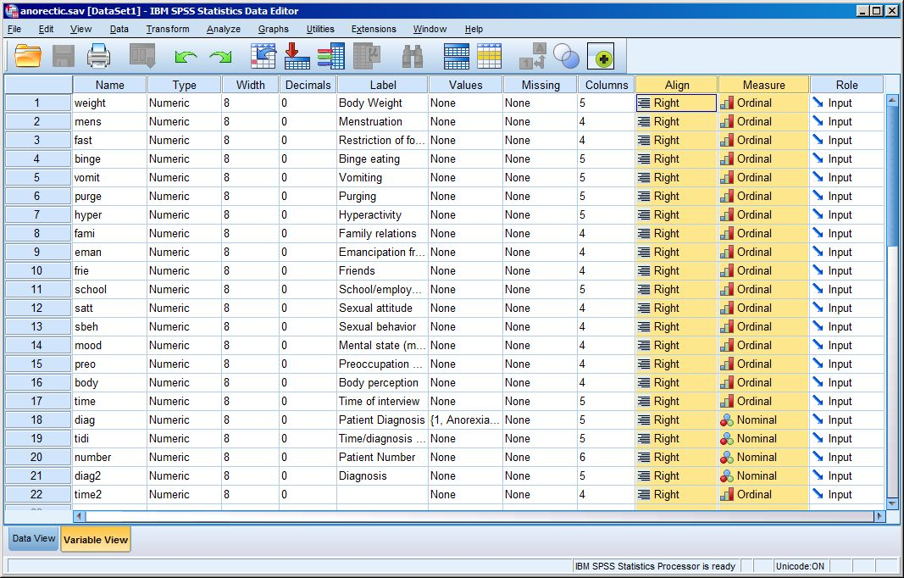
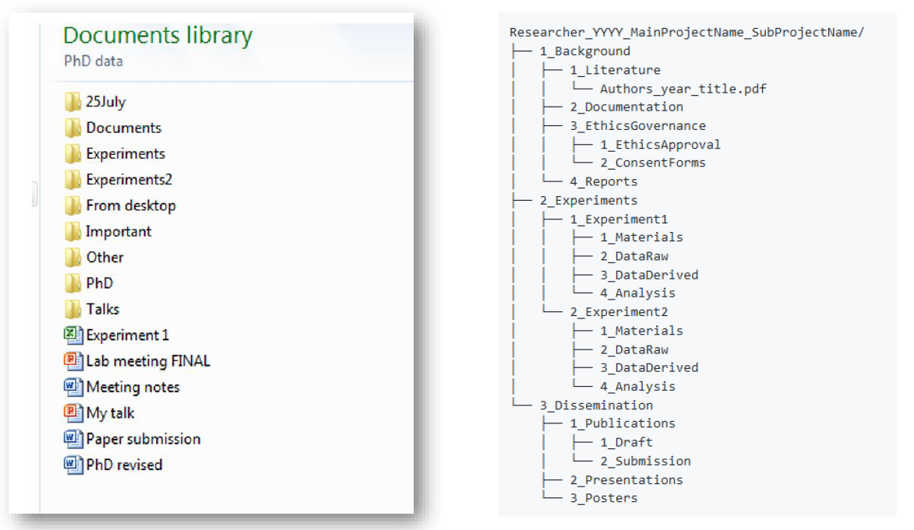

## Lessons and Topics in this Section
- L Data documentation
  - T Data Documentation - Introduction
  - T Why Document Your Data?
  - T Examples of Data Documentation
  - T Different Levels of Data Documentation
  - T Metadata
  - T Data Standards
  - T Exercise: Data Standards
  - T Licences
- L Organizing
  - T Research and Lab Notebooks
  - T File Formats
  - T File Naming
  - T Good File Management
  - T Benefits of Good File Management
  - T Do's and Don'ts
  - T Batch Renaming of Automatically Generated Files
  - T Version Control
  - T Folder Structure
- L Documenting & Organizing - References
  - T Documenting & Organizing - References

## Data Documentation

### Data Documentation - Introduction
By now you understand how to describe your data collection in terms of, for example, type, size, and format. You have identified this for your own research data. Now we will look into the documentation and metadata which will accompany your data. Documentation and metadata are essential to understand what a dataset means and to make it reusable in the future. In this part of the course you will learn to:

- Understand how documenting your data helps yourself and others understand, verify, review, replicate, access, reuse and build upon your findings;
- Discern between different ways to document your data;
- Understand the role of metadata in increasing data interoperability;
- Apply the presented information to your own data.

<iframe src="https://elearning.bits.vib.be/wp-admin/admin-ajax.php?action=h5p_embed&id=18" width="958" height="442" frameborder="0" allowfullscreen="allowfullscreen"></iframe>

### Why Document Your Data?

John MacInnes, professor of Sociology of the University of Edinburgh, explains why it is necessary to document each step of your research and how this will benefit you in the long term.

https://www.youtube.com/embed/EIZsxT-fIiQ

Indeed, the importance of documenting your data during the collection and analysis phase of your research cannot be overestimated.

While collecting and analysing, you may be on intimate terms with your dataset. However, remembering that the variable *sgimemgp* means *single member of group* can become difficult months or years later. The same goes for the exact procedure you used to transform or derive particular variables.

Here are the main reasons why you want to document your data, and document it well:

- Recall the FAIR Data guidelines
- Enables you to **understand/interpret** data later
- Make data independently understandable i.e. **reusable**
- Make results independently **reproducible**, starting from raw data
- Helps **avoid incorrect use/misinterpretation**

As rule of thumb, if you want to know what to document, ask yourself **what any user would need to know to make sense of your data.**

### Examples of Data Documentation

Since there is a wide variety of types of data and types of research, there are many different ways of documenting data. A few examples of data documentation are:

- Laboratory notebooks and experimental procedures
- Questionnaires, codebooks, data dictionaries
- Software syntax and output files;
- Custom developed software
- Information about equipment settings & instrument calibrations
- Database schemes
- Methodology reports
- Provenance information about sources of derived or digitised data

<iframe src="https://elearning.bits.vib.be/wp-admin/admin-ajax.php?action=h5p_embed&id=17" width="958" height="570" frameborder="0" allowfullscreen="allowfullscreen"></iframe>

### Different Levels of Data Documentation
There are many different ways to set up and organise your documentation.

#### Project Level

Project level documentation gives contextual information about the study/project: it explains the aims of the study, the research questions, the methodologies, etc.

Project level documentation also seeks answers to questions such as:

- **For what purpose was the data created?**
  Describe the project history, its aims, objectives, concepts and hypotheses, including:
  - The title of the project
  - Authors, creators, co workers of the dataset
  - The institution of the author(s)/creator(s)
  - Funders
  - Grant numbers
  - References to related projects
  - Publications from the data.
- **What does the dataset contain?**
  - Kind of data (interviews, images, questionnaires, instrumental, etc.)
  - Organization & structure
  - Relationships between files
  - Description of data file(s): version and edition, structure of the database, associations, links between files, external links, formats, compatibility
- **How was the data collected?**
  - The methodology and technique used in collecting and creating the data
  - Description of all the sources the data originate from
  - The methods/modes of data collection (for example):
    - The instruments, hardware and software used to collect the data
    - Digitisation or transcription methods
    - Data collection protocols
    - Sampling design and procedure
    - Target population, units of observation
- **What possible manipulations were done to the data? How was the data processed?**
  - Modifications made to data over time since their original creation and identification of different versions of datasets
  - Describe workflow and specific tools, instruments, procedures, hardware/software or protocols you might have used to process the data
  - Anonymisation /pseudonymization strategy
- **What where the quality assurance procedures?**
  - Checking for equipment and transcription errors
  - Quality control of materials
  - Data integrity checks
  - Calibration procedures
  - Data capture resolution and repetitions
  - Other procedures related to data quality such as weighting, calibration, reasons for missing values, checks and corrections of transcripts, transformations.
- **How can the data be accessed?**
  Describe the use and access conditions of the data:
  - Where the data can be found
  - Access conditions such as embargo
  - Parts of the data that are restricted, protected or confidential
  - Licences
  - Permanent identifiers
  - Copyright and ownership issues

A complete academic thesis normally contains this information in details, but a published article may not. If a dataset is shared, a detailed technical report needs to be included for the user to understand how the data were collected and processed. You should also provide a sample bibliographic citation to indicate how you would like secondary users of your data to cite it in any publication.

#### File or Database Level

File or database level documentation documents how all the files (or tables in a database) that make up the dataset relate to each other, what format they are in, whether they supersede or are superseded by previous files, etc.

For this purpose, a **codebook** is advised. These codebooks can be used as a separate file or they can be embedded within the datafile. The first allows for much flexibility, but is yet another document to maintain, the latter sits close to data, is easy to use, but is hardly flexible and may get lost in conversion

Source: Ellis SE, Leek JT. 2017. How to share data for collaboration. *PeerJ Preprints* 5:e3139v5 https://doi.org/10.7287/peerj.preprints.3139v5

Data level documentation should also seek to document the **processing steps**, answering questions such as:

- What happens between data files and why?
- What is the chronology like? What happens when, and why?
- use annotated scripts or cookbooks that describe all steps, decisions and study protocol

#### Variable or Item Level

Variable or item level documentation documents how an object of analysis came about. For example, it does not just document a variable name at the top of a spreadsheet file, but also the full label explaining the meaning of that variable in terms of how it was operationalised.

Best practices regarding **variable names**:

- Use valid variable names
  - Meaningful abbreviations, e.g. use *bmi*, not *var1*
  - Refer to numbering system in instrument, e.g. *q1a, q1b, q2, q3a*
  - Avoid simplistic numerical order system like *v1, v2, v3*
- Be consistent
  - Don't change variable names across (versions of) datasets (e.g. *gender, sex*)
  - Use 1 language
  - Short, no spaces, no special characters and lower case. (*Gender* vs *gender*)

Best practices regarding **variable descriptions**:
Variables in tabular data should have descriptive labels.
- Be brief, max. 80 characters
- Spaces or special characters are ok
- Include unit of measurement where applicable
- Refer to number used in instrument. e.g. variable *q11bhexw* with label *q11b: hours spent taking physical exercise in a typical week* the description gives the unit of measurement and a reference to the question number (*q11b*)

#### Additional resources

- [How to share data for collaboration](https://doi.org/10.7287/peerj.preprints.3139v5)

### Metadata

Metadata is data about data. Consequently, it allows for very structured documentation, with descriptors facilitating cataloguing data and data discovery. Metadata is intended for machine-reading, and thanks to metadata you can browse sites like Zenodo using filters like *Access Right* and *File Type*.

Watch this web lecture to learn about the different types of metadata and how metadata can help make your research data better findable. You are pointed to useful sources for metadata standards.

https://www.youtube.com/embed/h0oZ3swbTJ0

#### Metadata Schemas and Standards
There is generally no need to generate machine-readable metadata yourself. Metadata often follows a certain **schema**, which is nothing but a predefined set of elements. There are also metadata standards, which in some cases are domain-specific. An example of such a standard is the [DublinCore](https://dublincore.org/) schema, which is a set of 15 metadata elements applicable to a wide range of datatypes

#### Exercise: Different Types of Metadata

<iframe src="https://elearning.bits.vib.be/wp-admin/admin-ajax.php?action=h5p_embed&id=19" width="958" height="949" frameborder="0" allowfullscreen="allowfullscreen"></iframe>

#### Metadata for Different Disciplines

Different disciplines like biology, earth sciences, physical sciences and social sciences and humanities have their own standards. By choosing a well-supported standard, you will maximise the chance that your data can be (re)used and understood by other researchers.

https://www.youtube.com/embed/AvL7hEk8RJQ

#### Controlled Vocabulary

You are advised to use a 'controlled' vocabulary when you collaborate with others or when you regularly do the same type of research, A 'controlled' vocabulary uses predefined and authorised terms. This avoids that the same concept is given different names and ensures consistency. Hence it makes it easier to find and understand data.

Without you knowing, you may already use a generally accepted controlled vocabulary, for instance:

- Latin names for plants in plant studies
- Chemical names in chemistry
- Entry terms for genes
- Latin names for diseases
- Mesh terms for medical terms in general
- Standard units for your results

If there is no vocabulary available, you can consider making a custom list within your research team.

#### Improve a Record Description

<iframe src="https://elearning.bits.vib.be/wp-admin/admin-ajax.php?action=h5p_embed&id=20" width="958" height="362" frameborder="0" allowfullscreen="allowfullscreen"></iframe>

Units are important, and metadata field names need explanations in for instance a codebook or another document explaining names. If metadata field names are from a standard, these are explained in the standard. This saves you time and you can simply refer to the standard in your data.

#### Metadata for Software
Metadata might include information like the source code, location, contributors, licence, version, identifier, references and how to cite the software. (Jiménez 2017)

#### Useful links to metadata standards:

- [Biology](http://www.dcc.ac.uk/resources/subject-areas/biology)
- [General Sciences](http://www.dcc.ac.uk/resources/subject-areas/general-research-data)
- A community-maintained [directory of metadata schemas](http://rd-alliance.github.io/metadata-directory/) which has been set up under the auspices of the Research Data Alliance.
- A list of metadata standards and other standards developed by [FairSharing](https://fairsharing.org/).
- [Understanding metadata](https://groups.niso.org/apps/group_public/download.php/17446/Understanding%20Metadata.pdf)

### Data Standards

Your dataset can be standardised in various aspects. Standardisation, in general, makes data comparable and interpretable. In other words, your data becomes interoperable by applying standards. Datasets can be combined, compared or are simply easier to reuse. You have to plan standardisation, as it is for many aspects hard or impossible to apply afterwards.

Standardise as much as possible between you and your collaborators or research group. If there are standards established and used in your field of research you are advised to use these.

Here is a list of things you can standardise in your research.

- Standardise how, what and when you measure things by standardising your **protocol, or methods and materials**. For instance, is there a standard set of questions for 'quality of life'? Is there a standard procedure to house mice for your purpose? What aspects do you measure? At what parameter values (age, concentration, etc.)? When do you measure (every two hours, every gram of weight gain, etc.)?
- Standardise your **file formats** so you can easily exchange results without technical difficulties. Check for standard taxonomies or coding systems within your research discipline.
- Standardise the **units** in which you note down your results. For instance, do you use mm, cm, m? It is extra work to transform units between experiments.
- Standardise the **metadata** you use to describe your records or study. What fields will fill in by default, and according to what standard do you define the fields' names? Will you design a metadata spreadsheet where you specify all things that you will note down?
- Standardise the **vocabulary** you use. If everyone has the same terminology, it can avoid confusion or misinterpretation. Check for standard taxonomies or coding systems within your research discipline.

### Exercise: Data Standards

Follow the links below for examples of standards. What type of standardisation do the links refer to?

- [Allie](http://allie.dbcls.jp/pair/GMS;General+Morphology+Score.html)
- [Demographic market research](http://www.amplituderesearch.com/market-research-questions.shtml)
- [Marine Geoscience Data](http://www.marine-geo.org/submit/guidelines.php)
- [The Cultural Objects Name Authority](http://www.getty.edu/research/tools/vocabularies/cona/index.html)
- [International Union of crystallography](http://www.iucr.org/resources/cif/spec/ancillary/abbreviations)
- [SI Units](https://www.nist.gov/pml/weights-and-measures/metric-si/si-units)
- [UK data service](https://www.ukdataservice.ac.uk/manage-data/format/recommended-formats)

Drag each link to the box that best describes its type of standardization

<iframe src="https://elearning.bits.vib.be/wp-admin/admin-ajax.php?action=h5p_embed&id=21" width="958" height="625" frameborder="0" allowfullscreen="allowfullscreen"></iframe>

### Licences
In the introduction of this course we have already touched upon the subject of licences, and we will deal with licences for your data again in the last chapter. At this point, however, it is important to mention that alongside your data also any custom developed scripts or software that you use should not only be documented but also be licensed. Failing to do so might impact badly on the reproducibility of your research. Jiménez RC, Kuzak M, Alhamdoosh M et al. advise the following:

  "*Adopt a suitable Open Source licence to clarify how to use, modify and redistribute the source code under defined terms and conditions. Define the licence in a publicly accessible source code repository, and ensure the software complies with the licences of all third party dependencies. Providing a licence:*

  - *Clarifies the responsibilities and rights placed on third parties wishing to use, copy, redistribute, modify and/or reuse your source code*
  - *Enables using the code in jurisdictions where 'code with no licence' means it cannot be used at all*
  - *Protects the software's intellectual property*
  - *Provides a model for long-term sustainability by enabling legally well-founded contributions and reuse*

  *We advise choosing a OSI-approved Open Source Licence unless your institution or project requires a different licence. Websites like 'Choose an open source license' provide guidelines to help users to select an OSI-approved Open Source Licence. Organisations like the OSS Watch also provide advice on how to keep track of the licences of software dependencies. For reusability reasons, we also advise authors to disclose any patents and pending patent applications known to them affecting the software.*" (Jiménez 2017)

## Organising Data

### Research and Lab Notebooks

Researchers can benefit by keeping a systematic record of their research. For many disciplines, this may take the form of a diary or notebook to record ideas, articles and references. Laboratory-based researchers usually complete lab notebooks as crucial components of data management. Look to the local practices in your research group or lab for guidance.
Research/lab notebooks can play an important role in:

- Supporting claims relating to intellectual property developed by University researchers;
- Defending claims of scientific fraud;
- Showing research is patent worthy during a patent registration process;
- Demonstrating adherence to standards of good practice, academic and ethical integrity;
- Demonstrating compliance with contractual provisions permitting sponsors to audit work carried out in pursuit of sponsored research.

Thorough and effective management of laboratory data and the routine documentation of all lab procedures is a highly important responsibility for all researchers.

If you want to learn more about the electronic lab notebook system at VIB, please see [these tutorials](https://material.bits.vib.be/topics/eln/)

### File Formats

This part is based on the online Research Data Management training 'MANTRA' of The University of Edinburgh (CC BY: [https://mantra.edina.ac.uk/](https://mantra.edina.ac.uk/)) and Managing Data @ Melbourne.

When collecting data it is important to consider the formats of your data files. Not all file formats are created equal. Some file fonmats are better suited for your data's needs than others. When you need to convert, migrate, compress or share your data, you should choose the best available method and file format for the intended use. In this part of the course you will learn to:

- Understand why research data formatting and transformation is important;
- Identify the risks of file transformations;
- Understand the difference between proprietary and open file formats;
- Understand why data centres require you to deposit your data in preffered data format;
- Make informed decisions about data file formatting, conversion and migration.

The file formats you use to generate your research data will influence how you can manage them over time, i.e. a program or application must be able to recognise the file format in order to access your data within the file.
For example, a web browser is able to process and display a file in the HTML file format so that it appears as a web page. If the browser encounters another file type, it may need to call on a special plug-in to view it. Or it may simply let you download the file to view if it can recognise it in another program.

To identify the file format, files usually have a file name extension, or suffix that follows a full stop in the file name and contains three or four letters, like for example:

- *.txt*
  text
- *.pdf*
  portable document format
- *.jpg*
  joint photographic experts group
- *.csv*
  comma separated values
- *.html*
  hypertext markup language
- *.xml*
  extensible markup language  
- *.rtf*
  rich text format

#### Proprietary and open formats

File formats that are non-proprietary (e.g. open source}, or in widespread use, will tend to retain the best chance of being readable in the future. Proprietary formats, especially non-standard formats, used only by a specific software program or a specific software version, are likely to present problems for future (re)use.

Rapid changes in technology and the market mean that file formats can become obsolete quickly. It happens all too often that a software application is unable to read a file created by an earlier version of itself. The implications for research data management depend on how long data need to be retained for future use by yourself or others.

Data formats that conform to an agreed intemational standard are less likely to become obsolete, because a variety of software applications should be able to read them. However, there are likely to be trade-offs in tenns of software functionality, for example, loss of formatting or macros.

File formats may be proprietary and closed, or open and published by a company, standards organisation or collective for anyone to use.

Files in proprietary formats usually must be opened by the software in which they were created. Someone without a license to the software may not be able to open the file at all. Open formats, in which the software company or collective publishes the format rather than keeps it proprietary, can be opened by more than one application. Adobe PDF is an example of an open format that may be viewed in a number of applications, not limited to just Adobe products.

It is recommended that you use open formats for your research data. If this is not possible, try and store a copy of your data in an open format. For example, you might use .xls to store your spreadsheet data, but by saving an additional copy in an open format (such as .csv) you will ensure that your data will be readable in the future.

Even though some proprietary file formats can also be opened in other programs, distortions and loss of data may occur. For example, .ppt can be opened on an IOS operating system, but some features may no longer function. Therefore, it is always advised to store your format in an open data file format, although this does not guarantee loss of features and information either. At least, you are not locked in by one supplier.

#### Preferred formats

Generally speaking, those file formats that allow for **sustainable access** are preferred. Very often they share these characteristics:

- Non proprietary (not protected by trademark, patent or copyright)
- Open, documented standard
- Common usage by research community
- Lossless compression (>< lossy compression)

It is not necessary to know all the technical ins and outs when you want to acquire knowledge about data formats. It is important, however, to have an idea of all factors involved. However, you need to know that long-term, sustainable storage requires a certain data format.

Data archives often maintain a list of preferred formats for the delivery of data. Only for data delivered in a preferred format can data archives like DANS and 4TU.Centre for Research Data guarantee long- term storage and accessibility.

There are reasons for preferring some data formats over others. For example, the preferred formats for image files are:
- JPEG, a universally used format which has the advantage of being easily accessible from many applications.
- TIFF, a format which allows you to preserve images at the highest quality, without compression, albeit with large file sizes.
- PNG, a high-quality format of a smaller file size than TIFF, with the disadvantage of not allowing the inclusion of metadata such as the type of camera used to take the picture. JPEG and TIFF do possess this functionality.

More information can be found
- at [Dans](https://dans.knaw.nl/en/about/services/easy/information-about-depositing-data/before-depositing/file-formats);
- at [Recommended Formats](https://www.ukdataservice.ac.uk/manage-data/format/recommended-formats)
- in the PDF which you can download below

[Preferred File Format](../../docs/01_DataCollection_Preferred_formats.pdf);

#### File Conversion and migration

At some time during your research you may need to convert or migrate your data files from one format to another or from one system to another. This may be due to a new computer, new software or because you want to share your data with someone who has different software. In this kind of cases, conversion is necessary in order to be able to keep using the data.

Conversion can be done via an **export** function if provided by the software, via **save as** or via **scripts**. When data is converted from one file format to another, this could result in loss of internal metadata (e.g. from SPSS to Excel) or loss of editing, formatting and formulas (e.g. XLSX to CSV). Therefore, it is important for you to understand what is at stake if you lose information for the type of data you are working with. Check for errors and changes after the conversion, and choose your formats carefully.

#### Exercises

Exercise 1
<iframe src="https://elearning.bits.vib.be/wp-admin/admin-ajax.php?action=h5p_embed&id=12" width="958" height="602" frameborder="0" allowfullscreen="allowfullscreen"></iframe>

Exercise 2
<iframe src="https://elearning.bits.vib.be/wp-admin/admin-ajax.php?action=h5p_embed&id=13" width="958" height="484" frameborder="0" allowfullscreen="allowfullscreen"></iframe>

Exercise 3
<iframe src="https://elearning.bits.vib.be/wp-admin/admin-ajax.php?action=h5p_embed&id=14" width="958" height="187" frameborder="0" allowfullscreen="allowfullscreen"></iframe>

#### Data compression

At some point you may choose to compress your data files for the purpose of local or networked storage, transportation or transmission. This is called bit-rate reduction, which involves encoding information using fewer bits than the original representation.

Zip (zip) is a de facto standard compression format that is used, though there are others, sometimes specific to a particular operating system. For example, a self-executing zip file {.exe) should not be used if the file is to be decompressed on another operating system.

Zip is a 'lossless' type of compression, which means the file should be identical to the original once unzipped. There are also 'lossy' types of compression associated with some multimedia file formats which may result in loss of quality/fidelity when played.

### File Naming

This part is based on the online Research Data Management training 'MANTRA' of The University of Edinburgh (CC BY: [https://mantra.edina.ac.uk/](https://mantra.edina.ac.uk/)) and Managing Data @ Melbourne.

During your research you will have numerous datasets and files which need to be managed. Logical folder structures and file names will help you throughout your research to understand what each file contains without opening it and looking in-depth.

In this part of the course you will learn to:

- Understand different concepts of data organisation and why consistently organising your data matters;
- Name the do's and don'ts in file naming;
- Apply the presented information to your own data.

### Good File Management

In this short video Jeff Haywood, professor at the University of Edinburg, explains his experiences with good and bad file management.

https://www.youtube.com/embed/i2jcOJOFUZg

At the start of a research project, it is easy to believe that you'll remember what name you gave a file and where you put it. However, once your research gets under way you may have collected multiple files in various formats, multiple versions and multiple forms such as websites, citations, blogs, articles, methodologies, notes, spreadsheets, etc. Good file management practices enable you to identify, locate and use your research data files efficiently and effectively. It is good practice to name your records according to agreed conventions such as group file naming protocols. This will not only make file naming easier for you and colleagues because you will not have to 'rethink' the process each time; it will also allow you to share your files in a share file space without confusion.

### Benefits of Good File Management
Your research data files and folders need to be named and organised in a systematic way so that they are both identifiable and accessible to yourself and other (future) users. The benefits of consistent data file naming are:

- Data files are distinguishable from each other;
- Data file naming prevents confusion;
- Data files are easier to locate and browse;
- Data files can be retrieved not only by the creator but by other users;
- Data files are sorted in a logical sequence;
- Data files are not accidentally overwritten or deleted;
- Different versions of data files can be identified;
- If data files are moved to another storage platform their names will retain useful context.

Work through the following do's and don'ts for organising your file naming and consider how you could apply these practices to your own (data) files.

### Do's and Don'ts

- Do not use generic file names that may conflict when moved from one location to another (e.g. 'Data.csv'). Ensure filenames are independent of your location.
- Do not use special characters in a filename suchas *8 * % S£]1{! @* The characters are often used for specific tasks in different operating systems.
- Do not assume that the software application or instrument uses case dependency when naming or renaming files. Instead, assume that *TANGO*, *Tango* and *tango* are the same, even though some file systems may consider them as different.
- Make sure that file names outlast the file creator who originally named the file.
- Consider how scalable your file naming policy needs to be, e.g, if you want to include the project number, don't limit your project number to two digits, or you can only have ninety nine projects.
- Format dates consistently.
- Use fixed and short coded elements to build your filename and have a separate document explaining these coded elements. Determining content from filenames is efficient and easy this way. When developing a file naming strategy, the following elements, captured in a short code, could be considered:
  - Date of creation
  - Name of creator
  - Description of content
  - Name of research team/department associated with the data
  - Publication date
  - Version number
  - Project number

- Use hyphens or underscores instead of full-stops or spaces because, like special characters, these are parsed differently on different systems;
- Keep file names short and relevant. Generally, about 25 characters is a sufficient length to capture enough descriptive information for naming a data file;
- Where possible, use default file extensions to accurately reflect the software environment in which the file was created and the physical format of the file. E.g.. use .por for SPSS portable files, .xls or .xlsx for Excel files, .ssd or .sas7bdat for SAS files, .txt for text files, etc.

An example of a good file name is for instance *20160912_Pr01_WP4_MA.txt* (date, project 1, workpackage 4, Microarray data)


<iframe src="https://elearning.bits.vib.be/wp-admin/admin-ajax.php?action=h5p_embed&id=22" width="958" height="300" frameborder="0" allowfullscreen="allowfullscreen"></iframe>

<iframe src="https://elearning.bits.vib.be/wp-admin/admin-ajax.php?action=h5p_embed&id=24" width="958" height="217" frameborder="0" allowfullscreen="allowfullscreen"></iframe>

### Batch Renaming of Automatically Generated Files

Although all operating systems have built-in tools for managing files, there are software tools that can organise research data files and folders in a consistent and automated way through batch renaming (also known as mass file renaming or bulk renaming). Batch renaming software exists for most operating systems. There are many situations for which batch renaming may be useful, such as:

- Images from digital cameras are automatically assigned base filenames consisting of sequential numbers;
- Proprietary software or instrumentation generates crude, default or multiple filenames;
- Files are transferred from a system that supports spaces and/or non-English characters in filenames to one that doesn't (or vice versa). In such cases, batch renaming software can be used to substitute characters or automatically assigned names with acceptable or descriptive ones.

### Version Control

#### Introduction
It is important to identify and distinguish versions of your research data files consistently. This ensures that a clear audit trail exists for tracking the development of a data file and identifying earlier versions when needed. When establishing a strategy for version control you can use the following tips:

- Use the date in the filename.
- Use ordinal numbers (1,2,3 etc.) for major version changes and decimals for minor ones, eg, v1.1, v2.6;
- Delete all versions with minor changes (which you already identified as less important) at set times, and other obsolete versions;
- Beware of using confusing labels. Labels such as *revision*, *final*, *final2*, *definitive_copy* are ambiguous as you may find that these accumulate during your research;
- Keep your files in one place only and make sure you stick to that. Consider copies at other places as 'not current';
- Use an auto-backup facility (if available) rather than saving or archiving multiple versions;
- Use version control facilities within software (e.g. MS Office);
- Turn on versioning or tracking in collaborative documents or storage utilities such as Wikis, Teams, Onedrive, Google Docs, etc.;

#### Version control for your Research Data, Software and Scripts
This part mainly draws on Jiménez (2017).

Organising everything with version control is a very clever idea, throughout your research. And interesting and indispensable as these version control platforms are, you may not want to use them to control your raw research data, for instance; multi-gigabyte files are likely too large for these platforms anyway. That being said, your processed research data is an entirely different matter indeed.

Version control needn't be restricted to just your research data. If, for instance, in your research you also develop custom scripts or software, then make sure you clearly document your code, document your project and put it on version control platforms just like you would with your research data. Mind, organising your code on these platforms does not necessarily mean that you are putting them on display for the entire world to see; you control access rights, which means you decide who gets to see your code, and who doesn't.

Putting it on version control platforms just makes a lot of sense, not only for the obvious benefits of having several versions to roll back to if need be. While according to Fogel (2005), the longer a project is run in a closed manner, the harder it is to open it later, we do understand that many people may not be inclined to disclose their source code already from day 1 -this is, after all, a work in progress. At some stage, however, you may already feel a little bit more comfortable releasing your code. This, too, is a very simple story if you have your files on, say, Github: change the access settings of your repository, and you're done. Open source in matter of seconds.

Opening code and exposing the software development life cycle publicly:
- Promotes trust in the software and broader project
- Facilitates the discovery of existing software development projects
- Provides a historical public record of contributions from the start of the project and helps to track recognition
- Encourages contributions from the community
- Increases opportunities for collaboration and reuse
- Exposes work for community evaluation, suggestions and validation
- Increases transparency through community scrutiny
- Encourages developers to think about and showcase good coding practices
- Facilitates reproducibility of scientific results generated by all prior versions of the software
- Encourages developers to provide documentation, including a detailed user manual and clear in-code comments

#### Tools
Use version control software such as [Git](https://git-scm.com/), [Github](https://github.com/), [TortoiseSVN](https://tortoisesvn.net/), [Subversion](https://subversion.apache.org/).

If you want to know all there is to know about Git and Github, then why not have a look at our [introduction to Git & Github](https://material.bits.vib.be/topics/git-introduction/)?

### Folder Structure
How to structure files and folders? Organic or predefined?
- Better to plan
- Use a logical structure and naming scheme. Make sure collaborators understand.
- Structure and naming is an implicit form of documentation
- Check if a common folder structure is used within research group, e.g. [https://github.ugent.be/jlammert/folders-experimental](https://github.ugent.be/jlammert/folders-experimental)

(from 'Introduction to RDM' by Research Department University Library (Book Tower), UGent, licensed under CC-BY 4.0)

## Documenting & Organising - References

### Documenting & Organizing - References
- Fogel K: *Producing Open Source Software: How to Run a Successful Free Software Project*. O'Reilly Media, Inc. 2005. [Reference Source](https://producingoss.com/en/producingoss.pdf
- Jiménez RC, Kuzak M, Alhamdoosh M *et al*. Four simple recommendations to encourage best practices in research software [version 1; peer review: 3 approved]. *F1000Research* 2017, 6:876 [https://doi.org/10.12688/f1000research.11407.1](https://doi.org/10.12688/f1000research.11407.1)
