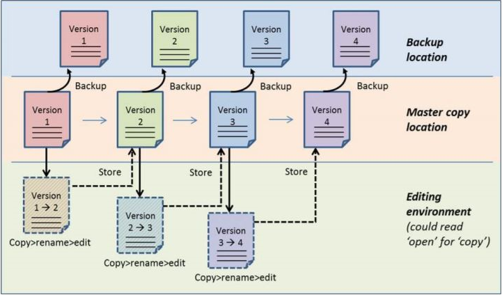
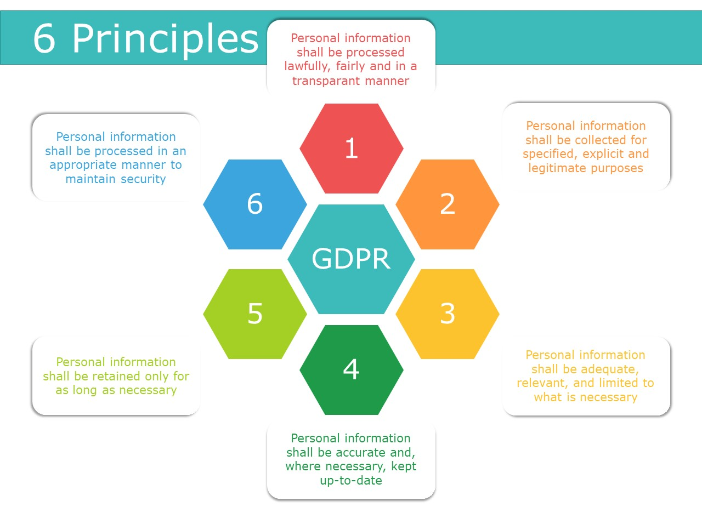
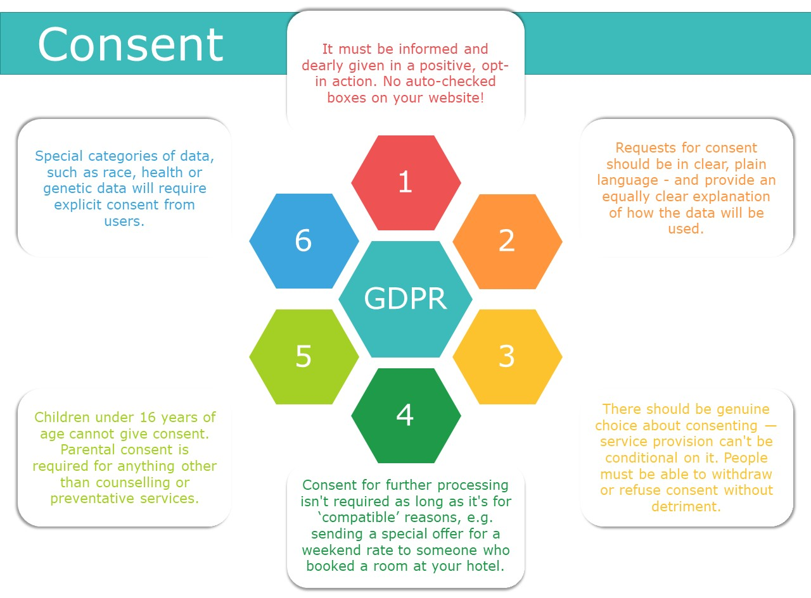

## Lessons and Topics in this Section

- L Data Storage
  - T Introduction
  - T Things that can go wrong
  - T Questions to Consider
  - T Shared or Individual Data
  - T Access Management
  - T External/Cloud Storage
  - T Single or Multiple Storage
  - T Additional or Tailored Services
  - T Store Your Masterfile
  - T Backups
- L Data Security
  - T Introduction
  - T Data Breaches
  - T Prevent Unauthorised Access
  - T Questionnaire: Unauthorised Access to Your Research Data
  - T Legal Agreements and Contracts
  - T Exercise: When to Use Which Legal Contract?
- L Privacy
  - T Privacy in a Nutshell
  - T Privacy-sensitive Data
  - T Six Principles from the European General Data Protection Regulation
  - T Privacy by Design
  - T Exercise: Which Data Breach Is Breached?
  - T Storing Personal Data
  - T Cases on How to Make Personal Data Accessible
  - T Informed Consent

## Data Storage

### Introduction
By now you will have obtained some idea of how to manage your data collection and how to organise and document your research data.

Now we will look into data storage. Since your data is the life blood of your research you want to avoid losing it. Recovery could be slow, costly or even impossible. Therefore, during your research you must ensure that all your research data, regardless of format, are stored securely, backed up and maintained regularly.

Need examples of data storage gone wrong? Watch this short video where John MacInnes, Professor of Sociology, the University of Edinburgh, talks about his experience with a corrupted hard drive and the importance of backups.

<iframe width="560" height="315" src="https://www.youtube.com/embed/1VPBtJAa9Ic" frameborder="0" allow="accelerometer; autoplay; encrypted-media; gyroscope; picture-in-picture" allowfullscreen></iframe>

In this part of the course you will learn to:

- Discern between data storage solutions;
- Choose an appropriate storage solution for your research data.

Bear in mind that technology is evolving rapidly. The suggestions in this course for storage options, technology and regulations is a snapshot that may soon be outdated.

### Things that can go wrong

- **Theft** Open doors, lack of backup, leaks of confidential information
- **Disasters** Fire can happen to anyone. It destroyed university buildings at Southampton, Twente and Delft, causing significant damage to data storage facilities
- **Technical Failure** In extreme conditions, less than 80% of all hard disk drives survive their 4th birthday; SSD's show better results, but are more expensive.

Source: [Backblaze](https://www.backblaze.com/blog/how-long-do-disk-drives-last/)
- **Hacking** Too many users don't see (or care about) standard risks e.g. spoofing, suspicious files, USB-sticks, . . .

### Questions to Consider

Different types of research data require different kinds of storage solutions. To determine which solution fits your research data and how to work with it, there are a number of questions you have to consider:
- Do I want to share my research data with others or not?
- Do I need to have my data stored locally or is external storage allowed? Do I need backups?
- What kind of additional storage services do I want or need?

### Shared or Individual Data

The first question you can ask yourself is whether you are going to use the data only by yourself or if you also want other people to access the data. Some storage solutions are specially set up for sharing data (with the possibility of giving other people read, write or even delete pennission) and others are not. It is good to be prepared for sharing if necessary.

### Access Management

When you use a shared data storage solution you will have to manage the access to your data. If you are working within a larger group, make sure it is clear who is in control of the access rights and who can authorise the use of the data to other individuals. When deciding on a shareable storage location take into account that not every storage solution may have the ability to grant access to people outside your research community.

### External/Cloud Storage

The General Data Protection Regulation (GDPR) only permits personal data to be stored within the EU, unless:
- participants officially consent to the data being stored in another country
- there are adequate and equivalent levels of data protection in place (e.g. the US/EU Privacy Shield agreement).

You should always assess whether you really need to store your data abroad and if agreements with the supplier pennit you to do so. If data needs to be stored outside the EU, information sheets and consent forms should explain why this is necessitated.

Using a cloud service to store files has many advantages. You can access your files from any computer with an intemet connection and in case of a computer crash or theft, your files are not lost. Moreover, it is often possible to recover earlier versions of files and you can easily share files or folders with others. Usually, there is no physical limit on the required storage space as a pay-per-use model is often used. If you need more {or less) storage in a certain period, the pricing can be adjusted.

You can choose a cloud storage service such as Dropbox, Google Drive, OneDrive or Box. However, there are certain risks involved in using a public cloud storage service:
- Storage of data is not guaranteed to take place in Europe. This may mean that others - for example, security services such as the American National Security Agency (NSA) - have access to your files. Also, you do not comply with the General Data Protection Regulation;
- There is no guarantee that the cloud service provider will remain available. What happens to your files if the company is taken over or ceases to exist?
- The conditions of use of a public cloud storage service may include stipulations which give the provider undesired rights {of ownership) to the stored files;
- Leaks in the security of the storage service may be discovered.

You could also consider securing your files by means of encryption. Data security is explained in a different lesson in this course. |

### Single or Multiple Storage

Is single storage sufficient or do you need backups of your data? You can choose a storage solution with a backup facility if you want to be sure that a backup is available and you don't want to make it yourself. Sometimes backups can be an option of the storage device, sometimes IT storage managers will set this up for you.

Criteria to choose for storage with or without backup are:
- **Reliability** Can you be sure that your data will not get lost and is always accessible?
- **Price** Is the storage price an issue? How can you keep the costs as low as possible?

Sometimes it is enough to store your data once which will save you costs. However, keep in mind that this data may get lost in case of a human error (delete or overwrite data) or in case the storage device fails. In all cases make sure that you can reproduce your research data or your experiment, e.g. by having one or more copies stored at another storage location. If you want to be sure that a backup is available and you don't want to take care of it by yourself, you can choose a storage solution which has this backup facility added to it. Sometimes this is an option of the storage device, and if not; then maybe your colleagues from IT may configure this for you.

### Additional or Tailored Services

Decide whether you need any kind of additional or tailored service. Many storage solutions have additional services. They come in different types:
- **Data management solutions** add an extra service layer on top of your data. With this service you can add information/metadata about data which is close to the stored data. Additional information on who, when and how the data was created gives people who want to use the data more context.
- **Cloud based storage** offer 'pay per storage', offer services to share and manage your data and are independent of the device you are working on.
- **Server based storage** can offer a special storage device, used to manage the storage and retrieval of data on or from disk. Some have a built-in data restoring service.
- **External disk devices** can be attached to your experiment device or laptop. You can offload data when there is no network available. And you can offload the data fast, depending on the type of the connection (USB etc.).

### Store Your Masterfile

To decide where to best store your master file, you should consider at what locations you work on your data. Do you have just one location from where you are working? Or do you have several copies of your datasets at different locations, like your PC at home and a laptop and a tablet at work? How do you keep track of what copy contains the most recent updates? When you choose the wrong file, it will take valuable time to merge both documents afterwards.

To avoid confusion, select one place where the master copies of your work are located (see Figure below). All other copies are temporary and should be placed back or synchronized with the master copy location, at regular intervals, fixed times, or after each edit. The master copy location is the standard source from which you get your files. It's important that you do not work from the backup or temporary locations.

### Backups

Keeping backups is probably your most important data management task. There is a real risk of losing data through hard drive failure or accidental deletion. As a reminder, have another look at the data disasters in the Introduction.

#### 3-2-1 backup rule

It is recommended that you keep at least three copies of your data on at least two different media. Keep your storage devices in separate locations with at least one off-site, and check that they work regularly. Backups are logically made from the master copy location, which should hold the most recent and correct version.

#### Backup Strategy

There are several backup strategies to choose from. You either always do a full backup of all files, or perform partial backups. You could consider backing up files with high change rates more often than other files.

The backup strategy you choose depends on:

- How much time a backup takes;
- How much space you have;
- How costly it is;  
- The risk to lose vital information between backups.

Some master copy locations provide automatic backup. In that case, at least inform yourself on the backup scheme used. And make sure that the backup location is secure as your master copy location. Moreover, check if the time and effort needed to restore a backup copy is acceptable for you.

To ensure that your backup system is working properly, you should regularly test it by restoring your data files from your backups to check that you can read them.

#### Backup in Practice
Two professors from the University of Edinburgh talk about backing up their research data.

Professor Lynn Jamieson, Centre for Research on Families and Relationships, talks about the importance of keeping regular backups of research data.

<iframe width="560" height="315" src="https://www.youtube.com/embed/eDclTVUyf_k" frameborder="0" allow="accelerometer; autoplay; encrypted-media; gyroscope; picture-in-picture" allowfullscreen></iframe>

Richard Rodger, Professor of Economic and Social History, talks about the different ways he backs up his research data.

<iframe width="560" height="315" src="https://www.youtube.com/embed/jX-XNo8KbOo" frameborder="0" allow="accelerometer; autoplay; encrypted-media; gyroscope; picture-in-picture" allowfullscreen></iframe>

### Questionnaire: How Much Data Would You Lose if Your Laptop Got Stolen?
[ays_poll id=4]

## Data Security

### Introduction
By now you know more about how to manage your data collection, how to organise and document your research data and where and how to store your data. Now we will take you into the world of keeping data safe and secure.

The loss of scientific data can have a devastating impact on careers. Imagine that you loose all of the research data you've been diligently collecting for four years. Now imagine the knock-on effect: you won't get the PhD you've been working towards, affecting your future career. This nightmare happened to Billy Hinchen, a biologist at Cambridge University. Listen to his story.

<iframe src="https://www.youtube.com/embed/3xlax_Iin0Y" allowfullscreen="" allow="accelerometer; autoplay; encrypted-media; gyroscope; picture-in-picture" height="515px" style="display: inline-block;" width="800px" title=""></iframe>

### Data Breaches

There are several examples of (mainly online) data storage going wrong, leading to leaks of sensitive and personal information.

The picture below shows the biggest cases of data breaches in the past 10 years. They involve some well-known, highly regarded and trusted companies as well as some practices from the academic world.
[Read about the story](http://www.informationisbeautiful.net/visualizations/worlds-biggest-data-breaches-hacks/)

### Prevent Unauthorised Access

Data security may be needed to protect intellectual property rights, commercial interests, or to keep personal or sensitive information safe. Data security involves security of data files, computer system security and physical data security. All three need to be considered to ensure the security of your data files and to prevent unauthorised access, changes, disclosure or even destruction. Data security arrangements need to be proportionate to the nature of the data and the risks involved. Attention to security is also needed when data are to be destroyed.  If data destruction is in order, you need to make sure that the destruction process is irreversible.

Learn about different measures depending on the kind of security you need.

#### Security of Data Files

The information in data files can be protected by:

- Controlling access to restricted materials with encryption. By coding your data, your files will become unreadable to anyone who does not have the correct encryption key. You may code an individual file, but also (part of) a hard disk or USB stick
- Procedural arrangements like imposing non-disclosure agreements for managers or users of confidential data
- Not sending personal or confidential data via email or through File Transfer Protocol (FTP), but rather by transmitting it as encrypted data e.g. [FileSender](https://filesender.belnet.be) or SFTP (SSH File Transfer Protocol)
- Destroying data in a consistent and reliable manner when needed
- Authorisation and authentication: for personal data you have to give very selective access rights to specified individuals.

#### Computer Security Systems

The computer you use to consult, process and store your data, must be secured:

- Use a firewall
- Install anti-virus software
- Install updates for your operating system and software
- Only use secured wireless networks
- Use passwords and do not share them with anyone. If necessary, secure individual files with a password.
- Encrypt your devices (laptop, smartphone, USB stick/disk).

#### Physical Data Security

With a number of simple measures, you can ensure the physical security of your research data:

- Lock your computer when leaving it for just a moment (Windows key + L)
- Lock your door if you are not in your room
- Keep an eye on your laptop
- Transport your USB stick or external hard disk in such a way that you cannot lose it
- Keep non-digital material which should not be seen by others in a locked cupboard or drawer.

#### Data Classification

TODO: **AB** insert videos from website

#### Data That Contain Personal Information

These data should be treated with higher levels of security than data which do not. You will learn more about privacy-sensitive data later in this module.

### Questionnaire: Unauthorised Access to Your Research Data

[ays_poll id=5]

### Legal Agreements and Contracts

Often other people are required to handle your data, or you might be the person that handles other people's data.

To arrange the security of the research data you work with, in many cases you have to make a (legal) agreement with other people involved. These agreements will make explicit permitted uses, retention time, and agreed upon security measures. Find out what legal contracts you can use by studying the figure below. Visit the Guide [Legal instruments and agreements](https://www.uu.nl/en/research/research-data-management/guides/legal-instruments-and-agreements) for more information.

### Exercise: When to Use Which Legal Contract?

You have been acquainted with the different flavors of legal agreements. Is it clear to you when you need which agreement? Please answer the following questions by choosing the right kind of agreement.

<iframe src="https://elearning.bits.vib.be/wp-admin/admin-ajax.php?action=h5p_embed&id=25" width="958" height="649" frameborder="0" allowfullscreen="allowfullscreen"></iframe>

## Privacy
### Privacy in a Nutshell

Privacy is a fundamental right. With regards to privacy, we all have two perspectives:

1. How is your privacy protected?
2. How can we, as a researcher, protect the privacy of the people involved in our research (the data subjects)?

Please consult this [Privacy Reference Card](https://www.eur.nl/sites/corporate/files/2017-11/Privacy_Reference_Card_-why__EUR_Version_1_0.pdf)

### Privacy-sensitive Data
Personal data is any information relating to an identified or identifiable natural person ('data subject'). Personal data is by definition privacy-sensitive and deserves special attention, both from an ethical as from a legal point of view. This applies in the highest degree to certain personal data that is considered particularly sensitive, such as information on race, ethnicity, health, criminal record, sexual orientation, beliefs and economical status. In this part of the course you will leam to:
- Understand the concept of privacy by design;
- Translate the seven principles of data protection from the European General Data Protection Regulation to your own situation;
- Recognise when data is identifiable and lean about measures you can take to protect your participant's privacy;
- Understand how sharing of research data that relates to people can often be achieved using a combination of obtaining consent, anonymising data and regulating data access.

#### Access to Privacy-Sensitive Data

If and how you can make personal data available, depends on the level of sensitivity of your data. The more sensitive, the more restrictions and safeguards need to be put in place to make sure the data does not fall into the hands of unauthorised persons both during and after research.

To determine where the privacy risks lie for your data you will have to do a Data Privacy Impact Assessment (DPIA).

For more information, you can visit the guide [Handling Personal Data](https://www.uu.nl/en/research/research-data-management/guides/handling-personal-data)

Towards the data subjects, you need to be transparent regarding the possible reuse, or retaining of the data for verification requirements, and get their prior consent.

### Six Principles from the European General Data Protection Regulation

The European General Data Protection Regulation (GDPR) outlines how we should work with privacy-sensitive data.

The GDPR outlines six data protection principles you must comply with when processing personal data. These principles relate to:

- **Lawfulness, fairness and transparency** You must process personal data lawfully, fairly and in a transparent manner in relation to the data subject.
- **Purpose limitation** You must only collect personal data for a specific, explicit and legitimate purpose. You must clearly state what this purpose is, and only collect data for as long as necessary to complete that purpose.
- **Data minimisation** You must ensure that personal data you process is adequate, relevant and limited to what is necessary in relation to your processing purpose.
- **Accuracy** You must take every reasonable step to update or remove data that is inaccurate or incomplete. Individuals have the right to request that you erase or rectify erroneous data that relates to them, and you must do so within a month.
- **Storage limitation** You must delete personal data when you no longer need it. The timescales in most cases aren't set. They will depend on your business' circumstances and the reasons why you collect this data.
- **Integrity and confidentiality** You must keep personal data safe and protected against unauthorised or unlawful processing and against accidental loss, destruction or damage, using appropriate technical or organisational measures.

### Privacy by Design

To comply with the six principles from the GDPR, you can implement privacy by design. This means that you design a data management plan with measures on both IT and procedural level.

<iframe src="https://www.youtube.com/embed/iZRcePnhS5I" allowfullscreen="" allow="accelerometer; autoplay; encrypted-media; gyroscope; picture-in-picture" height="515px" style="display: inline-block;" width="800px" title=""></iframe>

### Exercise: Which Data Breach Is Breached?

<iframe src="https://elearning.bits.vib.be/wp-admin/admin-ajax.php?action=h5p_embed&id=26" width="958" height="811" frameborder="0" allowfullscreen="allowfullscreen"></iframe>

### Storing Personal Data

Data is personal if, without disproportional large effort, this leads to the identity of a person. Identifiers can be direct (e.g. name, address) or indirect (e.g. a rare occupation combined with a person's age).

When dealing with personal data, you can take the following (security) measures:
- **Anonymisation**, to the point that the person is no longer identifiable, is one way to avoid having to take strict security measures.
- Replacing the unique identifier of a person with a **pseudonym** instead can provide the means to still be able to link records between sets with information from the same person.
- If it is not feasible to de-identify the data, **encrypting** data is also a way to prevent information on person level to be disclosed. Check [Encryption for Researchers](https://osf.io/nx8km/) for more information.
- **Separating identifiable information** from the other information and storing these and their key separate, is another possible security measure you can take.

Only if the access can be unambiguously be restricted to authorised persons, can data be stored without such measures.

Should you want an elaborate visualisation of what is considered identifiable data, check out the information sheet at the Future Privacy Forum.

[Download the visual guide to practical data de-identification](https://fpf.org/2016/04/25/a-visual-guide-to-practical-data-de-identification/)

<iframe src="https://elearning.bits.vib.be/wp-admin/admin-ajax.php?action=h5p_embed&id=27" width="958" height="512" frameborder="0" allowfullscreen="allowfullscreen"></iframe>

### Cases on How to Make Personal Data Accessible

#### Case 1: YOUth Cohort Study

[YOUth](https://www.uu.nl/en/research/youth-cohort-study) is a large-scale, long-term cohort study. YOUth follows children from before birth until the age of 18. YOUth scientists are not allowed to share YOUth data with other scientists or joumals either publicly or privately themselves. All data requests are evaluated on eligibility criteria by an ethical committee. If granted, the data is given out with a unique pseudonymisation code by a data manager, to prevent data coupling with data from other requests. A specific Data Transfer Agreement (DTA) needs to be signed by the requesting party, which states the limitations towards purpose, storage, and access. The participants are asked to sign a consent form.

#### Case 2: Wings

[Wings](https://wings.esat.kuleuven.be/), a GAP project, seeks to optimize the ICT infrastructure required to support and enable Whole Genome Sequencing. Its aim is to bridge the gap between the low cost of sequencing and the high cost of analysis to enable widespread clinical use of WGS.

### Informed Consent

In the topic *Legal agreements and contracts* you learned about informed consent. Informed consent is very important when working with data which is in any way related to people.

One thing to arrange in your informed consent is the possibility for future use, for verification or reuse. In your informed consent, it is important to be clear on future use of data.

#### Informed Consent for Data Sharing

<iframe src="https://elearning.bits.vib.be/wp-admin/admin-ajax.php?action=h5p_embed&id=28" width="958" height="688" frameborder="0" allowfullscreen="allowfullscreen"></iframe>
