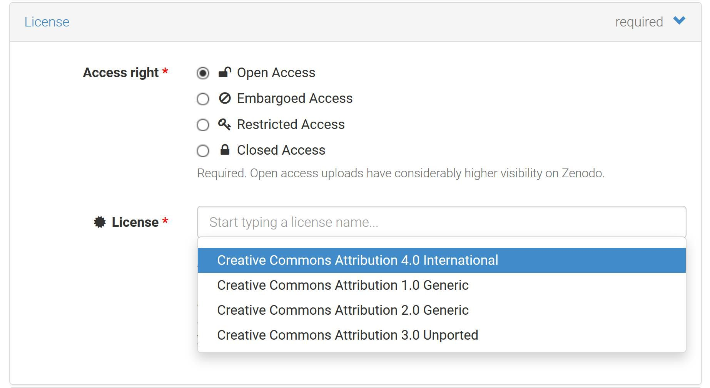
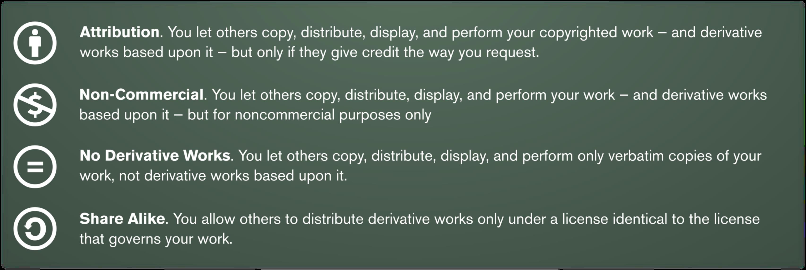

## Lessons and Topics in this Section
- L Sharing Data
  - T Sharing Data - Introduction
  - T Things That Can Go Wrong
  - T Benefits of Data Sharing
  - T Challenges of Data Sharing
  - T Restrictions on Data Sharing
  - T Ways of Sharing Data
  - T Data Repositories
  - T Choosing a Data Repository
  - T Registry of Data Repositories
  - T Exercise: Explore Data Repositories
  - T Questionnaire - How Will You Share Your Data?
  - T Data Journals
  - T Benefits of Publishing in a Data Journal
  - T Different Types of Data Journal
  - T Citing a Dataset
  - T Questionnaire - Data Loss Risks
  - T Licences
  - T Sharing & Licensing Derivative Works
  - T Assigning a Licence to Your Data
  - T The License Selector
  - T Questionnaire - Which Licence Would You Choose?
- L Preserving Data
  - T Preserving Data - Introduction
  - T What to Preserve?
  - T Where to Preserve?
  - T Exercise: Workflow
  - T Accounting for Data of Others
  - T Accounting for Data of Others on Websites
  - T How to Preserve Your Data Correctly
  - T Exercise: Match the Solutions to the Data Loss
- L Sharing & Preserving Data - References
  - T Sharing & Preserving Data - References

## Sharing Data
### Sharing Data - Introduction
Thanks to information and communication technology and globalisation new opportunities arise to exchange results of scientific research - publications and research data - and even of scientific methods and practices. This new way of practising science is called 'open science'.

Open data is a part of this movement towards open science. It is the ambition of universities, governments, funders and publishers to make research data optimally suited for reuse.

There are different reasons why you may not be able to share your research data. Thinking about these issues and challenges when developing your data management plan will help you reflect on such reasons in an early stage.

### Things That Can Go Wrong

#### Irreproducible Results
In January 2020, tbe [BBC](https://www.bbc.com/news/world-us-canada-50989423) reported *Nobel Prize-winning scientist Frances Arnold retracts paper* It was retracted because '*the results were not reproducible, and the authors found data missing from a lab notebook*'. This is merely to illustrate that reproducibility is a big thing. If you ever had problems understanding or reusing your data, perhaps this helps you to imagine better it is no sinecure to ensure the entire world can understand and use your data. If you have indeed ever experienced difficulties to understand or resuse your own data, do not worry -you are certainly not the only one!

#### Data Disasters
The following are real examples where researchers or data centers have lost crucial data. Could any of these ever happen to you? With good planning you could avoid or reduce the impact of such occurrences.

<iframe src="https://elearning.bits.vib.be/wp-admin/admin-ajax.php?action=h5p_embed&id=1" width="958" height="642" frameborder="0" allowfullscreen="allowfullscreen"></iframe>

#### Data Lost Forever

https://www.theatlantic.com/national/archive/2013/12/scientific-data-lost-forever/356422/

#### A Short Story
Not being prepared to share your data can lead to problems in using the data. In this short video, you see what shouldn't happen when a researcher makes a data sharing request! Topics include storage, documentation, and file formats. A made-up, yet not unrealistic story.

https://www.youtube.com/embed/66oNv_DJuPc

### Benefits of Data Sharing

From [Overcoming obstacles to sharing research data](https://www.slideshare.net/brianhole/overcoming-obstacles-to-sharing-research-data) by Brian Hole, licensed under [CC BY 4.0](https://creativecommons.org/licenses/by/4.0/)

Indeed, there are many benefits to sharing data:

#### Access, Re-use & Recognition
- Facilitating future research by allowing others to build on or add to your research data.

From [Facts and Figures for Open Research Data](https://ec.europa.eu/info/research-and-innovation/strategy/goals-research-and-innovation-policy/open-science/open-science-monitor/facts-and-figures-open-research-data_en)
- Enhancing research visibility and impact and increasing citations of research data and of publications based on that data.

- Accelerating Scientific discovery
  - "*Just three weeks after the first viral sequence was published, more than 42 different genomes are available on [Nextstrain](https://nextstrain.org/)*" ([CBC](https://www.cbc.ca/news/health/coronavirus-2019-ncov-science-virus-genome-who-research-collaboration-1.5446948))
  - Using open source tools and public cyberinfrastructure for transparent, reproducible analyses of viral datasets: the [Galaxy Project](https://covid19.galaxyproject.org/)

#### Efficiency
- Increasing your research efficiency by saving time and resources.
- Supporting research integrity and reproducibility

From [nature.com](https://www.nature.com/news/1-500-scientists-lift-the-lid-on-reproducibility-1.19970)

- Preventing duplication of effort by enabling others to use your data.
  - "We're opening everything': Scientists share coronavirus data in unprecedented way to contain, treat disease" - [CBC](https://www.cbc.ca/news/health/coronavirus-2019-ncov-science-virus-genome-who-research-collaboration-1.5446948)
- Respecting conventions regarding filenames and folder structure.

- Efficient use of resources: *'The cost of not having FAIR research data costs the European economy at least **€10.2bn every year***

From [Cost-benefit analysis for FAIR research data](https://op.europa.eu/en/publication-detail/-/publication/d375368c-1a0a-11e9-8d04-01aa75ed71a1/language-en)

#### Quality & Security
- Ensuring the integrity and reproducibility of your research.
- Ensuring that research data and records are accurate, complete, authentic and reliable.
- Enhancing data security and minimising the risk of data loss.

#### Compliance
- Meeting legal obligations, restrictions and codes of conduct.
- Meeting the University policy for research data requirements.
- Meeting funding body grant requirements.
- Meeting publisher requirements for data access.

From [plos.org](https://journals.plos.org/plosone/s/data-availability)

#### Career Recognition
Shift from 'publishing as fast as possible' to 'sharing knowledge as early as possible', adapting reward and evaluation systems.
  - [EC Expert Group on Reward Systems](https://ec.europa.eu/research/openscience/index.cfm?pg=rewards_wg) on Open Science: 'Open Science must become part of the recruitment criteria, career progression and grant assessment procedures for researchers at all levels'.
  - Initial [agreement](http://data.consilium.europa.eu/doc/document/ST-8550-2019-INIT/en/pdf) on Horizon Europe: 'Recognition and reward mechanisms (...), as well as incentives promoting the adoption of open science practices'.

### Challenges of Data Sharing
- **Time and effort** Making data sharable is labor intensive
- **Lack of incentives for sharing data** The current academic culture lacks the incentive structure to properly reward researchers who share their data.
- **Loss of control over data** Scoop, errors in their data, contradictory conclusions, misuse
- **Personal data** Anonymizing/pseudonymizing not always easy. Trade off with utility.

### Restrictions on Data Sharing
Possible reasons for restricting the sharing of data are:
- Privacy
- Otherwise confidential or sensitive data
- Third party data
- Data protected by copyright
- Data commercial/economic valorization potential

Zenodo Access right settings:

### Ways of Sharing Data
- Mail data upon request (Avoid)
- Make them available via a personal or project website
- Add them as supplementary materials to a journal article
- Share data via a data repository/data archive (Preferred)

The first two options are to be avoided at all times. In this part we will only cover sharing via data repositories.

### Data Repositories

In order to preserve, manage, and provide access to your research data, you can deposit your data in a data repository. This has obvious advantages:

- No handling of data reuse queries and managing data access.
- Guarantees in terms of sustainable access to data.
- Make your data discoverable and citable.
- Make your data FAIR

There is a wide variety of data repositories. Most have the option to publish your dataset using a persistent identifier and some provide the service of long-term preservation. Some repositories host data from various disciplines and others are domain- or discipline specific.

### Choosing a Data Repository
- Does your publisher recommend a repository?
- Does your domain have an established repository?
- Other
  - Certificates / ensure long term preservation
  - Licenses / access rights management
  - Provides DOIs / persistent identifiers
  - Metadata standards
  - Costs
  - Criteria for selection of trustworthy repo's

Icons representing attributes of data repositories in [Re3data.org](https://www.re3data.org/), taken from [plos.org](https://journals.plos.org/plosone/article?id=10.1371/journal.pone.0078080)

"[Practical Guide to the International Alignment of Research Data Management](https://www.scienceeurope.org/media/jezkhnoo/se_rdm_practical_guide_final.pdf)" mentions the following selection criteria:
- Provision of Persistent and Unique Identifiers (PIDs)
  - Allow data discovery and identification
  - Enable searching, citing, and retrieval of data
  - Provide support for data versioning
- Metadata
  - Enable finding of data
  - Enable referencing to related relevant information, such as other data and publications
  - Provide information that is publicly available and maintained, even for non published, protected, retracted, or deleted data
  - Use metadata standards that are broadly accepted (by the scientific community)
  - Ensure that metadata are machine retrievable
- Data access and usage licences
  - Enable access to data under well specified conditions
  - Ensure data authenticity and integrity
  - Enable retrieval of data
  - Provide information about licensing and permissions (ideally in machine-readable form)
  - Ensure confidentiality and respect rights of data subjects and creators
- Preservation
  - Ensure persistence of metadata and data
  - Be transparent about mission, scope, preservation policies, and plans (including governance , financial sustainability, retention period, and continuity plan)

### Registry of Data Repositories
You can browse or search for a data repository at [re3data.org](https://www.re3data.org/). This is a global registry of research data repositories covering different academic disciplines. You can search or browse by subject, content type or country. You can filter the search and browse results on criteria for choosing a data repository as described above.

Here are some well-known and generic repositories:

- **[Zenodo](https://zenodo.org/)** A repository that enables researchers, scientists, EU projects and institutions to share and showcase multidisciplinary research results (data and publications) that are not part of the existing institutional or subject-based repositories of the research communities;
- **[Dryad](http://www.datadryad.org/)** A curated general-purpose repository that makes the data underlying scientific publications discoverable, freely reusable and citable. Dryad has integrated data submission for a growing list of journals;
- **[DataverseNL](https://dataverse.nl/dataverse/UU)** For any kind of data with a designated service for Utrecht University;
- **[Open Science Framework (OSF)](https://osf.io/)** A scholarly commons to connect the entire research cycle. It is part network of research materials, part version control system, and part collaboration software;
- **[Figshare](https://figshare.com/)** A repository that allows researchers to publish all of their research outputs in an easily citable, sharable and discoverable manner.
- **[Elixir Core Data Resources](https://elixir-europe.org/platforms/data/core-data-resources)** ELIXIR Core Data Resources are a set of European data resources of fundamental importance to the wider life-science community and the long-term preservation of biological data.

### Exercise: Explore Data Repositories

You have just learned about the existence of a global registry of research data repositories that covers repositories from different academic disciplines.

[re3data.org](https://www.re3data.org/) makes it possible to search for a repository that meets your criteria.

<iframe src="https://elearning.bits.vib.be/wp-admin/admin-ajax.php?action=h5p_embed&id=30" width="958" height="1532" frameborder="0" allowfullscreen="allowfullscreen"></iframe>

Specifically for the life sciences, make sure you check [ELIXIR Deposition Databases for Biomolecular Data](https://elixir-europe.org/platforms/data/elixir-deposition-databases)

### Questionnaire - How Will You Share Your Data?

You have learned by now that there are various ways to share and make your data available for reuse.

We are very interested to know what you will do with (most of) your data.

When you choose one of the options, no strings attached, we will show you the responses of other researchers in this course. All responses will be processed anonymous.

[ays_poll id=6]

### Data Journals

Data journals are publications whose primary purpose is to publish datasets. They enable you as an author to focus on the data itself, rather than producing an extensive analysis of the data which occurs in the traditional journal model. Fundamentally, data journals seek to:

- Promote scientific accreditation and reuse;
- Improve transparency of scientific methods and results;
- Support good data management practices;
- Provide an accessible and permanent route to the dataset.

### Benefits of Publishing in a Data Journal

Publishing in a data journal may be of interest to researchers and data producers for whom data is a primary research output. In some cases, the publication cycle may be quicker than that of traditional journals, and where there is a requirement to deposit data in an "approved repository", long-term curation and access to the data is assured. Publishing a data paper may be regarded as best practice in data management as it:

- Includes an element of peer review of the dataset;
- Maximises opportunities for reuse of the dataset;
- Provides academic accreditation for data scientists as well as for front-line researchers.

(source: [ANDS Guide](http://www.ands.org.au/working-with-data/publishing-and-reusing-data/data-journals))

### Different Types of Data Journal

There are data journals for various disciplines and also more general data journals exist. A widespread standard PID is the DOI. DOI stands for 'Digital Object Identifier'. A DOI is an alphanumeric string assigned to an object which allows for an object to be identified over time. Often a DOI will be presented as a link which looks like: https://doi.org/10.1109/5.771073. There are other identifiers available which some repositories may use instead. If you are depositing in a reputable repository then you should be given some type of persistent identifier which you can use to cite and link to your data.

Examples of generic data journals:

- [Scientific Data](http://www.nature.com/sdata/about)  
- [Data in Brief](http://www.journals.elsevier.com/data-in-brief)   
- [Data Science Journal](http://www.codata.org/publications/data-science-journal)

Examples of disciplinary data journals:

- [Open archaeology data](https://openarchaeologydata.metajnl.com/);
- [Earth System Science Data](https://www.earth-system-science-data.net/);
- [Research Data Journal for the Humanities and Social Sciences](https://brill.com/view/journals/rdj/rdj-overview.xml).

<iframe src="https://elearning.bits.vib.be/wp-admin/admin-ajax.php?action=h5p_embed&id=31" width="958" height="466" frameborder="0" allowfullscreen="allowfullscreen"></iframe>

### Citing a Dataset

Citations to your data can add to your academic impact. A citation should include enough information so that the exact version of the data being cited can be located. Including a Persistent Identifier (PID) in the citation ensures that even if the location of the data changes, the PID will always link to the data that were used. You can indicate in your (Creative Commons) licence or user agreement that you want your data cited when reused. Data citations work just like book or journal article citations and can include the following information:

- Author;
- Year;
- Dataset title;
- Repository;
- Version;
- Persistent IDentifier (PID), often works as a functional link/URL.

#### Examples

A widespread standard PID is the DOI. DOI stands for 'Digital Object Identifier'. A DOI is an alphanumeric string assigned to an object which allows for an object to be identified over time. Often a DOI will be presented as a link which looks like: https://doi.org/10.1109/5.771073. There are other identifiers available which some repositories may use instead. If you are depositing in a reputable repository then you should be given some type of persistent identifier which you can use to cite and link to your data.

Irino, T; Tada, R (2009): Chemical and mineral compositions of sediments from ODP Site 127‐797. Geological Institute, University of Tokyo. http://dx.doi.org/10.1594/PANGAEA.726855

#### Tips

- Tip1: Get a PID at the data repository of your choice.
- Tip2: Is your PID a DOI and do you want to cite it in the format of a specific journal? Use the [DOI formatter](https://citation.crosscite.org/) from CrossCite.

<iframe src="https://elearning.bits.vib.be/wp-admin/admin-ajax.php?action=h5p_embed&id=32" width="958" height="545" frameborder="0" allowfullscreen="allowfullscreen"></iframe>

### Questionnaire - Data Loss Risks
Think about your own data. Which risk of losing data will be most difficult to solve for your data?

When you give your reply, we will show you the responses of other researchers in this course.

[ays_poll id=8]

### Licences

Licences let potential users know in advance what they can do with shared data. When you are depositing data in the data repository of your choice, you can select which licence you want.

**Standard licences** have Terms and conditions are already defined. They might not cover very specific cases but have multiple advantages:
- Simplicity
- transparency
- Machine readability
- Interoperability

Examples of standard licences are
- Creative Commons (CC) and Open Data Commons (ODC).
- Open Government licenses. E.g. UK Open Government license.
- Open software licenses (e.g. GNU General Public License, Apache).

Sometimes, however  research partner, funder, research institution, or data repository may require a **tailor-made licence**. The most common reason to adopt them is the commercial value of data. These tailor-made licences are typically written by the publisher or adapted from a standard license by adding / adaption conditions. They may increase complexity for users, and decrease interoperability.

#### Additional Resources

- [About Creative Commons Licenses](https://guides.library.queensu.ca/c.php?g=704790&p=5014948)

### Sharing & Licensing Derivative Works
Whenever licensing a work or dataset that contains data already licensed, do not claim rights you do not hold. If the derived data was licensed with conditions:
- Copyleft / SA: license the derived dataset in the same way.
- NC: do not charge for the derived dataset.

### Assigning a Licence to Your Data

Assigning licences to data can also have disadvantages. Licences are static and do not change with the quick developments in the field of research data. Therefore, some data repositories work with a CC0 licence whereby no rights are reserved. Instructions regarding use are completed with codes of conduct, which may be adapted more easily.

A short movie explaining the different Creative Commons elements is shown below. Remember that sharing without a licence can still lead to conflicts.

https://www.youtube.com/embed/HyWdeNQ7fo0

Here's a video from Kingsborough Community College that shows how you can add a CC licence to your work.

https://www.youtube.com/embed/5QxkuuiZwRU

### The License Selector
There is a nice tool that you can use when you want to select a licence, called the [License selector](http://ufal.github.io/public-license-selector/)

(from [Sharing and preserving data](https://osf.io/kdypa/), Research Department - University Library (Book Tower), Ghent University)

(from [Sharing and preserving data](https://osf.io/kdypa/), Research Department - University Library (Book Tower), Ghent University)

### Questionnaire - Which Licence Would You Choose?
We are very interested to know what license you would choose if you were to share the underlying research data of your most recent publication.  

An explanation for each license can be found by clicking on the links below.

- CC BY: [Attribution](https://creativecommons.org/share-your-work/licensing-types-examples/licensing-examples/#by)
- CC BY-SA: [Attribution ShareAlike](https://creativecommons.org/share-your-work/licensing-types-examples/licensing-examples/#sa)
- CC BY-ND: [Attribution-NoDerivs](https://creativecommons.org/share-your-work/licensing-types-examples/licensing-examples/#nd)
- CC BY-NC: [Attribution-NonCommercial](https://creativecommons.org/share-your-work/licensing-types-examples/licensing-examples/#nc)
- CC BY-NC-SA: [Attribution-NonCommercial-ShareAlike](https://creativecommons.org/share-your-work/licensing-types-examples/licensing-examples/#by-nc-sa)
- CC BY-NC-ND: [Attribution-NonCommercial-NoDerivs](https://creativecommons.org/share-your-work/licensing-types-examples/licensing-examples/#by-nc-nd)
- CC0: [Public Domain](https://creativecommons.org/share-your-work/public-domain/)

When you give your reply, we will show you the responses of other researchers in this course.

[ays_poll id=7]

## Preserving Data

### Preserving Data - Introduction
For clarity's sake, preserving data does not equal storing or backing up your data. When we use the words data preservation, then without exception we are talking about a milestone version of your data which is not in active use anymore. As it's not subject to change, one could compare it to a mosquito caught in amber.

Research should be transparent and you should always be able to revert back to your data if necessary and be able to show others how you came to your results. Therefore, your research data with all information reasonably necessary for verification needs to be preserved.

With well-managed and preserved research data, you can defend yourself against allegations of mistakes. You can also prevent wrong conclusions from further spreading into the scientific community if there really are mistakes.

The main reasons for data preservation are
- Ensuring that your research can be verified and reproduced;
- Maintaining data for future reuse (e.g. further research/teaching)

Additionally, it can also be your own wish or that of your university, funder or journal.

#### Verification

For the FWO, the emphasis is on long-term data preservation and management. The data are targeted to be preserved for a period of at least five years from the end of the research. The DMP related questions in the application form are related to this central aspect.

#### Reuse

It may be worthwhile to make (part of) your data available for a longer period of time and/or for a wider audience. Data which are suitable to keep for reuse are interpretable data on which new research can be based,  independent of the publication.

On the one hand, making research data reusable will need extra effort. On the other hand, possible reuse, even by your future self, might bring you lots of benefits and credits. Consider if your data is worth the effort of making it reusable or if preserving and archiving for verification is enough.

### What to Preserve?

Others should be able to understand what you did. It is not enough to just provide data. Without associated information, research data quickly become useless. For all data selected for preservation, you should therefore keep a 'data package' consisting of:
- **Research data** files themselves
  - primary (raw) data
  - secondary (processed) data
  - Sometimes, other criteria may help you decide on whether to include particular data or not, e.g.
    - Legal/ethical requirements to keep data for a specified retention period (e.g. for clinical trials)
    - Funder, institutional or publisher policies
    - High potential reuse value of the data
    - Great scientific, historical, or cultural significance of the data
    - The data are unique and/or cannot easily be re created.
    - The benefits outweigh the costs of data preservation.
- **Meaningful file/folder structure** An overview of what the contents of the data package stating what file contains what information, and how these are related.
- **Documentation and metadata** to ensure data remains findable, comprehensible, and (re)usable:
  - Computer code/scripts;
  - Protocols;
  - Lab journals;
  - Metadata and/or codebooks describing the data;
  - Collection methods;
  - Procedures;
  - Experimental protocol;
  - Your research question;
  - Stimuli used;
  - Sample descriptions.

This is especially practical if the data package can be found and used on its own account. This is the case if it is published in a data repository or data journal as a data package for reuse.

Do not forget to explicitly state who is responsible for the content of the data package, who is to be contacted in case of a request for access, and under what conditions access is granted.

#### Alternatives to preserving raw data

If preserving your raw data poses problems, alternatives can also ensure verfication. For instance, transcripts of recorded interviews could hold all important information and may be less privacy-sensitive, so it is reasonable to preserve those instead of the recordings themselves. Also, if raw data is very large, preserving your data only in some processed form could be an alternative. Combined with, for instance, a demonstrable quality check on the processing.

### Where to Preserve?

Research data and documentation selected for retention should be kept in a suitable location and in a secure manner to ensure that they remain available and usable beyond the end of your project, with appropriate access rights:
- **Data repository** This is the preferred way.
- **In house** Sometimes it is not be possible/appropriate to deposit data in an external repository, e.g. for legal, ethical, contractual, practical, or other reasons.

As you have just learned, preserving your data may serve the purpose of verification or  reuse. Public data repositories cater to both needs. In addition, they handle requests to view or use your data which means you do not have to take care of such requests yourself.

### Exercise: Workflow
In the example below, you find a workflow for experimental research. What information can be made available in what place? Drag the items on the right to the correct place in the figure. Please note that some items can be used more than once.

<iframe src="https://elearning.bits.vib.be/wp-admin/admin-ajax.php?action=h5p_embed&id=34" width="958" height="440" frameborder="0" allowfullscreen="allowfullscreen"></iframe>

### Accounting for Data of Others

If you are permitted to use data from other parties, you will have to account for those as well if your research is to be verifiable and reproducible by others. You may recognise this from chapter 1 of this course: Data collection: Discover existing data, weblecture 'Assessing usefulness of research data of others'.

You have the following options:

- If the used data is preserved correctly somewhere for the coming ten years, refer to the data repository in question.
- If it is not taken care of, contact the responsible persons, negotiate correct preservation in a data repository for ten years, and refer to that repository.
- If this isn't possible, try to arrange a local copy that you preserve yourself;
- If this isn't allowed, you will not be able to present the data in case of questions. Therefore, you should question yourself whether you can actually use the data.

### Accounting for Data of Others on Websites

If you find interesting information on a website that you want to refer to, it is possible that this information will not be future proof.

The link or web address might change over time (link rot). Or the information on a website is updated, changed or replaced with other content (content drift).

It is possible to archive web pages on a web archive like the [Internet Archive](https://archive.org/web/). You can capture a web page as it appears now for use as a trusted citation in the future (save a page). You will get an alternative link, pointing to the archived, static version of the page. Use this alternative link as a reference to the online information.

### How to Preserve Your Data Correctly

In order for the data to survive for the long term, an active preservation regime has to be applied. The bad news is, data automatically gets lost over time.

There are five main ways your data can be lost:

- Digital sources degrade over time ('bit rot');
- File formats and software become outdated;
- The media on which your data is stored becomes outdated or defective;
- Disaster strikes the storage location;
- The person that understands the data finds another job or data simply becomes forgotten.

In this video below you will learn how to minimise the risk of losing data. You are also given good preservation practices.

https://www.youtube.com/embed/qENaO0Lk6eo

### Exercise: Match the Solutions to the Data Loss

From the weblecture you learned how to prevent data loss. Can you recall all applicable active regimes, as explained in the weblecture?

1. Have multiple copies. Use a checksum to identify faulty copies
2. Use preferred file formats that can be opened by a wide range of software. Update the file format to a current one.
3. Move data to fresh media well before the media's expiration date.
4. Have multiple copies. Move data to fresh media well before the media's expiration date.
5. Document your data well.
6. Advertise the content in a data catalogue.

<iframe src="https://elearning.bits.vib.be/wp-admin/admin-ajax.php?action=h5p_embed&id=35" width="958" height="692" frameborder="0" allowfullscreen="allowfullscreen"></iframe>

## Sharing & Preserving Data - References

### Sharing & Preserving Data - References
- Baker, M. (2016, May 25). 1,500 scientists lift the lid on reproducibility. Retrieved from [https://www.nature.com/news/1-500-scientists-lift-the-lid-on-reproducibility-1.19970](https://www.nature.com/news/1-500-scientists-lift-the-lid-on-reproducibility-1.19970)
- Crowe, K. (2020, February 1). 'We're opening everything': Scientists share coronavirus data in unprecedented way to contain, treat disease. Retrieved from [https://www.cbc.ca/news/health/coronavirus-2019-ncov-science-virus-genome-who-research-collaboration-1.5446948](https://www.cbc.ca/news/health/coronavirus-2019-ncov-science-virus-genome-who-research-collaboration-1.5446948)
- Facts and Figures for open research data. (2020, July 17). Retrieved from [https://ec.europa.eu/info/research-and-innovation/strategy/goals-research-and-innovation-policy/open-science/open-science-monitor/facts-and-figures-open-research-data_en](https://ec.europa.eu/info/research-and-innovation/strategy/goals-research-and-innovation-policy/open-science/open-science-monitor/facts-and-figures-open-research-data_en)
- Hole, B. (2014). 'Overcoming Obstacles to Sharing Research Data' (Slideshare Presentation). Retrieved from [https://www.slideshare.net/brianhole/overcoming-obstacles-to-sharing-research-data](https://www.slideshare.net/brianhole/overcoming-obstacles-to-sharing-research-data) (Accessed: 17 July 2020). Licensed under [CC BY 4.0](https://creativecommons.org/licenses/by/4.0/)
- PwC EU Services. (2019, 16 January). Cost-benefit analysis for FAIR research data. Retrieved from [https://op.europa.eu/en/publication-detail/-/publication/d375368c-1a0a-11e9-8d04-01aa75ed71a1/language-en](https://op.europa.eu/en/publication-detail/-/publication/d375368c-1a0a-11e9-8d04-01aa75ed71a1/language-en)
- Science Europe. (2018, November) ‘Practical Guide to the International Alignment of Research Data Management’: D/2018/13.324/4. Retrieved from [https://www.scienceeurope.org/media/jezkhnoo/se_rdm_practical_guide_final.pdf](https://www.scienceeurope.org/media/jezkhnoo/se_rdm_practical_guide_final.pdf)
