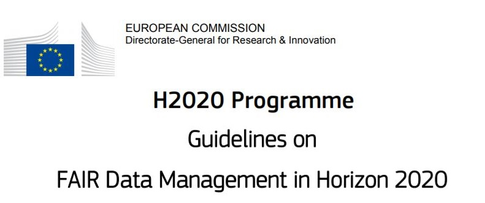

<!-- This is a comment. -->

## Why manage your research data?

In this video Katarzyna Biernacka explains what data in a research context is.

<iframe src="https://www.youtube.com/embed/XCckz_4mlhU" allowfullscreen="" allow="accelerometer; autoplay; encrypted-media; gyroscope; picture-in-picture" height="515px" style="display: inline-block;" width="800px" title=""></iframe>

CC-BY-4.0: Katarzyna Biernacka, HU Berlin & [Discipline Workshops 2019](http://www.discipline-workshops.com/)

Managing your data effectively is crucial to the success of your research. This doesn't only apply to the immediate context of your thesis or publications. Managing your data is a practice that will benefit you throughout your research career. The following list gives an overview of what benefits are evident.

1. **Access, Re-use & Recognition**
   * Facilitating future research by allowing others to build on or add to your research data.
   * Increased citations of research data and of publications based on that data.
2. **Efficiency**
   * Increasing your research efficiency by saving time and resources.
   * Preventing duplication of effort by enabling others to use your data.
3. **Quality & Security**
   * Ensuring the integrity and reproducibility of your research.
   * Ensuring that research data and records are accurate, complete, authentic and reliable.
   * Enhancing data security and minimising the risk of data loss.
4. **Compliance**
   * Meeting legal obligations, restrictions and codes of conduct.
   * Meeting the University policy for research data requirements.
   * Meeting funding body grant requirements.
   * Meeting publisher requirements for data access.

## A case to consider

Marleen is an early career researcher. She completed her PhD about four years ago and is now a postdoctoral research fellow at a different university. Since she obtained her PhD, she has published a number of journal articles based on her doctoral research. Her papers have been cited widely in the literature of her field. But just recently a fellow researcher has questioned her findings. He has gone so far as to suggest that the data on which her research was based is inaccurate. One implication is that the data could even have been falsified. Marleen is confident that her research is valid and that her data is accurate.

- What steps could Marleen take to verify her research findings?
- What evidence would she need to demonstrate that she hasn't falsified her data?

Think about your own research. If someone accused you of research misconduct, would you be in a position to defend your research and reputation? List some strategies you could implement right now that would assist you, should you ever find yourself in Marleen’s situation.

## Data disasters – postcards from the edge

The following are real examples where researchers or data centers have lost crucial data. Could any of these ever happen to you? With good planning you could avoid or reduce the impact of such occurrences.

TODO: add H5P 

<iframe src="https://lll-platform.uu.nl/mod/hvp/embed.php?id=2295" width="800px" height="664" frameborder="0" allowfullscreen="allowfullscreen"></iframe>

## University policy framework for research data

For the Flemish universities, it is important that all researchers honour scientific standards, including the meticulous and ethical treatment of research data.
This policy is intended to set out parameters to safeguard the quality, availability and accessibility of research data within any Flemish university. It provides a basis for evaluating compliance with laws, regulations and codes of conduct. The policy also clarifies the various roles and responsibilities of university staff in managing research data.

The highlights of the policy are:
* Archive (relevant and valuable) research data for a minimum of ten years;
* Store data in a structure that is suitable for long-term preservation and later consultation;
* Provide metadata to describe the data with sufficient clarity to ensure they are findable for further research;
* Make archived research data available for access and reuse at and outside VIB insofar as is reasonably possible;
* Each individual researcher / research leader is responsible to draw up a Data Management Plan (DMP) at the start of the research project and to follow up the agreements made in this plan;
* Scientific directors are responsible for the implementation and monitoring of the University policy framework and for drawing up additional faculty guidelines to this end if needed.

Links to the Policy Frameworks of the Flemish Universities

* [Policy Framework from Ghent University](https://www.ugent.be/en/research/datamanagement/rdm-policy.pdf/at_download/file)

* [Policy Framework from KU Leuven](https://www.kuleuven.be/english/research/scholcomm/rdm/policy-plan-rdm-ku-leuven-2014)

* [Policy Framework from UHasselt](https://bibliotheek.uhasselt.be/sites/default/files/uploads/RDM/20180517_UH_RDM_PolicyPlan_NL.pdf)

* [Policy Framework from VUB](https://vub.sharepoint.com/sites/ORG-RandD/SitePages/RESEARCH-DATA-MANAGEMENT.aspx?web=1)

## Policy in Practise

In this short video Prof. dr. Chantal Kemner explains the importance of good data management for Utrecht University. Chantal is full professor of Biological Developmental Psychology in Utrecht at the faculty of social sciences and since 2013 also at the UMCU.

<iframe src="https://www.youtube.com/embed/f48l4Uca9nA" allowfullscreen="" allow="accelerometer; au
toplay; encrypted-media; gyroscope; picture-in-picture" height="515px" style="display: inline-block
;" width="800px" title=""></iframe>

## Funder requirements

More and more research funders explicitly require you to consider the management and publication of your research data, both during and after your research project. The European Commission and the Flemish funders FWO have explicit policies on research data management.

**European Commission - Horizon 2020**

The European Commission wants “Horizon 2020 beneficiaries to make their research data findable, accessible, interoperable and reusable (FAIR), to ensure it is soundly managed. Good research data management is not a goal in itself, but rather the key conduit leading to knowledge discovery and innovation, and to subsequent data and knowledge integration and reuse.” Horizon 2020 is the biggest research and innovation program of the European Commission.

**FWO**

FWO states that “FWO has made data management a key element of its policy for all support channels provided by the FWO. The FWO expects researchers to pay due attention to this dimension before, during and for at least five years after their research.”

[FWO Overview Data Management Plan](https://www.fwo.be/en/the-fwo/organisation/data-management-plan/)

## Funder guidelines and templates

Most funders require you to write a Data Management Plan. A DMP outlines all key aspects of collecting, storing and managing research data during and after a project. For this they provide you with guidelines, forms, templates and examples. For more information you can download the documents under Resources or check out the websites. You can also contact your faculty Research Support Office:

- [EC – Horizon 2020: guidelines](https://ec.europa.eu/research/openscience/index.cfm)
- [FWO template](https://www.fwo.be/media/1023898/fwo-dmp-templatedocx.docx)

## Writing a data management plan

By now it should be clear that data needs to be properly managed throughout its lifecycle. The most effective way to do this is to create a Data Management Plan (DMP). This will take into account all the stages of the research data lifecycle. As outlined earlier, each individual researcher or research leader is responsible to draw up a data management plan. He or she should do this at the start of the research project. And during the research you should actively follow up on the agreements made in this plan.

Think about our early career researcher Sasha (introduced in ‘Why manage your research materials and data?’) who needs to defend herself against accusations of researcher misconduct. As well as defending against misconduct accusations, some additional benefits of creating a data management plan include:

- Accessing your data more easily;
- Prioritising and balancing activities relating to research data collection and storage;
- Mitigating data loss;
- Reaching agreement between stakeholders about ownership of data;
- Reducing time and effort in the long term.
The good news is that this online training will take you through the necessary steps to create a plan during the subsequent modules.

## Getting started with DMPonline

We offer you DMPonline to create your Data Management Plan. DMPonline is an international online service that guides you in creating a DMP by answering a series of questions about your research project. It allows you to create, share, store, and revise your data management plans online. You will be asked to complete different sections of your DMP as we go through the other modules. As a result you will have written your own data management plan at the end of this course.

With DMPonline you can:

* Write your plan and keep it up-to-date
  * You can easily update your DMP throughout the lifecycle of a project

* Share plans online
  * DMPonline allows collaborative access, so you can share your DMP with other researchers, within and outside of your university.

* Create multiple plans
  * You can store different DMPs for different projects. And you can make a copy of a previous plan as the basis for writing a new one.

* Download plans
  * You can download your DMP in a variety of formats.

We recommend that graduate researchers share their data management plans with their supervisor(s).

<iframe src="https://player.vimeo.com/video/251506151" allowfullscreen="" allow="accelerometer; autoplay; encrypted-media; gyroscope; picture-in-picture" height="515px" style="display: inline-block;" width="800px" title=""></iframe>

## About RDM Support

RDM Support provides all kinds of research data management assistance to researchers of VIB in all stages of their research. This can range from one-off individual advice to large-scale infrastructure coordination.

You can find an overview of the contact details of the main host institutions for DMP related questions and guidance are as follows:

* AMS: Bart Cambré (bart.cambre@ams.ac.be)
* Hogere Zeevaartschool: Marc Vervoort (marc.vervoort@hzs.be)
* ITG: Ann Verlinden (averlinden@itg.be)
* KU Leuven: RDM.ub@kuleuven.be
* UAntwerpen: RDM-support@uantwerpen.be
* UGent: Myriam Mertens and Annik Leyman (rdm.support@ugent.be)
* UHasselt: Sadia Vancauwenbergh (rdm@uhasselt.be)
* Vlerick: Eva Cools (eva.cools@vlerick.com)
* VUB: dmp@vub.be
* VIB: bits@vib.be
