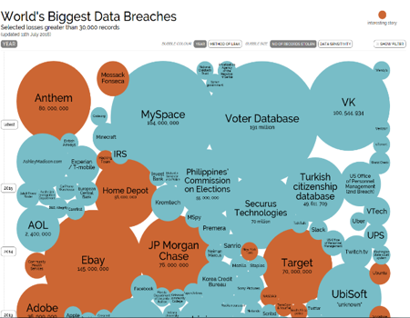

## Data Security

By now you know more about how to manage your data collection, how to organise and document your research data and where and how to store your data.

Now we will take you into the world of keeping data safe and secure.

### Loss of Data, Loss of Academic Career

The loss of scientific data can have a devastating impact on careers. Imagine that you loose all of the research data you've been diligently collecting for four years. Now imagine the knock-on effect: you won't get the PhD you've been working towards, affecting your future career. This nightmare happened to Billy Hinchen, a biologist at Cambridge University. Listen to his story.

<iframe src="https://www.youtube.com/embed/3xlax_Iin0Y" allowfullscreen="" allow="accelerometer; autoplay; encrypted-media; gyroscope; picture-in-picture" height="515px" style="display: inline-block;" width="800px" title=""></iframe>

### Data Breaches

There are several examples of (mainly online) data storage going wrong, leading to leaks of sensitive and personal information.

The picture below shows the biggest cases of data breaches in the past 10 years. They involve some well-known, highly regarded and trusted companies as well as some practices from the academic world.
[Read about the story](http://www.informationisbeautiful.net/visualizations/worlds-biggest-data-breaches-hacks/)

### Prevent Unauthorised Access

Data security may be needed to protect intellectual property rights, commercial interests, or to keep personal or sensitive information safe. Data security involves security of data files, computer system security and physical data security. All three need to be considered to ensure the security of your data files and to prevent unauthorised access, changes, disclosure or even destruction. Data security arrangements need to be proportionate to the nature of the data and the risks involved. Attention to security is also needed when data are to be destroyed.  If data destruction is in order, you need to make sure that the destruction process is irreversible.

Learn about different measures depending on the kind of security you need.

#### Security of Data Files

The information in data files can be protected by:

- Controlling access to restricted materials with encryption. By coding your data, your files will become unreadable to anyone who does not have the correct encryption key. You may code an individual file, but also (part of) a hard disk or USB stick
- Procedural arrangements like imposing non-disclosure agreements for managers or users of confidential data
- Not sending personal or confidential data via email or through File Transfer Protocol (FTP), but rather by transmitting it as encrypted data e.g. [FileSender](https://filesender.belnet.be) or SFTP (SSH File Transfer Protocol)
- Destroying data in a consistent and reliable manner when needed
- Authorisation and authentication: for personal data you have to give very selective access rights to specified individuals.

#### Computer Security Systems

The computer you use to consult, process and store your data, must be secured:

- Use a firewall
- Install anti-virus software
- Install updates for your operating system and software
- Only use secured wireless networks
- Use passwords and do not share them with anyone. If necessary, secure individual files with a password.
- Encrypt your devices (laptop, smartphone, USB stick/disk).

#### Physical Data Security

With a number of simple measures, you can ensure the physical security of your research data:

- Lock your computer when leaving it for just a moment (Windows key + L)
- Lock your door if you are not in your room
- Keep an eye on your laptop
- Transport your USB stick or external hard disk in such a way that you cannot lose it
- Keep non-digital material which should not be seen by others in a locked cupboard or drawer.

#### Data Classification

TODO: what to do with classified data. UU refers to https://intranet.uu.nl/en/data-classification

#### Data That Contain Personal Information

These data should be treated with higher levels of security than data which do not. You will learn more about privacy-sensitive data later in this module.

### Your Experience with Unauthorised Access to Your Research Data

TODO: implementation form widget

We are interested to know if you have ever experienced unauthorized access to any of your research data. When you give your reply, we will show you an overview with the responses of other researchers in this course. All responses will be processed anonymously.

[(1)] No, I am sure about that
[(2)] Not that I am aware of
[(3)] Yes, without much consequences
[(0)] Yes, with severe consequences

### Legal Agreements and Contracts

Often other people are required to handle your data, or you might be the person that handles other people’s data.

To arrange the security of the research data you work with, in many cases you have to make a (legal) agreement with other people involved. These agreements will make explicit permitted uses, retention time, and agreed upon security measures. Find out what legal contracts you can use by studying the figure below. Visit the Guide [Legal instruments and agreements](https://www.uu.nl/en/research/research-data-management/guides/legal-instruments-and-agreements) for more information

For tailored advice and templates, contact TODO: add link

### When to Use Which Legal Contract?

You have been acquainted with the different flavors of legal agreements. Is it clear to you when you need which agreement? Please answer the following questions by choosing the right kind of agreement.

TODO: add quiz or H5P quiz - check 03_WhenUseWhichContract_1a.png  > 03_WhenUseWhichContract_3b.png

## Privacy

### Privacy-sensitive Data
Personal data is any information relating to an identified or identifiable natural person (‘data subject’). Personal data is by definition privacy-sensitive and deserves special attention, both from an ethical as from a legal point of view. This applies in the highest degree to certain personal data that is considered particularly sensitive, such as information on race, ethnicity, health, criminal record, sexual orientation, beliefs and economical status. In this part of the course you will leam to:
- Understand the concept of privacy by design;
- Translate the seven principles of data protection from the European General Data Protection Regulation to your own situation;
- Recognise when data is identifiable and lean about measures you can take to protect your participant's privacy;
- Understand how sharing of research data that relates to people can often be achieved using a combination of obtaining consent, anonymising data and regulating data access.

### Privacy in a Nutshell

Privacy is a fundamental right. With regards to privacy, we all have two perspectives:

1. How is your privacy protected?
2. How can we, as a researcher, protect the privacy of the people involved in our research (the data subjects)?

Please consult this [Privacy Reference Card](https://www.eur.nl/sites/corporate/files/2017-11/Privacy_Reference_Card_-why__EUR_Version_1_0.pdf)

### Six Principles from the European General Data Protection Regulation

The European General Data Protection Regulation (GDPR) outlines how we should work with privacy-sensitive data.

TODO: create working infographics with images
see http://gdprcoalition.ie/infographics
TODO: create HP5 lesson

The GDPR outlines six data protection principles you must comply with when processing personal data. These principles relate to:

- **Lawfulness, fairness and transparency** You must process personal data lawfully, fairly and in a transparent manner in relation to the data subject.
- **Purpose limitation** You must only collect personal data for a specific, explicit and legitimate purpose. You must clearly state what this purpose is, and only collect data for as long as necessary to complete that purpose.
- **Data minimisation** You must ensure that personal data you process is adequate, relevant and limited to what is necessary in relation to your processing purpose.
- **Accuracy** You must take every reasonable step to update or remove data that is inaccurate or incomplete. Individuals have the right to request that you erase or rectify erroneous data that relates to them, and you must do so within a month.
- **Storage limitation** You must delete personal data when you no longer need it. The timescales in most cases aren't set. They will depend on your business’ circumstances and the reasons why you collect this data.
- **Integrity and confidentiality** You must keep personal data safe and protected against unauthorised or unlawful processing and against accidental loss, destruction or damage, using appropriate technical or organisational measures.

### Privacy by Design

To comply with the six principles from the GDPR, you can implement privacy by design. This means that you design a data management plan with measures on both IT and procedural level.

<iframe src="https://www.youtube.com/embed/iZRcePnhS5I" allowfullscreen="" allow="accelerometer; autoplay; encrypted-media; gyroscope; picture-in-picture" height="515px" style="display: inline-block;" width="800px" title=""></iframe>

### Which Data Breach Is Breached?

Can you recognise the principles that are breached in the different ways personal data is processed?

TODO: H5P quiz 7 cases - check 03_WhichDataBreachIsBreached_01.png, 03_WhichDataBreachIsBreached_02.png

### Storing Personal Data

Data is personal if, without disproportional large effort, this leads to the identity of a person. Identifiers can be direct (e.g. name, address) or indirect (e.g. a rare occupation combined with a person's age).

When dealing with personal data, you can take the following (security) measures:
- **Anonymisation**, to the point that the person is no longer identifiable, is one way to avoid having to take strict security measures.
- Replacing the unique identifier of a person with a **pseudonym** instead can provide the means to still be able to link records between sets with information from the same person.
- If it is not feasible to de-identify the data, **encrypting** data is also a way to prevent information on person level to be disclosed.
- **Separating identifiable information** from the other information and storing these and their key separate, is another possible security measure you can take.

Only if the access can be unambiguously be restricted to authorised persons, can data be stored without such measures.

Should you want an elaborate visualisation of what is considered identifiable data, check out the information sheet at the Future Privacy Forum.

[Download the visual guide to practical data de-identification](https://fpf.org/2016/04/25/a-visual-guide-to-practical-data-de-identification/)

TODO H5P
###  Can you recognize identifiable data?  

1. A collection of GPS data of daily routines
2. A list of households sizes associated with number of pets
3. MRI scans without identifying metadata.
4. Audio recordings with no metadata and no names of the recorded persons
5. Transcripts of interviews without any directly identifying information
6. A list of gender and grades for a de-identified course

  
Check the answers.

Answer 1,3, and 4 are correct!

GPS data holds information on where people go. In a daily routine, the track ends at a particular location which is likely the home of the subject. AN MRI scan from the profile of the head can be identifiable. Audio recordings can be identifiable from the tone of the voice. A list of surnames in itself is not identifying nor personal information.

{: .question }

### Access to Privacy-Sensitive Data

If and how you can make personal data available, depends n the level of sensitivity of your data. The more sensitive, the more restrictions and safeguards need to be put in place to make sure the data does not fall into the hands of unauthorised persons both during and after research.

To determine where the privacy risks lie for your data you will have to do a Data Privacy Impact Assessment (DPIA).

For more information, you can visit the guide [Handling Personal Data](https://www.uu.nl/en/research/research-data-management/guides/handling-personal-data)

Towards the data subjects, you need to be transparent regarding the possible reuse, or retaining of the data for verification requirements, and get their prior consent.

### Cases on How to Make Personal Data Accessible

#### Case 1: YOUth Cohort Study

[YOUth](https://www.uu.nl/en/research/youth-cohort-study) is a large-scale, long-term cohort study. YOUth follows children from before birth until the age of 18. YOUth scientists are not allowed to share YOUth data with other scientists or joumals either publicly or privately themselves. All data requests are evaluated on eligibility criteria by an ethical committee. If granted, the data is given out with a unique pseudonymisation code by a data manager, to prevent data coupling with data from other requests. A specific Data Transfer Agreement (DTA) needs to be signed by the requesting party, which states the limitations towards purpose, storage, and access. The participants are asked to sign a consent form.

#### Case 2: TODO: other example from Wings?

CBS publishes reliable and coherent national statistical information. Microdata from the CBS always remains on the CBS network and can be accessed and analysed remotely only by a special secure connection that has to be established. Researchers are prohibited to present the microdata as output. You can publish your script and describe the data. You can refer to the data as hosted and management by CBS if you want your data to be verifiable.

### Informed Consent

In the topic *Legal agreements and contracts* you learned about informed consent. Informed consent is very important when working with data which is in any way related to people.

TODO: add graphics on informed consent - check 03_SixPrinciplesGDPR.png

One thing to arrange in your informed consent is the possibility for future use, for verification or reuse. In your informed consent, it is important to be clear on future use of data.

#### Informed Consent for Data Sharing

One thing to arrange and to be crystal clear about in your informed consent is the possibility for future use of your data, for verification or reuse.

TODO H5P
###  Question  

Check the sentences that do permit data sharing if used as a single statement.

1. Any personal information that reasonably could identify you will be removed or changed before files are shared with other researchers or results are made public.
2. Other genuine researchers (may) have acces to tis data only if they agree to preserve the confidentiality on the information as requested in this form.
3. Any data that could identify you will be accessible only to the researchers responsible for performing this study.
4. All personally identifying information collected about you will be destroyed after the study.

  
Check the answers.

Answer 1 and 2 are both correct!

Sharing of research data that relates to people can often be achieved using a combination of obtaining consent, anonymizing data and regulating data access. If the statement towards the data only mentions the current study, sharing is not explicitly possible. You should add some sentence to make it clear to participants that the data could be used for further research, deidentified where possible, or identifiable with enough safeguards and security measures, if it is not.

{: .question }

## Write Your Data Management Plan for Your Data Security

Go to DMPonline and open your draft data management plan created in the Introduction.

You have now completed the module on data security. You should be able to complete the following questions:

- Will you use or collect any confidential or privacy-sensitive data?
- What measures will you take to ensure the security of any confidential or privacy-sensitive data?
- What measures will you take to comply with security requirements and mitigate risks? To whom will access be granted/restricted?
