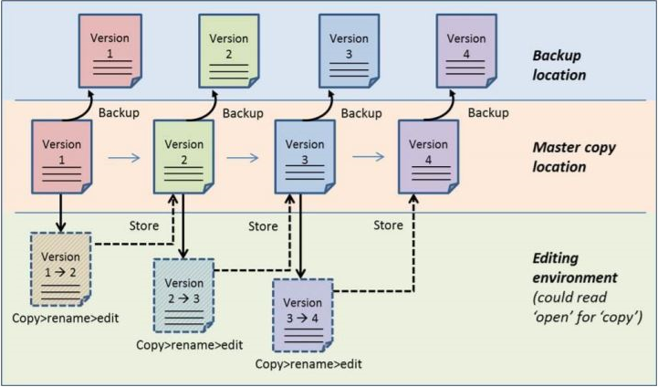

## Data Storage

By now you will have obtained some idea of how to manage your data collection and how to organise and document your research data.

Now we will look into data storage. Since your data is the life blood of your research you want to avoid losing it. Recovery could be slow, costly or even impossible. Therefore, during your research you must ensure that all your research data, regardless of format, are stored securely, backed up and maintained regularly.

Need examples of data storage gone wrong? Watch this short video where John MacInnes, Professor of Sociology, the University of Edinburgh, talks about his experience with a corrupted hard drive and the importance of backups.

<iframe width="560" height="315" src="https://www.youtube.com/embed/1VPBtJAa9Ic" frameborder="0" allow="accelerometer; autoplay; encrypted-media; gyroscope; picture-in-picture" allowfullscreen></iframe>

In this part of the course you will learn to:

- Discern different kinds of data and their storage requirement;
- Select an appropriate single source location for your data files;
- Understand the importance of backups and a backup strategy.

## Storage options

Your storage solution detennines whether you can easily share, manage and recover your data when needed. In this part of the course you will leam to:
- Discern between data storage solutions;
- Choose an appropriate storage solution for your research data.

### Questions to Consider

Different types of research data require different kinds of storage solutions. To determine which solution fits your research data and how to work with it, there are a number of questions you have to consider:
- Do I want to share my research data with others or not?
- Do I need to have my data stored locally or is external storage allowed? Do I need back-ups?
- What kind of additional storage services do I want or need?

### Shared Data or Individual DATA

Decide whether you want to share your data with others or not.

#### To Share or Not to Share

The first question you can ask yourself is whether you are going to use the data only by yourself or if you also want other people to access the data. Some storage solutions are specially set up for sharing data (with the possibility of giving other people read, write or even delete pennission) and others are not. It is good to be prepared for sharing if necessary.

#### Access Management

When you use a shared data storage solution you will have to manage the access to your data. If you are working within a larger group, make sure it is clear who is in control of the access rights and who can authorise the use of the data to other individuals. When deciding on a shareable storage location take into account that not every storage solution may have the ability to grant access to people outside your research community.

#### External Storage

The General Data Protection Regulation (GDPR) only permits personal data to be stored within the EU, unless:
- participants officially consent to the data being stored in another country
- there are adequate and equivalent levels of data protection in place (e.g. the US/EU Privacy Shield agreement).

You should always assess whether you really need to store your data abroad and if agreements with the supplier pennit you to do so. If data needs to be stored outside the EU, information sheets and consent forms should explain why this is necessitated.

#### External/Cloud Storage

Using a cloud service to store files has many advantages. You can access your files from any computer with an intemet connection and in case of a computer crash or theft, your files are not lost. Moreover, it is often possible to recover earlier versions of files and you can easily share files or folders with others. Usually, there is no physical limit on the required storage space as a pay-per-use model is often used. If you need more {or less) storage in a certain period, the pricing can be adjusted.

You can choose a cloud storage service such as Dropbox, Google Drive, OneDrive or Box. However, there are certain risks involved in using a public cloud storage service:
- Storage of data is not guaranteed to take place in Europe. This may mean that others - for example, security services such as the American National Security Agency (NSA) - have access to your files. Also, you do not comply with the General Data Protection Regulation;
- There is no guarantee that the cloud service provider will remain available. What happens to your files if the company is taken over or ceases to exist?
- The conditions of use of a public cloud storage service may include stipulations which give the provider undesired rights {of ownership) to the stored files;
- Leaks in the security of the storage service may be discovered.

You could also consider securing your files by means of encryption. Data security is explained in a different lesson in this course. |

#### Single or Multiple Storage

Is single storage sufficient or do you need back-ups of your data? You can choose a storage solution with a back-up facility if you want to be sure that a back-up is available and you don't want to make it yourself. Sometimes back-ups can be an option of the storage device, sometimes IT storage managers will set this up for you.

Criteria to choose for storage with or without back-up are:
- **Reliability** Can you be sure that your data will not get lost and is always accessible?
- **Price** Is the storage price an issue? How can you keep the costs as low as possible?

Sometimes it is enough to store your data once which will save you costs. However, keep in mind that this data may get lost in case of a human error (delete or overwrite data) or in case the storage device fails. In all cases make sure that you can reproduce your research data or your experiment, e.g. by having one or more copies stored at another storage location. If you want to be sure that a backup is available and you don't want to take care of it by yourself, you can choose a storage solution which has this backup facility added to it. Sometimes this is an option of the storage device, and if not; then maybe your colleagues from IT may configure this for you.

#### Additional or Tailored Services

Decide whether you need any kind of additional or tailored service. Many storage solutions have additional services. They come in different types:
- **Data management solutions** add an extra service layer on top of your data. With this service you can add information/metadata about data which is close to the stored data. Additional information on who, when and how the data was created gives people who want to use the data more context.
- **Cloud based storage** offer ‘pay per storage’, offer services to share and manage your data and are independent of the device you are working on.
- **Server based storage** can offer a special storage device, used to manage the storage and retrieval of data on or from disk. Some have a built-in data restoring service.
- **External disk devices** can be attached to your experiment device or laptop. You can offload data when there is no network available. And you can offload the data fast, depending on the type of the connection (USB etc.).

## Store Your Masterfile

To decide where to best store your master file, you should consider at what locations you work on your data. Do you have just one location from where you are working? Or do you have several copies of your datasets at different locations, like your PC at home and a laptop and a tablet at work? How do you keep track of what copy contains the most recent updates? When you choose the wrong file, it will take valuable time to merge both documents afterwards.

To avoid confusion, select one place where the master copies of your work are located (see Figure below). All other copies are temporary and should be placed back or synchronized with the master copy location, at regular intervals, fixed times, or after each edit. The master copy location is the standard source from which you get your files. It’s important that you do not work from the backup or temporary locations.

TODO add H5P
Indicate which of the following storage options are appropriate for a master file.
- Laptops
- CD-rom
- USB-stick
- Local hard drive
- Mail Server

Laptops are not appropriate for your master file as they are perishable and not backed up in any way. CD-ROMs are not appropriate for your master file as they are highly perishable, not backed up in any way and easily lost. USB-sticks are not appropriate for your master file as they are perishable, not backed up in any way and easily lost. Local hard drives are not appropriate for your master file as they are perishable and usually not backed up in any way. An email server is not appropriate for your master file as it is unclear where the data is stored and for how long.

## Make Backups

Keeping backups is probably your most important data management task. There is a real risk of losing data through hard drive failure or accidental deletion. As a reminder, have another look at the data disasters in the Introduction.

### Backup Recommendation

It is recommended that you keep at least three copies of your data on at least two different media. Keep your storage devices in separate locations with at least one off-site, and check that they work regularly. Backups are logically made from the master copy location, which should hold the most recent and correct version.

### Backup Strategy

There are several backup strategies to choose from. You either always do a full backup of all files, or perform partial backups. You could consider backing up files with high change rates more often than other files.

The backup strategy you choose depends on:

- How much time a backup takes;
- How much space you have;
- How costly it is;  
- The risk to lose vital information between backups.

Some master copy locations provide automatic backup. In that case, at least inform yourself on the backup scheme used. And make sure that the backup location is secure as your master copy location. Moreover, check if the time and effort needed to restore a backup copy is acceptable for you.

To ensure that your backup system is working properly, you should regularly test it by restoring your data files from your backups to check that you can read them.

### Backup in Practice
Two professors from the University of Edinburgh talk about backing up their research data.

Professor Lynn Jamieson, Centre for Research on Families and Relationships, talks about the importance of keeping regular backups of research data.

<iframe width="560" height="315" src="https://www.youtube.com/embed/eDclTVUyf_k" frameborder="0" allow="accelerometer; autoplay; encrypted-media; gyroscope; picture-in-picture" allowfullscreen></iframe>

Richard Rodger, Professor of Economic and Social History, talks about the different ways he backs up his research data.

<iframe width="560" height="315" src="https://www.youtube.com/embed/jX-XNo8KbOo" frameborder="0" allow="accelerometer; autoplay; encrypted-media; gyroscope; picture-in-picture" allowfullscreen></iframe>

### How Much Data Would You Lose if Your Laptop Got Stolen?
When you give your reply, we will show you the responses of other researchers in this course.

TODO add survey here. Options:
- Nothing – everything is backed up
- Less than 1 day of work
- 1 – 7 days of work
- 1 week – 1 month of work
- Prefer not to think about it

## Write Your Data Management Plan for Your Data Storage

Go to DMPonline and open your draft data management plan created in the Introduction.

You have now completed the module on data storage. You should be able to complete the following questions:

- Where will you store your data?
- How will the data be backed up?
