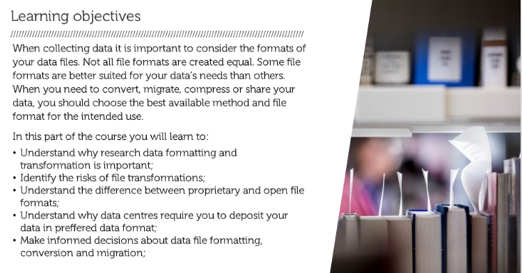

## Introduction to Data Collection

By now you will have obtained some idea of what research data management is all about. Now we will have a more in-depth look into the different phases of your research by starting with data collection.

Data collection involves understanding the different types of data you collect. Depending on the nature of your research, there are different methods of collecting data and thus different types of data.

Your data may be physical (paper records or archival forms) or digital (database contents or Excel data). The source of your data may be external, you collect it yourself or you generate it from a machine.

When you write your data management plan you will need to take into account the type of data you collect, the source of the data, and how you will process and analyse your data.

You can watch the video below, provided by TU Delft, about data collection. The video stops at 1:12.

<iframe src="https://www.youtube.com/embed/AqnVrnVdv2Y" allowfullscreen="" allow="accelerometer; autoplay; encrypted-media; gyroscope; picture-in-picture" height="515px" style="display: inline-block;" width="800px" title=""></iframe>

## Preferred Formats for Your Research Data

This part is based on the online Research Data Management training 'MANTRA' of The University of Edinburgh (CC BY: [https://mantra.edina.ac.uk/](https://mantra.edina.ac.uk/)) and Managing Data @ Melbourne.

---
The file formats you use to generate your research data will influence how you can manage them over time, i.e. a program or application must be able to recognise the file format in order to access your data within the file.
For example, a web browser is able to process and display a file in the HTML file format so that it appears as a web page. If the browser encounters another file type, it may need to call on a special plug-in to view it. Or it may simply let you download the file to view if it can recognise it in another program.

To identify the file format, files usually have a file name extension, or suffix that follows a full stop in the file name and contains three or four letters, like for example:

TODO: add PDF with links to preferred file formats

- *.txt*
  text
- *.pdf*
  portable document format
- *.jpg*
  joint photographic experts group
- *.csv*
  comma separated values
- *.html*
  hypertext markup language
- *.xml*
  extensible markup language  
- *.rtf*
  rich text format

### Proprietary and Open formats

File formats that are non-proprietary (e.g. open source}, or in widespread use, will tend to retain the best chance of being readable in the future. Proprietary formats, especially non-standard formats, used only by a specific software program or a specific software version, are likely to present problems for future (re)use.

Rapid changes in technology and the market mean that file formats can become obsolete quickly. It happens all too often that a software application is unable to read a file created by an earlier version of itself. The implications for research data management depend on how long data need to be retained for future use by yourself or others.

Data formats that conform to an agreed intemational standard are less likely to become obsolete, because a variety of software applications should be able to read them. However, there are likely to be trade-offs in tenns of software functionality, for example, loss of formatting or macros.

File formats may be proprietary and closed, or open and published by a company, standards organisation or collective for anyone to use.

Files in proprietary formats usually must be opened by the software in which they were created. Someone without a license to the software may not be able to open the file at all. Open formats, in which the software company or collective publishes the format rather than keeps it proprietary, can be opened by more than one application. Adobe PDF is an example of an open format that may be viewed in a number of applications, not limited to just Adobe products.

It is recommended that you use open formats for your research data. If this is not possible, try and store a copy of your data in an open format. For example, you might use .xls to store your spreadsheet data, but by saving an additional copy in an open format (such as .csv) you will ensure that your data will be readable in the future.

TODO H5P - check 01_ProprietaryOpenFileFormats.png

###  Question

Determine which format is proprietary and which is an open format

.xml .pdf .psd .odf .ppt .docx .csv .xls

  
Check your answers!

1. Proprietary: .psd, .docx, .xls, .ppt
2. Open format: .csv, .xml, .odf, .pdf

Even though some proprietary file formats can also be opened in other programs, distortions and loss of data may occur. For example, .ppt can be opened on an IOS operating system, but some features may no longer function. Therefore, it is always advised to store your format in an open data file format, although this does not guarantee loss of features and information either. At least, you are not locked in by one supplier.

### Preferred formats

It is not necessary to know all the technical ins and outs when you want to acquire knowledge about data formats. It is important, however, to have an idea of all factors involved. However, you need to know that long-term, sustainable storage requires a certain data format.

Data archives often maintain a list of preferred formats for the delivery of data. Only for data delivered in a preferred format can data archives like DANS and 4TU.Centre for Research Data guarantee long- term storage and accessibility.

There are reasons for preferring some data formats over others. For example, the preferred formats for image files are:
- JPEG, a universally used format which has the advantage of being easily accessible from many applications.
- TIFF, a format which allows you to preserve images at the highest quality, without compression, albeit with large file sizes.
- PNG, a high-quality format of a smaller file size than TIFF, with the disadvantage of not allowing the inclusion of metadata such as the type of camera used to take the picture. JPEG and TIFF do possess this functionality.

attachments:
- 01_DataCollection_DANSpreferredformatsUK.pdf
- 01_DataCollection_Preferred_formats.pdf
- 01_DataCollection_PreferredFormatsExcersizePenguinDOC.docx

### File Conversion and migration

At some time during your research you may need to convert or migrate your data files from one fonnat to another or from one system to another. This may be due to a new computer, new software or because you want to share your data with someone who has different software. In this kind of cases, conversion is necessary in order to be able to keep using the data.

Some lossiness’ - that is the loss of information and/or quality in the original data - may occur when converting from one file fonmat to another. It is important for you to understand what is at stake if you lose information for the type of data you are working with.

TODO add h5p - check 01_IdentifyRisksFileConversion_01.png

###  Question

While file conversion or migration sometimes has to be done, there are also risks. Which ones can you think of?

  
Check your answers!

- File size may change and even become surprisingly large
- Blanks used as missing data code
- Special characters and end of line returns may change
- Relation among items in a table and among tables may be lost
- Layers, color fidelity and resolution may be lost or changed in image files
- Fonts, footnotes and links to other documents may change
- Frame rate, sound quality, codecs and wrappers may be altered in multimedia files
- Last characters in rows (due to row size limitations) may be altered

Depending on your data type, all of these issues can occur in file migration or conversion. Prevent problems by cleaning data (e.g. replace special characters in your files, replace footnotes by normal text) before you convert. Also investigate whether other file format exists that may suit your needs better. Always check your files thoroughly after conversion, specifically on the points in the checkboxes which you just selected.

###  Hands On

Open the following .docx file: [PreferredFormatsExcersizePenguinDOC.docx](../../images/PreferredFormatsExcersizePenguinDOC.docx)

1. Convert this docx file to the preferred format .txt
2. Open the text file in an editor
3. Is all formatting preserved OK?

  
Check your answers!

  No, the format Microsoft Word creates saves the layout together with the textual and other elements. The .txt format created by Word is only the textual information in your file.

###  Hands On  

Open the following .docx file: [PreferredFormatsExcersizePenguinDOC.docx](../../images/PreferredFormatsExcersizePenguinDOC.docx)

1. Convert this docx file to the preferred format .odt
2. Open the .odt file
3. Is all formatting preserved OK?

  
Check your answers!

  No, ODT files are formatted using the OASIS OpenDocument XML-based standard. When you open an OpenDocument Text file in Word, it might not have the same formatting as it did in the original application it was created in. This is because of the differences between applications that use the OpenDocument Format.  

### Data compression

At some point you may choose to compress your data files for the purpose of local or networked storage, transportation or transmission. This is called bit-rate reduction, which involves encoding information using fewer bits than the original representation.

Zip (zip) is a de facto standard compression format that is used, though there are others, sometimes specific to a particular operating system. For example, a self-executing zip file {.exe) should not be used if the file is to be decompressed on another operating system.

Zip is a “lossless” type of compression, which means the file should be identical to the original once unzipped. There are also “lossy” types of compression associated with some multimedia file formats which may result in loss of quality/fidelity when played.

## Discovering Existing Data

### Where to Discover Existing Data?

Watch the screencast below. In this screencast, you will be guided through different ways to find data.

<iframe src="https://www.youtube.com/embed/AZMUKgM8X-A" allowfullscreen="" allow="accelerometer; autoplay; encrypted-media; gyroscope; picture-in-picture" height="515px" style="display: inline-block;" width="800px" title=""></iframe>

### Discover Existing Data Yourself

You have just learned that there are different places to find data. By actively searching the different places, you will get an understanding of the differences. Look at the different portals below. Some of them have been showcased in the screencast, some of them are additional.

> [Google](http://www.google.be) - add "database OR registry OR dataset OR archive OR statistics" to your search
>
> [Registry of Research Data Repositories re3data](https://www.re3data.org/) - find appropriate repositories holding interesting data
>
> [Elsevier Data Search](https://datasearch.elsevier.com/#/) - try out chip-seq drosophila
>
> [Google Dataset Search](https://datasetsearch.research.google.com/) - try out chip-seq drosophila. Google Dataset Search indexes [OmicsDI](https://www.omicsdi.org/), an index providing a knowledge discovery framework across heterogeneous omics data (genomics, proteomics, transcriptomics and metabolomics).   

### Assess the Usefullness of Existing Data

How useful is a dataset? Follow this short tutorial.

<iframe src="https://www.youtube.com/embed/t1SZutbCAxI" allowfullscreen="" allow="accelerometer; autoplay; encrypted-media; gyroscope; picture-in-picture" height="515px" style="display: inline-block;" width="800px" title=""></iframe>

### Assess the Usefullness of Existing Data Yourself

In the previous activity, the lecture described four main points to check if you want to reuse existing data:

- Condition for reuse
- Context
- Trustworthiness
- Persistence

In the following quizzes, take a closer look at the description or metadata of some datasets and assess the usefulness of these datasets yourself. As the description or metadata of datasets can be lacking in several different areas at the same time, it will be indicated per assignment on which of the four main points your focus should be.

###  Hands On  

Can you re-use [this dataset](https://dataverse.nl/dataset.xhtml?persistentId=hdl:10411/UWAU3K) on Spatial Patterns of Water-dispersed Seed Deposition along Stream Riparian Gradients in DataverseNL?

1. Maybe
2. Yes
3. No

  
Check your answer!

  Yes, the Terms of use indicate that there is a Creative Commons license 'Public Domain Dedication', which means you can copy, modify, distribute and perform thge work, even for commercial purposes, all without asking permission.

###  Hands On  

Can you re-use [this weather dataset](http://www.climatemps.com/)?

1. Maybe
2. Yes
3. No

  
Check your answer!

  Maybe, although the website states 'We hope that you will enjoy using ClimaTempss as much as we have enjoyed developing it!", there is no clear license or use agreement and directions on how to cite the data are lacking. The use has not been defined nor explained. In this case of re-use you should simply contact the creators.

###  Hands On  

Given the follwing description of a dataset: can you assess the usefulness of this dataset to establish cholestasis (an unhealthy condition of the liver) parameters in livers in the age group of puberty through adulthood? Please focus on the context.

Description: "We measured livers for several parameters of cholestasis. The subjects were in advanced stages of liver cancer."

1. Maybe
2. Yes
3. No

  
Check your answer!

  No, the dataset is not useful because the subjets have cancer. This should affect the values of parameters for cholestasis. You would rather have a dataset of healthy subjects.

###  Hands On  

Would you trust the following dataset on heart rate under severe physical stress?

Heart rate (beats per minute): 124, 160, 240, 0, 120, 400, 198, 156, 167

Please focus on the trustworthiness.

1. Maybe
2. Yes
3. No

  
Check your answer!

  No, there are weird values in the dataset, a value of zero is unlikely. And overall, the values are on the high side.

###  Hands On  

Is your research likely to be reproducible when you use the following the following infrastructure?

The datasets is created during a PhD. Conditions for use state that it is a dataset stored and shared by the PhD student on his university account.

1. Maybe
2. Yes
3. No

  
Check your answer!

  No, it is unlikely that the dataset can be reused since you do not have certainty that the files stored on the university file drives are availble for at least 10 years which is the current rule for data availablity.

## Describe What Kind of Data You Will Generate

Having a clear view of what data you will generate will enable you to plan its management. You can create an overview of the data you produce or collect by drawing the data in a workflow, or noting down in a table.

Please watch the video below. Tessa Pronk will explain to you how to describe your data.

<iframe src="https://www.youtube.com/embed/KE2UpZY4wYA" allowfullscreen="" allow="accelerometer; autoplay; encrypted-media; gyroscope; picture-in-picture" height="515px" style="display: inline-block;" width="800px" title=""></iframe>

## Order Elements in Your Data Flow

TODO: add H5P quiz - check 01_Order_Elements_In_Data_Flow.png

## Copyright and Intellectual Property Rights (IPR) Issues

Copyright is a form of intellectual property right which arises automatically if an original work is created. Copyright may affect the way data may be stored, shared and reused. You should ask yourself who the copyright holder of your datasets is, especially when you use existing data or when you collaborate with external parties.

### Using Someone Else’s Research Data
Here's a [A brief guide to determining what consent is necessary to reuse someone else’s data](../../documents/01_Brief_Guide_To_Determining_Consent_To_Reuse_Data.pdf).

### Clarifying the Ownership of Your Research Data

TODO: change accordingly for VIB

Officially VIB, as your employer, is considered the rights holder to the research data you create. You, as a researcher, have the primary responsibility for taking care of the data. Questions on data exploitation may be even more important than those of ownership. Who can use the data? Who can publish it? Who can provide it to third parties?  

We strongly recommend that you deal with the issues around data exploitation at an early stage of your research project. Write down agreements between yourself, your supervisor, project members and other interested parties in your Data Management Plan.

TODO: change accordingly

Please find more information in the guide [Legal instruments and agreements](https://www.uu.nl/en/research/research-data-management/guides/legal-instruments-and-agreements)

### Confidential or Privacy-Sensitive Data
When your research project has received data under confidentiality or under legal privacy restrictions, you will have to identify and explain how you will deal with these restrictions in your data management plan (also see ‘[Learning Unit: Handle - Data security](../handle-security/tutorial.md)’).

## Costs Involved with Managing Your Data

TODO: https://www.uu.nl/en/research/research-data-management/guides/costs-of-data-management

The costs of data management and sharing activities must be included into your research, in terms of time and resources needed.

### Data Management Cost Guide

When you plan your research you may not be able to oversee all costs involved. Nevertheless, it is useful to have an idea of possible costs at an early stage. You can use the Guide [Costs OVerview](../../documents/01_UU_CostOverview.docx), which is a practical overview of possible costs per activity within each phase of the research process. Note: The Cost Guide offers cost indications and examples. These are not real prices.

### Budget Your Data Management Costs

You are advised to budget the data management costs as separate data management costs. These costs are eligible for funding with funders like FWO and the European Commission, as long as the costs are invoiced before the end of the project.

### Planning Can Save Time and Money

Planning an early start for certain activities within your research project can lower the costs for data management in the run of your project. You can save time by:

- Properly describing your data while collecting it, instead of doing it afterwards
- Choosing the right file format so that file conversion afterwards is not necessary
- Hiring an experienced data manager

Spending time to think about data activities beforehand can help prevent unexpected extra efforts and costs later on in your research project.

## Check Current and Expected Costs for Your Research Data

You have just learned that in many parts of a research project there are data related costs. These costs depend on the type and volume of data you produce, analyse and store.

[Cost overview](../../docs/01_UU_CostOverview.docx)

## Write Your Data Management Plan for Your Data Collection

Go to DMPonline and open your draft data management plan created in the Introduction.

You have now completed the module Data collection. You should be able to complete the following questions:

- Will you use existing data?
- What data will you collect or create?
- How will the data be collected or created?
- How will you manage rights issues?
- What are the costs involved in managing and storing your data?
