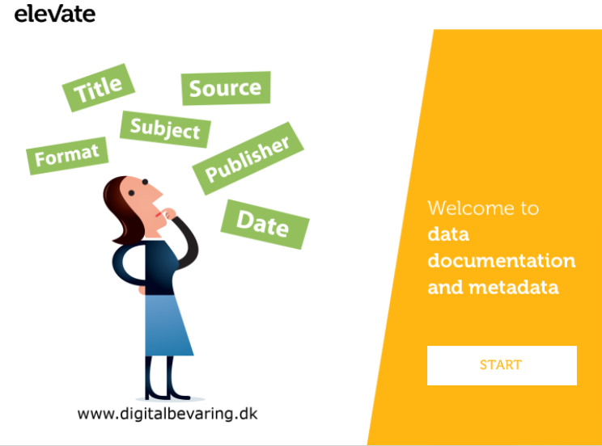

# Introduction
{:.no_toc}

<!-- This is a comment. -->

  
Click to expand!

*Heading*
1. A
2. list
   * With some
   * Sub bullets

### Introduction to documentation and metadata

By now you understand how to describe your data collection in terms of, for example, type, size, and format. You have identified this for your own research data.

Now we will look into the documentation and metadata which will accompany your data. Documentation and metadata are essential to understand what a dataset means and to make it reusable in the future.

In this part of the course you will learn to:

* Understand why your research data needs to be documented and why other researchers rely on this documentation;
* Understand why metadata is used and when you need to use this;
* List different descriptions of data (record, study, code);
* Describe the purpose/goals of descriptions of data;
* State why standards are important and how to find and apply them;
* Name and apply the do’s and don’ts in arranging folders and naming files;  
* Recognise the importance of managing data files;
* Apply the gained knowledge about data documentation to your own research data and write the data documentation section for your data management plan.

### Introduction to documentation and metadata

Tips for data documentation - John MacInnes, professor of Sociology of the University of Edinburgh, explains why it is necessary to document each step of your research and how this will benefit you in the long term.

!?[John MacInnes Tips on Documentation](https://youtu.be/EIZsxT-fIiQ)

**Examples of data documentation**

Since there is a wide variety of types of data and types of research, there are many different ways of documenting data. A few examples of data documentation are:

* Laboratory notebooks and experimental procedures
* Questionnaires, codebooks, data dictionaries
* Software syntax and outout files;
* Information about equipment settings & instrument calibrations
* Database schemes
* Methodology reports
* Provenance information about sources of derived or digitised data

What data documentation will you use?
TODO: quiz without an answer

[[]] Laboratory notebooks
[[]] Code on github
[[]] Software syntax or outout files
[[]] Questionnaires
[[]] Experimental protocols
[[]] Information about equipment settings & instrument calibrations
[[]] Database schemes
[[]] Methodology reports
[[]] Provenance information about sources of derived or digitised data

There are many different ways to set up and organise your documentation.

**Project level**

Project level documentation documents what the study sets out to do; how it contributes to new knowledge in the field, what research questions/hypotheses are, what methodologies are used, what samples are used, what intruments and measures are used, etc. A complete academic thesis normally contains this information in details, but a published article may not. If a dataset is shared, a detailed technical report needs to be included for the user to understand how the data were collected and processed. You should also provide a sample bibliographic citation to indicate how you would like secondary users of your data to cite it in any publication.

**File or database level**

File or database level documentation documents how all the files (or tables in a database) that make up the dataset relate to each other, what format they are in, whether they supersede or are superseded by previous files, etc. A readme.txt file is the classic way of accounting for all the files and folders in a project.

**Variable or item level**

Variable or item level documentation documents how an object of analysis came about. For example, it does not just document a variable name at the top of a spreadsheet file, but also the full label explaining the meaning of that variable in terms of how it was operationalised.

John MacInnes, professor of Sociology of the University of Edinburgh, speaks about how data documentation can help to find a way in often voluminous data collections of different copies, routings, syntaxes, samplings, etc.

**On the necessity of data documentation in secondary data analysis**

!?[John MacInnes, Data documentation in secondary analysis](https://youtu.be/Ebaiwg08CW8)

Looking back at your previous research project: Did you ever have problems reusing other people's data because of lack of documentation?

[[]] Never tried
[[]] Successfully reused
[[]] Had to ask clarification
[[]] Had to abandon the reuse attempt

Thorough and effective management of laboratory data and the routine documentation of all lab procedures is a highly important responsibility for all researchers.

TODO: Link to eLab Notebook

**An introduction to metadata**

Watch this web lecture to learn about the different types of metadata and how metadata can help make your research data better findable. You are pointed to useful sources for metadata standards.

!?[Ins and outs of metadata and data documentation](https://youtu.be/h0oZ3swbTJ0)

**identify different types of metadata**

TODO: HP5 quiz or matrix quiz

**Metadata for different disciplines**

Different disciplines like biology, earth sciences, physical sciences and social sciences and humanities have their own standards. By choosing a well-supported standard, you will maximise the chance that your data can be re)used and understood by other researchers.

!?[Metadata standards](https://youtu.be/AvL7hEk8RJQ)

**Metadata for different disciplines**

Useful links to metadata standards:

* [Biology](http://www.dcc.ac.uk/resources/subject-areas/biology)
* [General Sciences](http://www.dcc.ac.uk/resources/subject-areas/general-research-data)

A community-maintained [directory of metadata schemas](http://rd-alliance.github.io/metadata-directory/) which has been set up under the auspices of the Research Data Alliance.

A list of metadata standards and other standards developed by [FairSharing](https://fairsharing.org/).

**Controlled vocabulary**

**Improve a record description**

Take a look at the record descriptions n the table below and answer the question below and in the following pages.

| Soil Sample       | Condition     | Length| Classx |
| ----------------- |:-------------:| -----:|:-------|
| A1                | low           | $458  | III    |
| A2                | low           | $391  | II     |
| A3                | medium        | $422  | IV     |

x according to the classification from last experiment

Sample - is the value clear?

[(X)] Yes
[( )] No

TODO: explain why

**Improve a record description**

Take a look at the record descriptions n the table below and answer the question below and in the following pages.

| Soil Sample       | Condition     | Length| Classx |
| ----------------- |:-------------:| -----:|:-------|
| A1                | low           | $458  | III    |
| A2                | low           | $391  | II     |
| A3                | medium        | $422  | IV     |

x according to the classification from last experiment

Condition - is the value clear?

[( )] Yes
[(X)] No

Correct! It is not clear what low or medium as condition means.

**Improve a record description**

Take a look at the record descriptions n the table below and answer the question below and in the following pages.

| Soil Sample       | Condition     | Length| Classx |
| ----------------- |:-------------:| -----:|:-------|
| A1                | low           | $458  | III    |
| A2                | low           | $391  | II     |
| A3                | medium        | $422  | IV     |

x according to the classification from last experiment

Length - is the value clear?

[( )] Yes
[(X)] No

Correct! It is not clear what is meant by length. Also a unit for the values is missing. Is it meters, centimeters, or seconds?

**Improve a record description**

Take a look at the record descriptions n the table below and answer the question below and in the following pages.

| Soil Sample       | Condition     | Length| Classx |
| ----------------- |:-------------:| -----:|:-------|
| A1                | low           | $458  | III    |
| A2                | low           | $391  | II     |
| A3                | medium        | $422  | IV     |

x according to the classification from last experiment

Class - is the value clear?

[( )] Yes
[(X)] No

Correct! There is a reference that the classes are explained somewhere. But no link to the document is given.

### Data standards explained

Your dataset can be standardised in various aspects. Standardisation, in general, makes data comparable and interpretable. In other words, your data becomes interoperable by applying standards. Datasets can be combined, compared or are simply easier to reuse. You have to plan standardisation, as it is for many aspects hard or impossible to apply afterwards.

Standardise as much as possible between you and your collaborators or research group. If there are standards established and used in your field of research you are advised to use these.

Here is a list of things you can standardise in your research.

* Standardise how, what and when you measure things by standardising your protocol, or methods and materials For instance, is there a standard set of questions for ‘quality of life’? Is there a standard procedure to house mice for your purpose? What aspects do you measure? At what parameter values (age, concentration, etc.)? When do you measure (every two hours, every gram of weight gain, etc.)?

* Standardise your file formats so you can easily exchange results without technical difficulties. Check for standard taxonomies or coding systems within your research discipline.

* Standardise the units in which you note down your results. For instance, do you use mm, cm, m? It is extra work to transform units between experiments.

* Standardise the metadata you use to describe your records or study. What fields will fill in by default, and according to what standard do you define the fields’ names? Will you design a metadata spreadsheet where you specify all things that you will note down?

* Standardise the vocabulary you use. If everyone has the same terminology, it can avoid confusion or misinterpretation. Check for standard taxonomies or coding systems within your research discipline.

### Check your knowledge on standards

Follow the links below for examples of standards. What type of standardisation do the links refer to?

* [Demographic market research](http://www.amplituderesearch.com/market-research-questions.shtml)
* Find via Google: “general morphology score (GMS)”
* [Marine Geoscience Data](http://www.marine-geo.org/submit/guidelines.php)
* [International Union of crystallography](http://www.iucr.org/resources/cif/spec/ancillary/abbreviations)
* [The Cultural Objects Name Authority](http://www.getty.edu/research/tools/vocabularies/cona/index.html))
* [SI Units](https://www.nist.gov/pml/weights-and-measures/metric-si/si-units)
* [UK data service](https://www.ukdataservice.ac.uk/manage-data/format/recommended-formats)

TODO: add H5P exercise

### Folder structure and file naming

CC BY: [https://mantra.edina.ac.uk/](https://mantra.edina.ac.uk/)

Trying to find a data file taht you need which has been stored or named incorrectly or inaccurately can be both frustrating and a waste of valuable time. In this short video Jeff Haywood, professor at the University of Edinburg, explains his experiences with good and bad file management.

!?[Jeff Haywood Importance of good file management](https://youtu.be/i2jcOJOFUZg)

**Project level**

Project level documentation documents what the study sets out to do; how it contributes to new knowledge in the field, what research questions/hypotheses are, what methodologies are used, what samples are used, what intruments and measures are used, etc. A complete academic thesis normally contains this information in details, but a published article may not. If a dataset is shared, a detailed technical report needs to be included for the user to understand how the data were collected and processed. You should also provide a sample bibliographic citation to indicate how you would like secondary users of your data to cite it in any publication.

**File or database level**

File or database level documentation documents how all the files (or tables in a database) that make up the dataset relate to each other, what format they are in, whether they supersede or are superseded by previous files, etc. A readme.txt file is the classic way of accounting for all the files and folders in a project.

**Variable or item level**

Variable or item level documentation documents how an object of analysis came about. For example, it does not just document a variable name at the top of a spreadsheet file, but also the full label explaining the meaning of that variable in terms of how it was operationalised.

**Choose the best chronological file name**

Which of the file names below is the most appropriate?

[[X]] 2019-03-24_Attachment
[[ ]] 24 March 2006 Attachment
[[ ]] 240306attach

Correct! Using a date in the format Year-Month-Day will maintain the chronological order of your files.

**Choose the best descriptive file name**

Which of the file names below is the most appropriate file name?

[[ ]] labtox_recent_110810_old_version.sps
[[X]] 2010-08-11_bioasssay_tox_V1.sps
[[ ]] FFTX_3776438656.sps

Correct! Keep the file names short and relevant while using sufficient characters to capture information. Do not name files recent or final or definitive_final, a date or version number will suffice.

**How would you treat your data**

Why should you discard or delete obsolete versions of data?

[[ ]] The most current version is the only relevant version.
[[X]] You have several versions of files in a state between versions
[[ ]] You are exceeding the storage space available to you.

Correct! Too many similar or related files may be confusing to yourself and to anyone else wanting to access or use your data. You may think that you know which data file is which but that may not always be the case as time passes and the number of different versions increases. It is easier to maintain a manageable number of versions with a clear naming structure. As long as the original raw or definitive copy is retained and processing is well documented, the intermediate working files can and should be discarded.

**Fill the blanks**

TODO: add H5P

### Write your data management plan for your data documentation

Go to DMPonline and open your draft data management plan created in the Introduction.

You have now completed the module Data documentation. You should be able to complete the following questions in the section Data documentation:

* How will you structure your data?
* How will the data be described and documented?
* What standards will you use?

