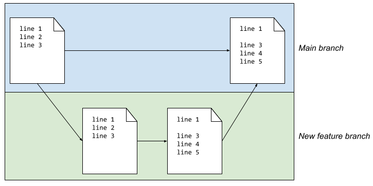
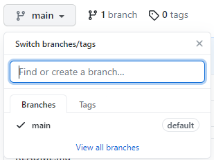
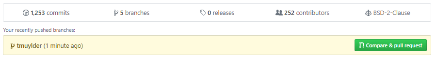
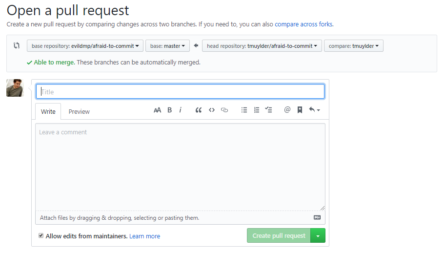
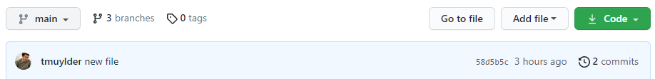

# 1. What's a branch?
The idea of branching is that we can create a copy of the project in which we can add a new feature. This branch is a completely separate version of your project and lives next to your original version. If the new feature is working properly we can merge it back into the project. It's a great way of testing new changes in some code when you're not sure whether it will work, and in the meanwhile not messing up the code that you already have. 

---

<center></center>

---

The original repository is now called the *master* branch, however historically was called the *main* branch.   

A new GitHub repository is initialized by default with one branch: the *main* branch. All the changes in our project that we did so far, have hence always been in this main branch. Remember that when we did `git status` we read a line saying that we were on the main branch. 

If we would make a new branch, we can name it however we like (e.g. *new-feature*). There are two ways of doing this: locally or on the GitHub website. We will first show you the latter (section 2) and afterwards how to do it locally via Git Bash or the Terminal (section 4). 

A repository can have numerous branches. Branches are ways of organising work on a project: you can have a branch for a new feature, for trying out something new, for exploring an issue - anything at all.

It’s a good practice to create a new branch for every new bit of work you start doing, even if it’s a very small one. It’s especially useful to create a new branch for every new feature you start working on. Branches are of course disposable, you can always remove them. 

# 2. Branching on GitHub
We can make a new branch on GitHub. 
1. Click the button: 'Main'
2. In 'Find or create a branch...' type `new-feature` (or any other name)
3. Click 'Create branch': new-feature

---

<center></center>

---

GitHub will now display `new-feature`. It's very important to understand that any changes that happen in this branch, will not be influencing the main branch. 

---

> ###  Exercise 5
>
>  Edit the `plot2.R` file again, however make sure you're in the *new-feature* branch. Add the following lines that will make a new plot. These lines will allow us to investigate the relation between the weight, horsepower and miles per gallon variables of `mtcars` dataset in R. 
> 
> ```R
> # Install requirements & plotting of 3D scatterplot
> install.packages("scatterplot3d")
> library(scatterplot3d)
> attach(mtcars)
> scatterplot3d(wt,hp,mpg, pch=16, highlight.3d=TRUE,
>               type="h", main="3D Scatterplot")
> ```
>    > <details markdown="1">
>    > <summary> Solution
>    > </summary>
>    > Edit the file `plot2.R` by clicking on the pencil icon and add the following lines: 
>    > 
>    > <center></center>
>    > Commit your changes with a useful commit message and save by clicking the green 'Commit changes'-button.
>    > 
>    > </details>
> 
{: .hands_on}

---

Switch back to your *main* branch and have a look to the `plot2.R`-file. It shouldn't contain these changes. 


# 3. Merging branches on GitHub
Before exploring how we make branches on our computer locally, we'll merge the changes in the *new-feature* branch into the *main* branch. Branches are merged by making a **pull request**. In this section we will explain how to do a pull request, often shorted to PR. 

Whether you are on the *main* or *new-feature* branch, doesn't matter. In both cases you should see the following yellow screen. Alternatively, go to 'Pull requests' and find it there. 

---

<center></center>

---

Click on **compare & pull requests** or go to the section **Pull requests** and create a **New pull request** (select the branches you want to incorporate). A new screen pops-up with the following information.

---

<center></center>

---

- The pull request should be interpreted as a request to pull the new branch and all of its changes into the main branch.   
- The base where it would be pulled towards is `base: main`. The branch where the changes are deriving from is `compare: new-feature`.   
- Note that GitHub checks the compatibility of the branches: in this case there are no conflicting edits and the branches can be merged together.   
- Give a descriptive title text and if appropriate some additional comment. 

Underneath the pull request related information, GitHub also gives you a summary of the changes that were done. 
- Each commit from the branch *new-feature* (i.e. only added these 7 lines in this case)
- Display of the file and a visual representation of what changed in that commit. 

---

<center></center>

---


Click on **Create pull request** to finalize the creation of the PR. Note that the the branches are not merged yet, one more comment before we do that! We know that GitHub allows us to collaborate on projects. Here we can find some of the features that GitHub is providing us to start collaborating. We could for example start a conversation here and discuss the PR, select a (couple of) reviewer(s), add assignees who authored, add labels representing what type of edits were done in the branch, etc. Essentially these are valuable for organizing bigger projects; keep track of who's working on what and who needs to review specific changes, etc.     

Finally, we verify the merge pull request commit and you give your consent to GitHub to merge both branches by clicking 'Merge pull request'.

---

<center></center>

---

It might be possible that in a project with several people, you are not authorized to make changes to the *main* branch. In this case you will always have to work in a separate branch and someone else will get this last message. He or she will then decide whether this pull request should be merged. 

# 4. Branching locally
Besides the possibility of making branches on GitHub, we can also do it locally on our computer. As we've made changes to the repository on GitHub, we'll start with pulling the changes into our local repository. Use `git pull` in your project folder. 
 
There is always an indication in the Terminal or Git Bash of which branch we are in (i.e. *main*). Here are the most important commands related to making branches and switching between different branches:
1. Listing all the existing branches is possible with `git branch -a`
2. `git checkout -b <new-branch>`: will create a new branch and move into this branch. 
3. `git branch <new-branch>`: will create a new branch, but will remain in the current branch (i.e. the *main* branch in this case)
4. With `git checkout <branch>` we will switch from one branch to the other. 

Let's start with listing all the existing branches (4). 
```
* main
remotes/origin/HEAD -> origin/main
remotes/origin/main
remotes/origin/new-feature
```
The first branch is our local *main* branch in which we are currently working (as denoted by the asterisk \*). The three others relate to the branches that exist **remotely** on GitHub. If we want to work on the branch *new-feature* we will have to import it first with: `git checkout new-feature`. Git will understand that there is a remote branch with the same name and you want to work on this one. 

**Note** that if you use `git checkout -b new-feature`, you would have created a new branch with the same name as the remote branch. This is error prone and will lead to problems! Hence, it is really important that you switch from branch and not create a new one!

## 4.1. Example workflow
An example workflow is depicted in the figure below and is discussed in the following points. 

---

<center></center>

---

**1. Make a new branch:**
```
git checkout -b <new-branch>
```
Git will make a new branch with the name `<new-branch>` and tell you it switched to the new branch. If you want to change branches, just type `git checkout` followed by the name of the branch, e.g. `git checkout main`.

**2. Make some changes:**
  - Add a new file
  - Edit an existing file

**3. Stage changes:**  
Use the following  command to simply add all the new or changed files. 
```
git add -A
```
 
**4. Commit staging area:**  
Commit all the staged files with:
```
git commit -m "some useful commit message"
```

**5. Push commits to GitHub:**

```
git push origin <new-branch>
```  
or alternatively:
```
git push --set-upstream origin <new-branch>
```
The `git push` command is now a bit longer. The first time we want to publish a new local branch on a remote repository (GitHub), we need to be explicit and tell Git to add the `<new-branch>` to the origin. In Git, the "origin" is used to refer to the GitHub original repository's URL and makes it much easier to talk about. 

Next time you want to push your commits from *new-branch*, you won’t need to be explicit - you can simply do `git push`, because now *new-branch* exists on GitHub and both branches know how to commmunicate with each other. 


---

> ###  Exercise 6
>
>  Make a new branch and make sure you're in the branch. Rewrite the README.md file so it contains the following text. Once the changes have been committed and pushed to GitHub, create a pull request and merge the changes into the main branch.  
> 
> ```
> # Downstream data-analysis R
> This repository contains all the scripts for the downstream data analysis of my project.
> ```
> 
> 
>    > <details markdown="1">
>    > <summary> Solution
>    > </summary>
>    >
>    >  
>    >  ```
>    >  git checkout -b readme
>    >  ```
>    >  Do the necessary changes
>    >  ```
>    >  git add README.md
>    >  git commit -m "changed README file completely"
>    >  git push origin readme
>    >  ```
>    >  Find the new branch in your GitHub repository. From there the solution is identical as discussed here above. 
>    > </details>
>
{: .hands_on}
---

As a final note on merging branches, we mention here that it is obviously also possible to merge branches on our computer locally. For this, we refer to some further reading materials linked [here](https://git-scm.com/book/en/v2/Git-Branching-Basic-Branching-and-Merging).


# 5. Deleting branches 

## 5.1. Via GitHub

If a branch is of no more use, we can delete it. To find all the existing branches in GitHub, click on *branches* in the top left corner of the repository.

---

<center></center>

---


After successfully merging our changes in the *main* branch, the old one(s) can be deleted. Click on the waste bin:

---

<center></center>

---

Go back to the main tab of the repository and find that the branch has been deleted. 


## 5.2. Locally

Deleting a branch is as simple as typing the following command:

```
git branch -d <name-of-the-branch>
```

If git refuses to do so, there is a forced way to do it as well by using the capital `-D` parameter. 


---


Let's continue with the [next session](https://material.bits.vib.be/topics/git-introduction/tutorials/6_forks/tutorial.html)!