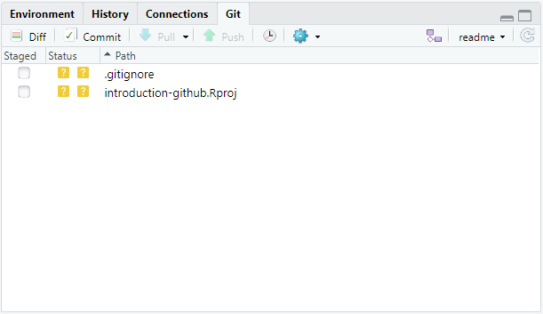

# 1. Introduction

Rstudio is a popular platform for downstream data-analysis, statistics, machine learning and more with R. If you're unfamiliar with R and Rstudio, the materials on this website will surely get you started and are accesible via [this link](https://material.bits.vib.be/topics/R/). Uptil now we have focused on the core principles of Git & GitHub, which gives us enough knowledge to start integrating in other platforms. 

To this extent we will exploit the repository that we created in this tutorial. A sample repository is also downloadable [here](../../../../assets/files/git-introduction/sample-repo).  

# 2. Starting a project 
Let's start by making a new project (File > New project...). The following screen pops up:

---

<center></center>

---

There are two options relevant for us to create a project in RStudio initialized with GitHub:
- **Existing Directory**: The preferred choice when a project folder already exists and which has previously been initialized with Git. 
- **Version Control**: Ideally for creating a new R project based on a repository in GitHub. 

Given the situation that there is a folder on our computer, created during this tutorial and initialized with Git, we will go for the first option. Select **Existing Directory**, browse to the location of the project folder and create the project. (If you've downloaded the sample repository mentioned above, this option still holds)

If we were to choose to create a new R project based on a GitHub repository, you would need to select **Version Control**, followed by *Git* and then copy the link of the GitHub repository from the green *Clone or Download* button and add it as the repository URL, and finally create the project. 

---

<center></center>

---

Notice that a `.gitignore` file is added on the fly containing the following 4 lines. We will extend this code later. 
```
.Rproj.user
.Rhistory
.RData
.Ruserdata
``` 

# 3. Exploring Git's integration in Rstudio

Find a *Git* tab in the upper right corner. The tab consists of the main actions that can be performed with Git (the window might be too small to contain the keywords related to the symbol). Neglecting the *diff* keyword, we can find the following actions: *Commit, Pull, Push, History* and *More* followed by *New Branch*, the name of the branch (*master*) and a refresh button. 

The only action we're missing is the *staging*. Rstudio & Git actually continuously process the files within the project searching for new changes. If there is a new change it will appear in the list in the screen as depicted here:

---

<center></center>

---


# 4. Routine usage

Recall the routine usage: *stage-commit-push*. Staging changes in Rstudio is done by simply checking the tickmarks in the list. This approach makes it very user-friendly to stage changes that are related with each other and that should be contained within the same commit. 

--- 

<center></center>

---

Subsequently, click on commit and find a similar screen:

--- 

<center></center>

---

Let's explore this screen for a while: 
- We can find a *history* tab summarizing all the previous commits in this repository. As this project already existed before, it also contains the commits from before the integration in RStudio. 
- Next to that tab we can switch the branch, generally we leave this untouched as we're already in the preferred branch. 
- The *staging* tab allows us to stage and unstage specific files, even after they were staged in a previous step.
- The *revert* tab is neglected in this tutorial
- *Ignore* allows us to edit the `.gitignore` file by simply selecting the file that we want to ignore and clicking on *Ignore*. 

If you're happy with the changes and the staging area, a commit message is written in the right tab and finalized by hitting the *Commit* button. A message will pop up summarizing the commit in a technical way. 

If the commit has to appear on GitHub we need one more step. Click on *Push* and find your new status of the project in the GitHub repository.


---

> ###  Exercise 
>
> Add the `.gitignore` file to the staging area and exploit the *Ignore* button to add the *Rproj* file to the `.gitignore` file. Write a commit message, and commit and push your changes to GitHub. 
>
>
>    > <details markdown="1">
>    > <summary> Solution
>    > </summary>
>    > 
>    > 
>    > 
>    > 
>    > 
>    > </details>
> 
{: .hands_on}

---
 
