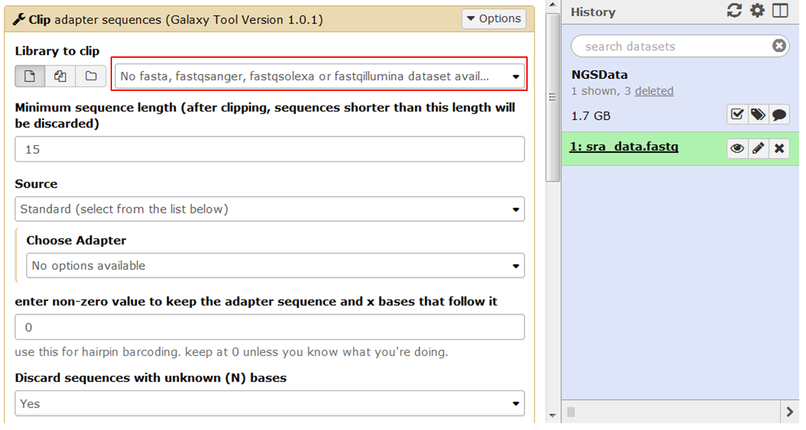
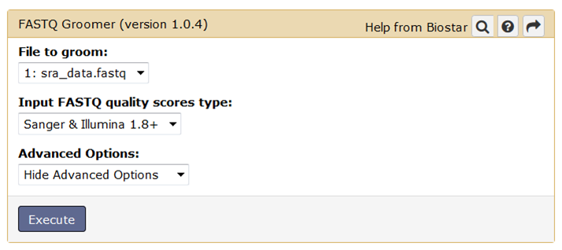
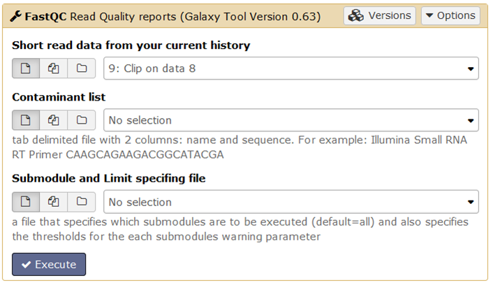
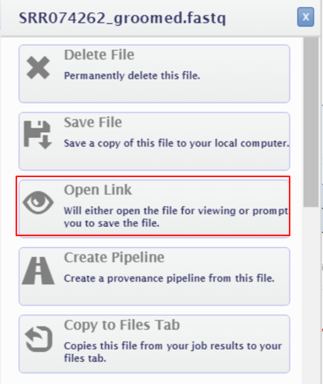

[Group exercises](http://data.bits.vib.be/pub/trainingen/NGSIntro/GroupExNoSol.pdf)

You can solve most quality issues found by FASTQC e.g. trimming contaminating adapters, low quality bases at the end of your reads, filtering low quality reads...
There's is a lot of debate on whether it is required to do this. Reads that are contaminated with adapter sequences will not map but if these reads make up a large fraction of the total number of reads they might slow down the mapping a lot. While it is true that mappers can use noisy info (still containing adapters, low quality bases...), the mapping results will be negatively affected by this noise.
Cleaning is in my opinion worthwhile especially when working with small reads and in case of extensive adapter contamination (almost always).

## Quality control in Galaxy

Links:
- [European Galaxy](http://usegalaxy.eu)
- [Raw Arabidopsis data in European Galaxy](https://usegalaxy.eu/u/janick/h/rawdata)
- [Groomed Arabidopsis data in European Galaxy](https://usegalaxy.eu/u/janick/h/groomeddata)
- [Clean Arabidopsis data in European Galaxy](https://usegalaxy.eu/u/janick/h/cleandata)
- [Raw E. coli data in European Galaxy](https://usegalaxy.eu/u/janick/h/ecoliraw)
- [Groomed E. coli data in European Galaxy](https://usegalaxy.eu/u/janick/h/ecoligroomed)
- [Filtered E. coli data in European Galaxy](https://usegalaxy.eu/u/janick/h/ecolifiltered)

- [Main Galaxy](http://usegalaxy.org 
- [Raw Arabidopsis data in main Galaxy](https://usegalaxy.org/u/janick/h/ngsdata)
- [Groomed Arabidopsis data in main Galaxy](https://usegalaxy.org:/u/janick/h/ngsgroomed-1)

Galaxy is a bioinformatics server that contains many tools, data and analysis results. Before you can upload your data to Galaxy, you have to register or log in to Galaxy (see slides).

### Upload data to Galaxy

If you want to work on your data in Galaxy, you have to first get the data into Galaxy. To accomplish this you can use the **Upload file** tool in the **Get data** section.
**Instead I shared the file on Galaxy so you can import it using [this link](https://usegalaxy.eu/u/janick/h/rawdata).** Make sure that you are logged on to Galaxy before you do this. When you click this link you are redirected to a web page where you can import the file:

 

### The history

Data sets that are uploaded or created by running a tool appear in the history in the right Galaxy pane.
To give a history a new name, click the history's current name, type a new one and hit enter.
Clicking the name of a data set unfolds a preview, a short description and tools to manipulate the data.

#### Icons in the History

- Clicking the floppy (**Download**) icon will download the file to your computer
- To visualize a file in the middle pane, click the eye (**View data**) icon next to the name of the file.

#### Colors of files in the HistoryData sets in the history have different colors representing different states.

- **Grey**: The job is placed in the waiting queue. You can check the status of queued jobs by refreshing the History pane.
- **Yellow**: The job is running.
- **Green**: When the job has been run the status will change from yellow to green if completed successfully.
- **Red**: When the job has been run the status will change from yellow to red if problems were encountered.

### Running Groomer in Galaxy

If you select a tool in Galaxy it will automatically detect all data sets in your history that it can use as input. In the case shown below the tool does not recognize the fastq file in the history:

 

The fact that the tool does not recognize the fastq file means that the fastq file is so messy that the tool can't read it. Remember that there is a tool to clean messy fastq files: **FASTQ Groomer** 

Check the quality encoding in your fastq file (e.g. in FASTQC), and click the **Execute** button to start the tool:

 

Grooming takes long (30 min when Galaxy traffic is low). You can choose to wait but if it takes too long you can click the **Delete** button in the History (see slides) to stop the tool. I have provided the groomed file: import it in Galaxy using [https://usegalaxy.eu/u/janick/h/groomeddata this link].

### Using Trimmomatic in Galaxy

To clean your data use the **Trimmomatic** tool in the **Quality Control** section of tools. Click the name of the tool to display its parameters in the middle pane.

See [this page](http://wiki.bits.vib.be/index.php/Parameters_of_Trimmomatic) for an overview of the Trimmomatic parameters.

A bit more explanation:

- **The input file with the reads**: Galaxy will automatically suggest a file from your History that has the right format, in this case: a fastq file. If Galaxy doesn't make a suggestion it means it cannot find any files in your History with the right format.
- **The sequence of the adapter**: provide a custom sequence. If you analyze your own data you know which adapter sequences were used. Since this is public data we don't really know the name of the adapter. However, remember that FASTQC gives you a list of contaminating adapter sequences so you have the sequence of the adapter. Choose **custom adapter sequence** and paste the adapter sequence from FASTQC. You can only enter one sequence.

Click **Execute** to run the tool.

In the history you see a new item, colored in yellow as long as the tool is running. Regularly hit the **Refresh** button in the History to check if the tool has finished. Clipping should go fast, after a few minutes you should have the result.

### Running FASTQC in Galaxy

Search for **FASTQC** in the tools pane and click the resulting **FastQC** link to open the parameter settings in the middle pane:

 

FASTQC automatically recognizes all files it can use as an input. Select the file you want to use.
The FASTQC implementation in Galaxy can take an optional file containing a list of contaminants. If you don't specify one, FASTQC will look for standardly used Illumina adapters. <!--As another option the tool takes a custom limits .txt file that allows setting the warning thresholds for the different modules and to specify which modules to include in the output.-->

In most cases you keep the default settings and click **Execute**.

## Quality control in GenePattern

[Genepattern](http://www.broadinstitute.org/cancer/software/genepattern/) is very similar to Galaxy. It's as user-friendly as Galaxy, allows analysis of NGS data just like Galaxy... 

It provides easy access to hundreds of tools for different kinds of analyses (e.g. RNA-seq, microarray, proteomics and flow cytometry, sequence variation, copy number and network analysis) via a web browser.

**Links**

- [BITS Genepattern server](https://dev.bits.vib.be:8686/gp/pages/index.jsf)
- [fasta file containing Arabidopsis adapter sequence](https://data.bits.vib.be/pub/trainingen/NGSIntro/adapter.fa)
- [fasta file containing E. coli adapter sequence](https://data.bits.vib.be/pub/trainingen/NGSIntro/adapterEcoli.fa)
- [Overview of Trimmomatic parameters](http://wiki.bits.vib.be/index.php/Parameters_of_Trimmomatic)

Consult the [GenePattern tutorial](https://wiki.bits.vib.be/index.php/GenePattern_tutorial) for more info.

### Running Groomer in GenePattern

The Broad Genepattern server does not contain the Groomer tool, but we have added the tool to our BITS Genepattern server. 

- Search for the Groomer tool in GenePattern.
- Define the parameters: one of the parameters you need to define is **Input format**: the encoding of the fastq file you want to clean. The encoding is important because it determines the offset of the quality scores (ASCII offset 33 or ASCII offset 64). If you're not sure you can check the encoding of your file in the FastQC report (take into account that FastQC sporadically makes the wrong guess).
 
- Run the Groomer tool.

### Running FastQC in GenePattern

- Search for the FASTQC tool
- Fill in the parameters
- Run the FASTQC tool

You can open the resulting HTML report in your browser: 

- Click the name of the output file at the bottom of the page
- Select **Open Link**
 

### Running Trimmomatic in GenePattern

In GenePattern you can improve the quality of your NGS data using the Trimmomatic tool. 
- Search for the Trimmomatic tool
- Fill in the parameters: See [this page](http://wiki.bits.vib.be/index.php/Parameters_of_Trimmomatic) for an overview of the Trimmomatic parameters.
- Run Trimmomatic

## Removing adapters using command line tools

See [exercise on using cutadapt to trim adapter sequences](http://wiki.bits.vib.be/index.php/Linux_command_line#Improving_the_quality_of_the_data)
