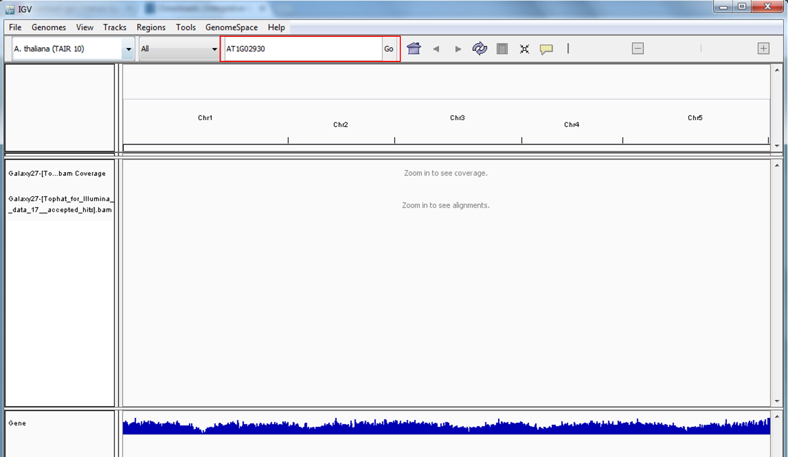
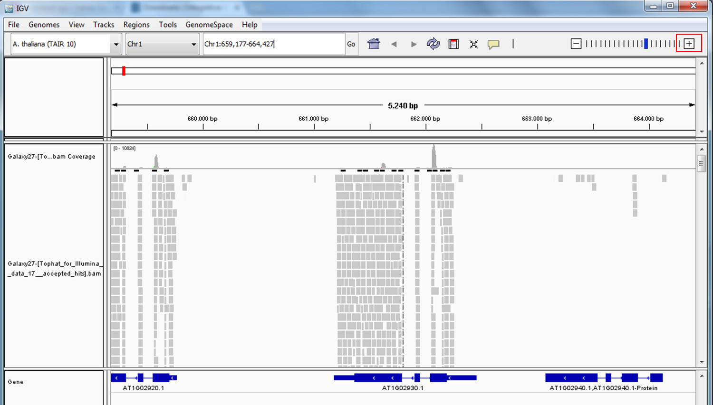
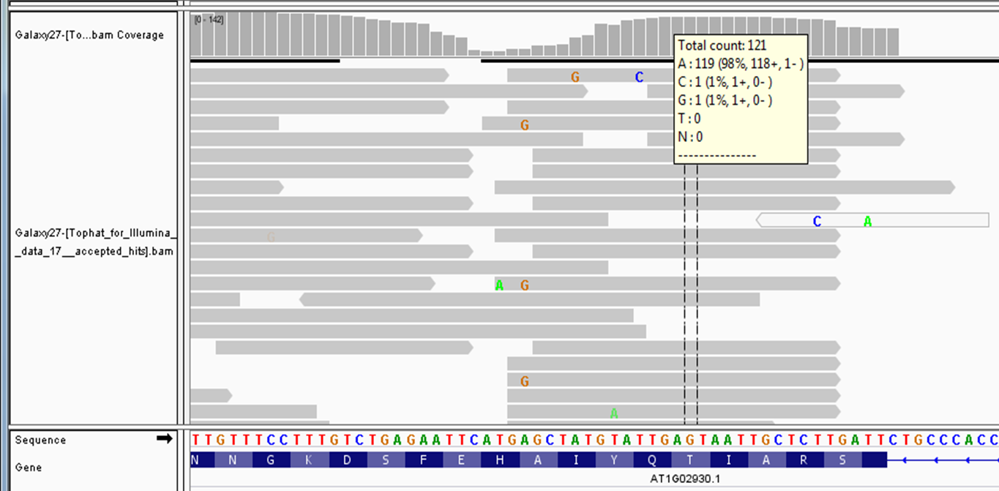
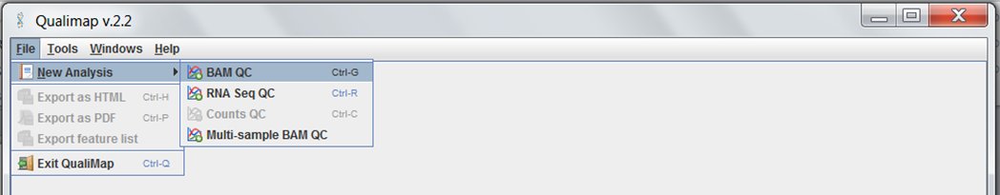
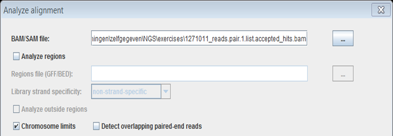
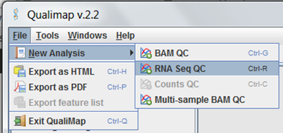
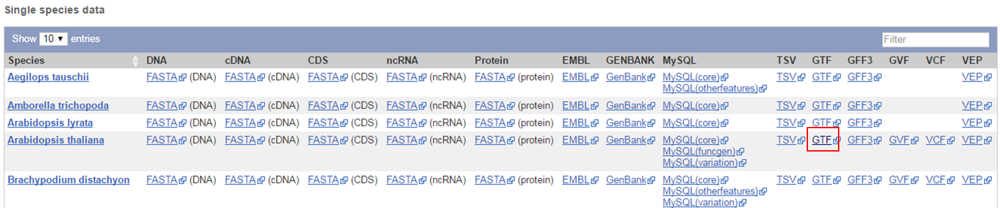
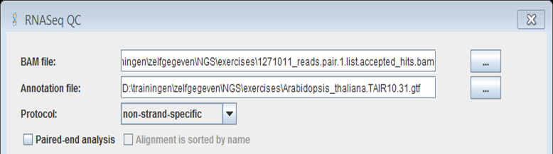

After quality control, the next step is to align the reads to a reference sequence. 
The reference is in most cases the full genome sequence but sometimes, a library of EST sequences is used. In either way, aligning your reads to a reference sequence is called mapping.
The most used mappers are [BWA](http://bio-bwa.sourceforge.net/) and [Bowtie](http://bowtie-bio.sourceforge.net/bowtie2/index.shtml) **for DNA-Seq data** and [Tophat](http://tophat.cbcb.umd.edu/) , [STAR](https://github.com/alexdobin/STAR) , [STAR article](http://bioinformatics.oxfordjournals.org/content/early/2012/10/25/bioinformatics.bts635) , or [HISAT2](http://www.ccb.jhu.edu/software/hisat/index.shtml) **for RNA-Seq data**.
Mappers differ in methodology, parameters, how fast and how accurate they are and whether they tolerate spliced alignments or not (relevant for RNA-Seq). Bowtie is faster than BWA, but looses some sensitivity (does not map an equal amount of reads to the correct position in the genome as BWA). BWA and Bowtie cannot align spliced reads while Tophat, STAR and HISAT2 can.
At the moment STAR is the most popular RNASeq mapper and HISAT2 is being pushed over TopHat.

## Mapping in Galaxy

Links:
 - [Mapped data for Arabidopsis in the European Galaxy](https://usegalaxy.eu/u/janick/h/cleandatamapped)
 - [paper on intron sizes in various organisms](https://www.ncbi.nlm.nih.gov/pubmed/10454621)
 - [Sorted and indexed data for *E.coli* in the European Galaxy](https://usegalaxy.eu/u/janick/h/ecolisorted)
 - [fasta file containing the E.coli K12 genome](http://data.bits.vib.be/pub/trainingen/NGSIntro/EcoliK12.fasta)
 - [Bowtie manual](http://bowtie-bio.sourceforge.net/manual.shtml)

### Running RNA STAR in Galaxy

STAR has a large number of parameters, we'll give an overview of the most important ones:
 - **Single end or paired end data**: the parameters you have to set will adjust accordingly
 - **RNASeq Fastq file**: STAR automatically detects files it can use as input, select the file you want to map.
 - **Custom or built-in reference genome**: many reference genomes are built-in in Galaxy just select the correct organism from the list of reference genomes.
 - **Length of the genomic sequence around annotated junctions**: the default is 100 but the ideal value is **read length-1**.
 - **Count number of reads per gene**: map reads and create a count table (table with counts of how many reads map to each gene).
 - **Would you like to set output parameters (formatting and filtering)?**: in most cases **yes** because the default settings will most likely not be ideal for your data
 - **Would you like to set additional output parameters (formatting and filtering)?**: in most cases **yes** because the default settings will most likely not be ideal for your data
 - **Would you like unmapped reads included in the SAM?**: by default STAR does not save the unmapped reads, so if you want to analyze them (BLAST...) you need to change this setting.
 - **Maximum number of alignments to output a read's alignment results, plus 1**: default is 10 meaning that reads that map to more than 10 locations in the genome are excluded from the results.  Multimappers are common when you map short reads. What to do with them is a complicated issue. You could use them to represent expression of whole classes/families of RNAs (e.g. transposons, gene families...). It can be useful to have two separate files: one for unique mappers and one for multimappers.
 - **Maximum number of mismatches to output an alignment, plus 1**: maximum number of mismatches for a read (single-end) or a pair of reads (paired-end). Default is 10. The value you should choose is dependent on the read length. For short quality trimmed reads you typically allow 5% mismatches.
 - **Maximum ratio of mismatches to read length**: how many mismatches you allow in the alignment (number is represented as a fraction of the total read length). Typically you choose 0.05 (= 5%) but this depends on the quality of the reads. In case of reads with many sequencing errors you need to increase the fraction of mismatches you allow.
 - **Other parameters (seed, alignment, limits and chimeric alignment)**: choose **extended parameter list** because the default settings will most likely not be ideal for your data
 - **Alignment parameters: Maximum intron size**: maximum distance between reads from a pair when mapped to the genome.
 - **Two-pass mode: Use two pass mode to better map reads to unknown splice junctions**: for the most accurate mapping, you should run STAR in 2-pass mode. It allows to detect more reads mapping to novel splice junctions. The basic idea is to run STAR with standard parameters, then collect the junctions detected in this first pass, and use them as annotated junctions for the second pass mapping.
 - **Parameters related to chimeric reads**: chimeric reads occur when one read aligns to two distinct portions of the genome. In RNA-Seq chimeric reads may indicate the presence of chimeric genes. Many chimeric genes form through errors in DNA replication or DNA repair so that pieces of two different genes are combined. Chimeric genes can also occur when a retrotransposon accidentally copies the transcript of a gene and inserts it into the genome in a new location. Depending on where the new retrogene appears, it can produce a chimeric gene...

Click **Execute** to start the mapping.

STAR produces 3 result files:
 - **bam** file containing all alignments (multimappers, reads that map to multiple locations, are printed at each location)
 - **tab** file containing all detected splice junctions
 - **log** file containing mapping statistics

### Running Bowtie for Illumina (= Bowtie1) in Galaxy

This is an overview of the main parameters:
 - **Will you select a reference genome from your history or use a built-in index?** Galaxy has many built-in genomes for Bowtie 1 but you can also use a fasta file from the history when the organism you work is not supported.
 - **Is this library mate-paired?** single end or paired end ?
 - **FASTQ file** Galaxy will automatically detect potential input files, select the file you want to use as input.
 - **Bowtie settings to use** ask for full parameter list since the defaults are most likely not ideal for your data
 - **Trim n bases from high-quality (left) end of each read before alignment (-5)** trim bases from high-quality (left) end of each read before alignment, default is 0.
 - **Trim n bases from low-quality (right) end of each read before alignment (-3)** trim bases from low-quality (right) end of each read before alignment, default is 0.
 - **Alignment mode** when the default -n option is used, bowtie determines which alignments are valid according to the following policy: alignments may have no more than n mismatches (where n is a number 0-3, set with **Maximum number of mismatches permitted in the seed (-n)**) in the first l bases (where l is a number 5 or greater, set with **Seed length (-l)**) on the high-quality (left) end of the read. The first l bases are called the "seed". The sum of the Phred quality scores at all mismatched positions (not just in the seed) may not exceed e (set with **Maximum permitted total of quality values at all mismatched read positions (-e)**).
In -v mode, alignments may have no more than v mismatches, where v may be a number from 0 through 3 set using the **Maximum number of mismatches (-v)** option. Quality values are ignored.
 - **Suppress all alignments for a read if more than n reportable alignments exist (-m)**  default is no limit. Bowtie is designed to be very fast for small -m but can become significantly slower for larger values of -m

### Download mapping results from Galaxy

Click the name of the file containing the sorted alignments in the history.
Click the **download** button at the bottom of the description. You should download two files: the bam file containing the mapping results and an index file (.bai) for fast access to the bam file. In Galaxy, indexing of bam files is done automatically. You need to download both files into the same folder. 
 

## Mapping in GenePattern

**Links**:
 - [Parameters of STAR](https://wiki.bits.vib.be/index.php/Parameters_of_STAR)
 - [paper on intron sizes in various organisms](https://www.ncbi.nlm.nih.gov/pubmed/10454621)
 - [fasta file containing the E.coli K12 genome](http://data.bits.vib.be/pub/trainingen/NGSIntro/EcoliK12.fasta)
 - [Bowtie manual](http://bowtie-bio.sourceforge.net/manual.shtml)

### Running STAR in GenePattern

 - Search for the STAR aligner tool
 - Fill in the parameters of STAR, you can find a detailed description of the parameters on [this page](https://wiki.bits.vib.be/index.php/Parameters_of_STAR)
 - Run STAR
 - Store the resulting bam file in your uploads folder
 - View the …align_summary.txt file in your browser to get an overview of the mapping results.

### Running Bowtie_1 indexer in GenePattern

Search for the Bowtie_1 indexer tool. Here's a detailed description of the main parameters:

 - **fasta files** one or several fasta files containing the DNA sequence of the genome to index.
 - **index name** a name for the bowtie 1 index files.

Run the indexer, it will produce 6 files:
 - <index name>.1.ebwt
 - <index name>.2.ebwt
 - <index name>.3.ebwt
 - <index name>.4.ebwt
 - <index name>.rev.1.ebwt
 - <index name>.rev.2.ebwt

For easy handling in GenePattern Bowtie_1.indexer puts all these files in a ZIP archive, which can be given as input to Bowtie_1.aligner. Store the resulting zip file in your uploads folder.

### Running Picard SortSam in GenePattern

Some downstream tools cannot handle raw bam files since they are so large and chaotic, they need sorted and indexed bam files. Bam files can be sorted and indexed with samtools or Picard. 
 - Search for a tool that can sort sam or bam files
 - Sort the file, keep the results in bam format. Sorting will add an index to the bam file (this is the .bai file that is generated)
 - Download the sorted bam and bai files to your computer

## Mapping via command line tools

On our Linux command line page you can find:
[an exercise on mapping with Bowtie](http://wiki.bits.vib.be/index.php/Linux_command_line#Mapping_reads_with_Bowtie) via the command line.

We will handle the mapping in detail in advanced NGS trainings, so we are not going into more detail now.

## Visualisation of mapping results in IGV

 - [bam-file for *Arabidopsis thaliana* from GenePattern](http://data.bits.vib.be/pub/trainingen/NGSIntro/GP_Athaliana.bam)
 - [bai-file for *Arabidopsis thaliana* from GenePattern](http://data.bits.vib.be/pub/trainingen/NGSIntro/GP_Athaliana.bai)
 - [bam-file for *Arabidopsis thaliana* from Galaxy](http://data.bits.vib.be/pub/trainingen/NGSIntro/Galaxy_Athaliana.bam)
 - [bai-file for *Arabidopsis thaliana* from Galaxy](http://data.bits.vib.be/pub/trainingen/NGSIntro/Galaxy_Athaliana.bai)
 - [bam-file for *E. coli* from GenePattern](http://data.bits.vib.be/pub/trainingen/NGSIntro/GP_Ecoli.bam)
 - [bai-file for *E. coli* from GenePattern](http://data.bits.vib.be/pub/trainingen/NGSIntro/GP_Ecoli.bai)
 - [bam-file for *E. coli* from Galaxy](http://data.bits.vib.be/pub/trainingen/NGSIntro/Galaxy_Ecoli.bam)
 - [bai-file for *E. coli* from Galaxy](http://data.bits.vib.be/pub/trainingen/NGSIntro/Galaxy_Ecoli.bai)

IGV needs a sorted bam file and an index (.bai) file.

 - Open IGV by clicking its icon on the Desktop. Be patient, it might take a few minutes for the program to start.
 - If necessary change the genome in IGV from **Human hg19** to the one you used in the mapping.

 
 - Load the mapped reads via **File** in the top menu and **Load from File**.

 

Select the .bam file to open. You don't need to load the .bai file, it's suffcient that it is present in the same folder as the .bam file. 
 - This loads the data into the center view. At this point, you can't see the reads, you have to zoom in to view them.
 - To zoom in on a gene type its accession number in the top toolbar and clicking **Go**:

 

 - Zooming in can be done using the zoom bar in the top toolbar:

 

The reads are represented by grey arrows, the arrow indicating the orietation of the mapping. Hovering your mouse over a read gives additional info on the mapping. The colored nucleotides indicate mismatches between the read and the reference.

By default IGV calculates and displays the coverage track (red) for an alignment file. When IGV is zoomed to the alignment read visibility threshold (by default 30 KB), the coverage track displays the depth of the reads displayed at each locus as a gray bar chart. If a nucleotide differs from the reference sequence in greater than 20% of quality weighted reads, IGV colors the bar in proportion to the read count of each base (A, C, G, T). You can view count details by hovering the mouse over a coverage bar:

 

## Quality control of mapping results using Qualimap

Qualimap is very similar to FastQC. It has an easy-to-use user interface and works on any platform: Windows, Mac, Linux. It's installed on the BITS laptops: you can run it by clicking the icon on the desktop.
You can do several analyses in Qualimap: we will focus on the BAM Quality Control and the RNA-Seq Quality Control.

### Starting a BAM QC analysis in Qualimap

 - [gtf-file for *Arabidopsis thaliana* from Ensembl Plants](http://data.bits.vib.be/pub/trainingen/NGSIntro/Arabidopsis_thaliana.TAIR10.31.gtf)

In the top menu, expand **File** and select **New analysis** and **BAM QC**

 

A parameters form is opened.

Select a .bam file as input file and leave all other parameters at their default setting:

 

 - With the default settings the mapping is evaluated over the full reference sequence but you can limit the evaluation to certain regions by selecting the **Analyze regions** option and providing a gtf file containing the regions of interest.
 - There are parameters for specific types of NGS experiments e.g. stranded libraries (**Library strand specificity**) and paired-end reads (**Detect overlapping paired-end reads**).

A BAM Quality Control report is generated, very similar to the report that FastQC produces. Let's take a look at some of the figures in the report:

 - **Coverage across reference**: In the top figure you see the coverage (red line; average coverage in a window of a certain size) across the reference sequence. In the bottom figure you see the GC content (black line) across the reference.
 - **Coverage histograms**: What percentage of the genome is not covered, covered at least once....

### Starting a RNA-Seq QC analysis in Qualimap

Specifically for RNA-Seq data you can  do a RNA-Seq QC in Qualimap. In the top menu, expand **File** and select **New analysis** and **RNA-seq QC**

 

A parameters form is opened. 

 - You need to provide an annotation file so Qualimap knows where the exons are located on the reference sequence. This annotation file is in gtf format and can be downloaded from the Ensembl or [EnsemblGenomes](http://ensemblgenomes.org/info/access/ftp) ftp site. GTF stands for general transfer format, used for linking features (exons, introns, genes, transcripts, repeats, mutations...) to locations in the genome. 

 
Select the .gtf file as annotation file
 - Select the .bam file as input file 
 - Leave all other parameters at their default setting

 

A RNA-seq Quality Control report is generated.

*Coverage Profile (Total)*: The plot shows mean coverage profile of the transcripts. All transcripts with non-zero coverage are used to calculate this plot.
*Coverage Profile (Low)*: The plot shows mean coverage profile of 500 lowest-expressed genes.
*Coverage Profile (Total)*: The plot shows mean coverage profile of 500 highest-expressed genes.
*Coverage Histogram (0-50x)*: Coverage of transcripts from 0 to 50X. If certain genes have higher coverage level they are added to the last column (50X).
*Junction Analysis*: This pie chart shows analysis of junction positions in spliced alignments. Known category represents percentage of alignments where both junction sides are known. Partly known represents alignments where only one junction side is known. All other alignments with junctions are marked as Novel.

[Solutions of Group Exercises](http://data.bits.vib.be/pub/trainingen/NGSIntro/Solutions.pdf)

