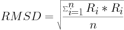

> ### Agenda
>
> In this tutorial, we will cover:
>
> 1. TOC
> {:toc}
>
{: .agenda}

# Structural comparison and RMDD 
We compare structures by superposing (or structurally align) them on top of each other. That is, we
 superpose structurally equivalent atoms. For now, we will only superpose CA atoms, so backbones. B
ut Yasara also can superpose on any type of atom you want. You always need to specify:

-  source object(s): the structure(s) that needs to be rotated and translated to superpose on anoth
er structure
-  target object: the structure to superpose on

An optimal superposition is found when the root-mean-square deviation (RMSD) is at a minimum. The R
MSD is given as:

where R is the distance between two structurally equivalent atom pairs (CA in our case) and n is th
e total number of atom pairs.Get data

> ###  Hands-on: Data download
>
> 1. Download the following adapted PDB files from [Zenodo](https://zenodo.org/record/3550492#.XdeNL1dKiUk) 
>
>    ```
>     1DKX_1.pdb 1DKY_1.pdb 1DKZ_1.pdb 3DPO_1.pdb 3DPP_1.pdb 
>    ```
>
{: .hands_on}

# Superimposing multiple structures using YASARA 

Now load all of them in YASARA:

```
File > Load > PDB File
```

and select the CA (C-alpha) view (F4) and superpose with the MUSTANG algorithm:


```
Analyze > Align > Objects with MUSTANG
```


In the first window you have to select the source objects that will be repositioned. Select Objects 2 till 5. In the second window you select the target Object to superpose on. That would then be the first object.

Notice that YASARA prints the RMSD of every superposition in the lower Console. Open the Console by pressing the spacebar once or twice to extend it.

Color the atoms by their B-factor:

```
View > Color > Atom > Belongs to or has > All
Then choose BFactor in the next window and press 'Apply unique color'.
```

High BFactors are yellow, low BFactors are blue.


> ###  Questions
>
> Question: Do you see a correlation between the BFactors and the variability in the structure?
>
> > ###  Solution
> >
> > 1. Yes, add explanation here
> > **TODO**: add image
> >
> {: .solution}
>
{: .question}


# Conclusion
{:.no_toc}

Superimposition of related structures is a very efficient approach to spot similarities and differences of structutally related proteins.
