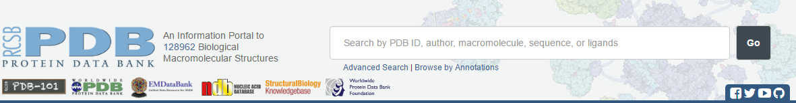
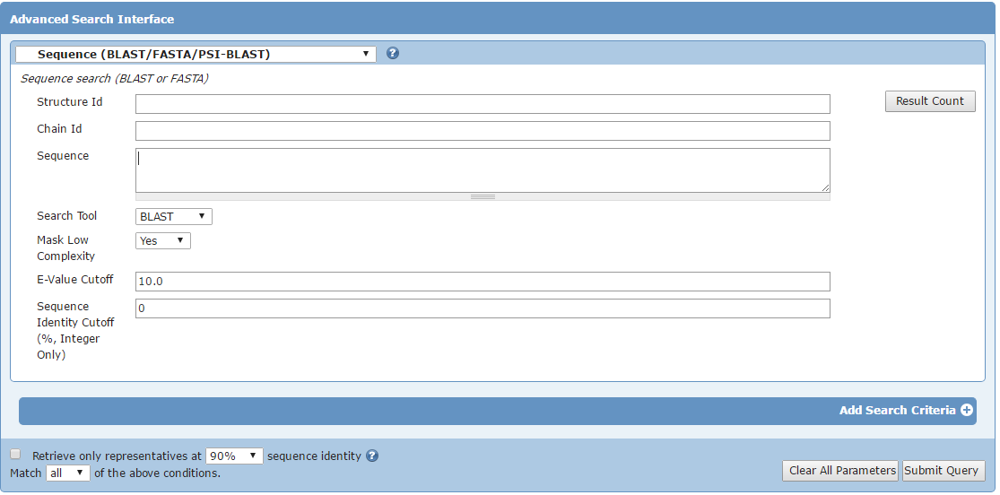
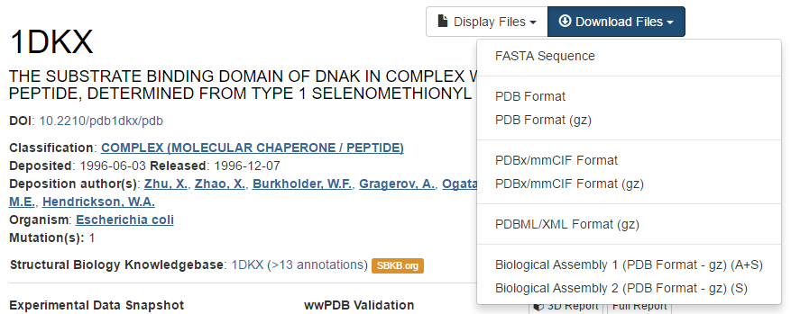

## Search for a structure

### Via [UniProt](http://www.uniprot.org/)
The way of searching for a specific protein structure depends on the data you already have. You might already have the PDB ID (a unique identifier), that's an easy one. But mostly you have the protein name or you just have a sequence. In the last cases I recommend to start from the UniProt website at <http://www.uniprot.org>, which is the best annotated protein database in the world. Our first model protein will be the molecular chaperone DnaK from *E. coli*. Below is an image of the UniProt search box where you can start your search for proteins.


<<<<<<< HEAD
=======
**TODO Replace howto below with video? If so, where host it?** youtube Christof voor BITS account channel
>>>>>>> e7656c794b288903a26802f6f174b0081784a7da

> ###  Explore a PDB structure on the Uniprot web site
>
> 1. Go to the UniProt website and search for the DnaK protein
> - The UniProt search engine returns a list of DnaK protein sequences from a variety of organisms. An entry with accession code **P0A6Y8** and entry name **DNAK_ECOLI** should be near the top of this list.
> 2. Click on the *accession code* (column Entry) to view the protein page of this DnaK from the model organism *Escherichia coli*.
> 3. Click on *Structure* in the left-side menu and then look at the *3D structure databases* table.
{: .hands_on }

https://youtu.be/rVY6GGvzE10?list=PLHOTpM-hNSSUa1b-Ac_gcIhwQGcMRISFq

**TODO Insert h5p** aanvullen met opties die fout zijn / welk scenario draagt je voorkeur (2 of 3 opties)?
**TODO where do we go from here? - scenario gebaseerde oefening / formaat screenshot of korte video

[h5p id="99"]


### Via the Protein Data Bank by PDB ID

You can find structural information directly at the PDB database. The web site of the PDB consortium is located at <http://www.wwpdb.org>. This web site provides links to all members of the PDB (left side). It is a question of taste which resource you start off with. For X-ray structures, it is currently PDBe, RCSB PDB, PDBj. For NMR structres, you find the BMRB. In today's course, we focus on the PDB resources only.

Below is an image of the RCSB search box <http://www.rcsb.org/pdb/home/home.do> where you can start your search for structures.



The PDB file with ID **1DKX** contains the atomic coordinates of the molecular chaperone (DnaK) from *E. coli*.

###  Search a structure on the RCSB web site

1. Go to the PDB website and type 1DKX in the search box
{: .hands_on }


This will lead you to the same page we got earlier through UniProt.

### Via the Protein Data Bank by sequence

In lots of cases we only have a sequence of which we would like to find out if there is structural information. The PDB can be searched using a sequence as input. Here is the sequence of the C-terminal substrate binding domain of DnaK:
```
    DVKDVLLLDVTPLSLGIETMGGVMTTLIAKNTTIPTKHSQVFSTAEDNQSAVTIHVLQGE
    RKRAADNKSLGQFNLDGINPAPRGMPQIEVTFDIDADGILHVSAKDKNSGKEQKITIKAS
    SGLNEDEIQKMVRDAEANAEADRKFEELVQTRNQGDHLLHSTRKQVEEAGDKLPADDKTA
    IESALTALETALKGEDKAAIEAKMQELAQVSQKLMEIAQQQHAQQQTAGADASANNAKDD
    DVVDAEFEEVKDKK
```
The PDB allows sequence searches through the same search box we used before.


There is also an Advanced Search section, with a Blast/Fasta option in the Sequence Features section.



> ###  Hands-on: BLAST search for PDB structure
>
> 1. Go to the Advanced Search section
> 2. Open the Sequence section in the Query Builder. This method allows you to change some parameters for the search.
> 3. Copy and paste the sequence in the ''Sequence'' field
> 4. Press Enter or click on the Search Icon in the bottom corner.
> 5. You should see the same structures popping up as you saw in the UniProt page of DnaK.
{: .hands_on}

# The PDB file

## Introduction

A PDB (Protein Data Bank) file is a plain text file that contains the atom coordinates of a solved 3D structure of a protein or even DNA. Such coordinate files can be obtained at the Protein Data Bank at <http://www.rcsb.org/pdb>. Each PDB file has a unique identifier (ID) consisting of 4 characters, the first one is always a number. Note: It has been announced that the 4 character code will change in the future <https://www.wwpdb.org/news/news?year=2017\#5910c8d8d3b1d333029d4ea8>.
The PDB file with ID **1DKX** contains the atomic coordinates of the molecular chaperone (DnaK) from *E coli*.

> ###  Hands-on: Search for PDB structure by identifier
>
> 1. Go to the PDB website at <http://www.rcsb.org/pdb>
> 2. Type 1DKX in the search and try to answer the following questions.
{: .hands_on}


[h5p id="100"]


## Downloading the structure

The file that holds the 3D coordinates can be downloaded by clicking on *Download files* in the top right corner and then choosing *PDB file (text)*. For convenience, save this file on your desktop. The filename is the 4-character unique PDB ID.



> ###  Hands-on: Open downloaded PDB file in an editor
> 1.   Open this file with a text editor, e.g. WordPad is an excellent tool for that.
> 2. Do you see the different sections in the PDB file? Analyse some ATOM lines and try to explain what kind of data is in each column.
{: .hands_on}

Additional exercises on searching PDB can be found on [the basic bioinformatics exercises page](http://wiki.bits.vib.be/index.php/Exercises_on_Protein_Structure).
