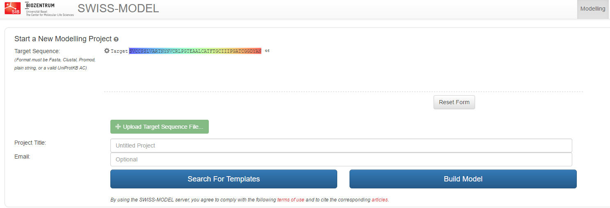
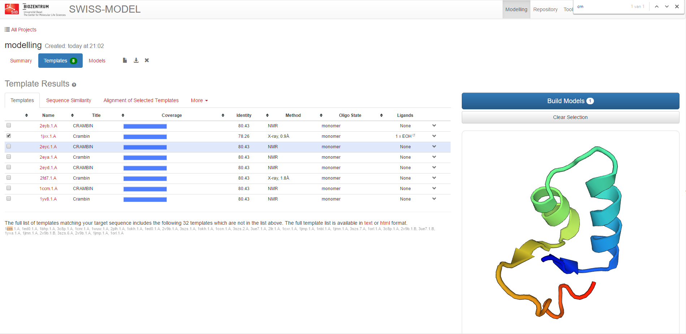
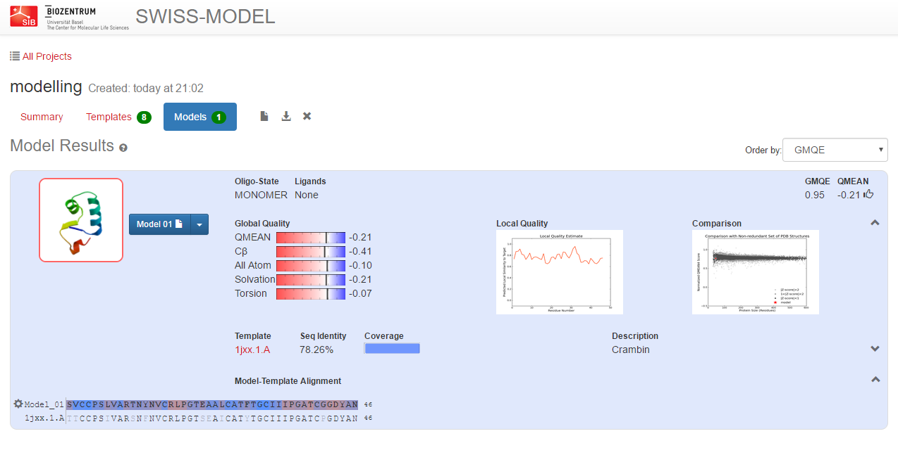
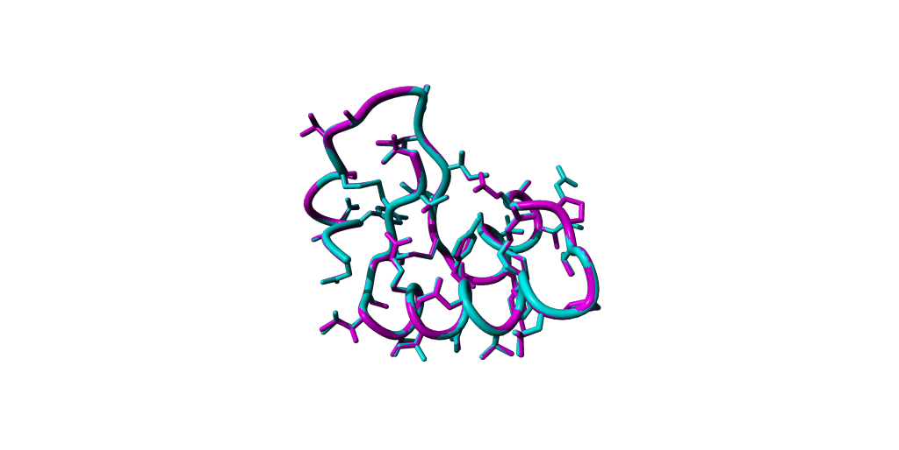

## Introduction
{:.no_toc}

<!-- This is a comment. -->

The goal of homology modeling is to predict the 3D structure of a protein that comes close to what would be achieved experimentally with X-Ray experiments.

Main principles of homology modeling

- We predict the structure of a protein sequence on the basis of the structure of another protein with a similar sequence (the template)
- If the sequences are similar, the structures will have a similar fold
- Structure is more conserved than sequence

## Main ingredients for homology modelling

### The sequence

Last week my colleague sequenced a plant protein. He is not a bioinformatician. Yet, he would like to know what the structure might look like to do some rounds of rational mutagenesis. Let's try to address the problem for him.

He came up with this sequence:

```
SVCCPSLVARTNYNVCRLPGTEAALCATFTGCIIIPGATCGGDYAN
```

### Searching for the template structure

Actually, the first step is to check whether the PDB already contains the structure of this sequence. That would be easy so we don't have to model anything. We will use Blast again to search with the sequence.

> ###  Hands-on: BLAST search for PDB structure
>
> 1. Go to the Advanced Search section
> 2. Please select 'Sequence BLAST/PSI-BLAST' in the Query type drop down.
>    This method allows you to change some parameters for the search.
> 3. Copy and paste the sequence in the ''Sequence'' field
> 4. Press ''Submit query''.
> 5. You should see the same structures popping up as you saw in the UniProt page of DnaK.
{: .hands_on}

A suitable template structure to make a high quality model should have following properties:

- The highest possible sequence identity from all structures in the PDB when aligned to the target sequence
- A good resolution (and R-factor): if many identical template structures exist with the same sequence, filter by resolution
- Is solved by X-RAY, not NMR.

**TODO Postponed. Add h5p. Get responses. Get a few alternatives for the second question if multiple choice**

> ###  Questions
>
> 1. Is there a difference in the number of identities, positives and gaps between the two remaining x-ray structures?
> 2. What is the PDB ID with the highest resolution, does not have insertions or deletions and should thus be the better template structure?
>
> <details markdown="1">
> <summary> Solution
> </summary>
>
> 1. **TODO**
> 2. **TODO**
>
> </details>
>
>
{: .question}


## Aligning target and template sequence and template selection

The alignment is the most crucial part of homology modeling. We will not explain what an alignment is and how you make it, this should be known. In an alignment, we put homologous sequences on top of each other in a text file. The point is that amino acids that are on top of each other in the same column are assumed to have the equivalent position in the 3D structure. So if the template sequence has an Ala at position 3, where the target sequence has a Phe, homology modelling tools will use the backbone of the template structure and replace the sidechain at position 3 from Ala to Phe.

Homology modelling evolved over the years and many online tools for homology modelling are available. In my experience, homology modelling can be rather difficult and needs expert knowledge depending on the actual situation (sequence conservation, available templates, etc.).

Can you imagine what could be the reasons?


# Building the homology model with Swiss Model

Our current request for homology modelling is a rather safe one, so we can use an automatic server for homology modelling. There are many automatic tools available and many of them compete in regular competitions like lastly, the 12th Community Wide Experiment on the Critical Assessment of Techniques for Protein Structure Prediction (CASP12) - [1].

In our example, we take the [Swiss Model server](https://swissmodel.expasy.org/interactive). SWISS-MODEL is a fully automated protein structure homology-modelling server, accessible via the ExPASy web server, or from the program DeepView (Swiss Pdb-Viewer). The purpose of this server is to make Protein Modelling accessible to all biochemists and molecular biologists worldwide.

> ###  Hands-on: Template selection step with Swiss Model
>
> 1. Browse to the [Swiss Model server](https://swissmodel.expasy.org/interactive)
> 2. On the first page, paste the sequence of our unknown protein in the field 'Target Sequence' and give the project a name.
>    
> 3. Click 'Search templates' to initiate the first step.
>    Thereafter, the server identifies structural template(s) and gives an overview list of hits
>    which you can select the templates from.
>
{: .hands_on}

**TODO POSTPONED add h5p. The answer 1jxx.1.A is listed but does not appear among the 8 results shown. Can this be adjusted?**

[h5p id="101"]

> ###  Question
>
> Which of the 10 (at the time of writing) possible template structures would you select as template for the model building process?
>
> <details markdown="1">
> <summary> Solution
> </summary>
>
> We suggest as template **1jxx.1.A** given that it is an X-ray structure with high resolution and a very high
> sequence identity (X-ray, 0.9 Å, 78.26 %).
> </details>
{: .question}


> ###  Hands-on: Model Building Step and Visualisation
>
> 1. Once you have selected the template, hit 'Build Model' to start the homology modelling procedure.
>    The server will alignment of target sequence and template structure(s), build a model and evaluate it.
>    These steps require specialized software and integrate up-to-date protein sequence and structure databases.
>    Each of the above steps can be repeated interactively until a satisfying modelling result is achieved.
>    
> 2. Once the model has been built, you can download it.
>    
> 3. If the Swiss Model server is too busy at the moment you execute the request, you can download the model from
>    [here](https://zenodo.org/record/3551850#.Xdqs4ehKiUk).
> 4. Load the created model into YASARA.
>    Perform a structural alignment with your reference e.g. 1CRN and try to detect the differences through manipulating the visualisations.
>    
{: .hands_on}


# Conclusion
{:.no_toc}

Homology modelling evolved over the years and many online tools for homology modelling are available. You have used the Swiss Model service with a reasonable simple modelling request. Often, in research projects, homology modelling can be rather difficult and needs expert knowledge depending on the actual situation (sequence conservation, available templates, etc.).
