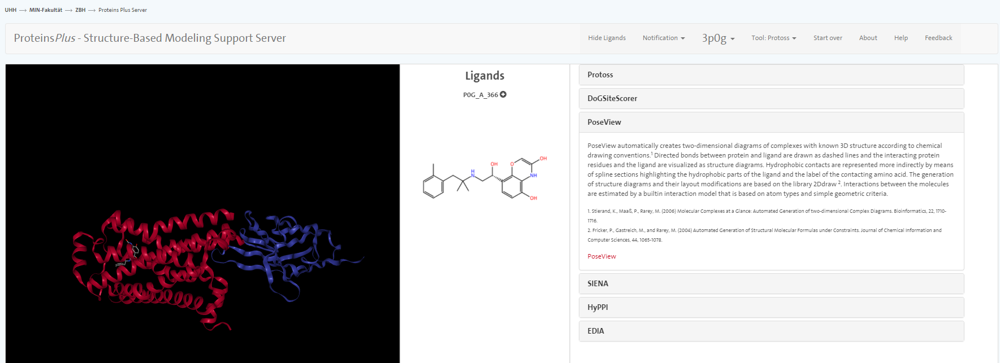
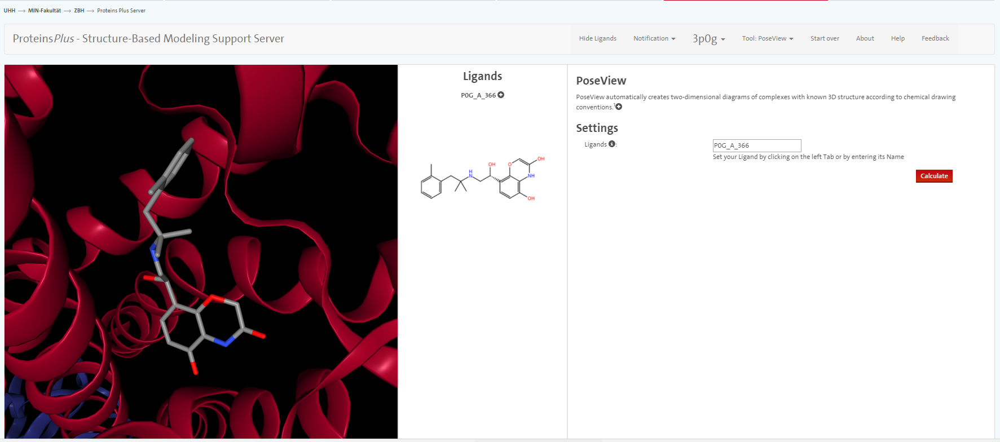
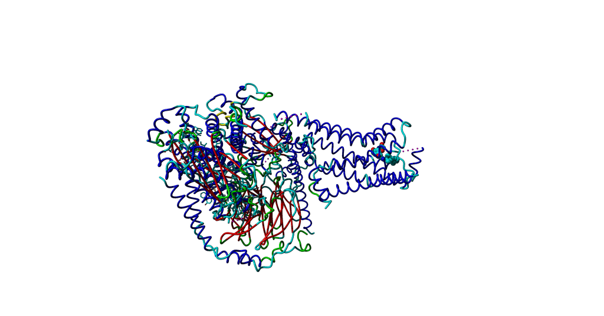

# Introduction
{:.no_toc}

<!-- This is a comment. -->

The goal of this exercise is appreciate how protein interactions can be studied through visual inspection and other software tools. Protein interactions can be classified into different groups regarding the molecular properties and functions of the interacting partners. (These groups are intertwined in several cases.) Some examples include:

- the interactions of proteins with other proteins, small molecules, carbohydrates, lipids or nucleic acids;
- Receptor-ligand interactions;
- Antigen-antibody interactions;
- Enzymatic interactions, enzyme-inhibitor interactions.

## Exploring the structure of a nanobody-stabilized active state of the β2 adrenoceptor - the ligand

We will start with exploring one crystal structure of the β2 adrenoceptor. Together with the Steyaert lab from VIB, Kobilka published several crystal structures of the β2 adrenoceptor in its various activation states (Rasmussen et al. Nature 2011, 477)

Let's get the data first: Download the crystal structure 3P0G from the PDB into YASARA: File - Load - PDB file from internet.

[h5p id="104"]

Some software routines need seperate chain identifiers for molecular entities to work correctly, so we suggest to rename the small molecule to chain L:

- Activate the Head-up display
- Select Rename
- Enter 'L' to proceed with the renaming.

We first have a look whether we can find out if there are specific interactions of the small molecule ligand with the adrenoreceptor. In order to do so, we first have to add Hydrogens to all present molecules:

- Edit - Add - hydrogens to : All
- Change the display of the ligand to Sticks
- Select the amino acids of the binding pocket i.e. a sphere of 10 Angstrom around the ligand: Select – in sphere around – Residue and drag with the mouse until the display says 10 Å
- View – show interactions – hydrogen bonds of - Residues Select 'Selected' in the panel Belongs to or has and press OK in the subsequent window.

Given that hydrogen bonding is dependent on the definition of a hydrogen bond in the program, it is not a bad idea to use other tools to compare the analysis. There are many options to do this online if you look at published crystal structures. Next to the tools which are directly linked out from the web site of the crystal structure at the PDB database you can use the [ProteinPlus server](http://proteinsplus.zbh.uni-hamburg.de/)

Go to the web site of ProteinPlus and enter the PDB code 3P0G into the search box. After clicking on Go, you should be presented with on overview of tools the ProteinPlus server provides.

We do not go into great detail on all the tools but only mention PoseView. With this tool, you can prepare an automatic sketch of the small molecule-protein interactions.




https://youtu.be/0gKccDq62-s?list=PLHOTpM-hNSSUa1b-Ac_gcIhwQGcMRISFq


# Exploring the structure of a nanobody-stabilized active state of the β2 adrenoceptor - the nanobody

In order to estimate the binding energy between the nanobody and the β2 adrenoceptor, we can use the FoldX tool AnalyseComplex. It is recommended to calculate these binding energies on energy-minimized structures. To illustrate the effect of the energy minimization, we compare the interaction energy of the current crystal structure and its minimized structure.


## Use the tool FoldX tool AnalyseComplex

> ### 
>
> 1. Given that energy-minimization takes a while for this rather large complex,
>     please download the Yasara scene [here](http://data.bits.vib.be/pub/trainingen/PSA/3P0G_1.sce)  
>    
>    Calculate the interaction energies between the chain A and B of the object 3P0G
>    and the RepairObj1, respectively.
>
>    ```
>    Analyze - FoldX - Interaction energy of molecules
>    ```
{: .hands_on}

This command also creates a list of residues forming the interface of the two proteins. Hit space to see the list of residues in the interface.

Tip: This list can also be useful if you want to make visualisations of the interaction site.

```
Plugin>interface residues between A and B
Plugin>TA66 TA68 IA72 IA127 RA131 AA134 IA135 TA136 SA137 PA138 FA139 KA140 QA142 YA219 VA222 EA225 AA226 LA266 KA267 EA268 AA271 LA272 TA274 LA275 IA278 IA325 YA326 RA328 SA329 PA330 SB27 IB28 FB29 SB30 IB31 TB33 AB50 IB51 eB52 SB56 TB57 NB58 YB100 AB102 VB103 LB104 YB105 EB106 YB107
```

https://youtu.be/0gKccDq62-s?list=PLHOTpM-hNSSUa1b-Ac_gcIhwQGcMRISFq&t=891

# Comparing the active and the inactive conformation of the β2 adrenoceptor

In case, there is still time, I would recommend to try to use some of your capabilities you learned today and create a superposition of the inactive and active conformation of the β2 adrenoceptor. We take one of the crystal structures which are available: 3SN6

```
File - Load - PDB file from Internet
```

You will be kind of overwhelmed once the structure is loaded into YASARA. In order to get a first quick overview, click on the 'Center' buttom in the menu of YASARA (5th buttom from the left). Then, it is time to look at the PDB entry of 3SN6 in the PDB database to have a first idea on what molecules are in the PDB file.

As you see on the website [3SN6](http://www.rcsb.org/pdb/explore/explore.do?structureId=3SN6i), the chain R consists of 2 molecules, the β2 adrenoceptor and lysozyme.
In the corresponding article, it is stated that 'the unstructured amino terminus of the β2AR is replaced with T4 lysozyme (T4L)'.

Since this is an extra molecule in the crystal structure which disturbes our view, we will delete it.

After the manipulation, the overall picture should look roughly like this.



In the following step, we structurally align only the receptors. The rest of the structures will move along. In order to do a structural alignment, it is suggested to use the first chain A from 3P0G as target.


```
Analyze - Align - Pairwise, based on structure - Molecules with MUSTANG
```

Investigate the differences in TM helices and the binding of the nanobody compared to the subunit of the G protein.

Tip: Color the secondary structures to better identify the individual chains/units of G protein.

# Conclusion
{:.no_toc}

In these exercises, you have explored how visualisation techniques together with structural alignment, superposition and the use of FoldX to calculate interaction energies enables in-depth analysis of protein-protein and protein-ligand complexes.
