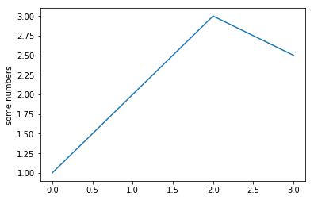

# 12. Plotting figures
*This chapter is based on the materials from [this book](https://www.packtpub.com/eu/big-data-and-business-intelligence/become-python-data-analyst) and [this website](https://python-graph-gallery.com/8-add-confidence-interval-on-barplot/)*

Matplotlib is a Python 2D plotting library which produces publication quality figures. Although Matplotlib is written primarily in pure Python, it makes heavy use of NumPy and other extension code to provide good performance even for large arrays.

We will start with the basics concepts being figures, subplots (axes) and axis. The following line of code allows the figures to be plotted in the notebook results


```python
%matplotlib inline
```

`matplotlib.pyplot` is a collection of command style functions that make matplotlib work like MATLAB. Each pyplot function makes some change to a figure: e.g., creates a figure, creates a plotting area in a figure, plots some lines in a plotting area, decorates the plot with labels, etc. In matplotlib.pyplot various states are preserved across function calls, so that it keeps track of things like the current figure and plotting area, and the plotting functions are directed to the current subplot.

What we first have to do is importing the library of course. 


```python
import matplotlib.pyplot as plt
```


```python
plt.plot([1, 2, 3, 2.5])
plt.ylabel('some numbers')
```


img 2


img 3


img 4


`plot()` is a versatile command, and will take an arbitrary number of arguments. For example, to plot x versus y, you can issue the command:


```python
x_list = list(range(1,10))
y_list = [pow(i, 2) for i in x_list]
print(x_list)
print(y_list)
```


```python
plt.plot(x_list, y_list)
plt.title("Title of the plot")
```

Using the pyplot interphase, you build a graph by calling a sequence of functions and all of them are applied to the *current subplot*, like so:


```python
plt.plot([1, 2, 3, 4], [10, 20, 25, 30], color='lightblue', linewidth=3)
plt.scatter([0.3, 3.8, 1.2, 2.5], [11, 25, 9, 26], color='darkgreen', marker='^')
plt.xlim(0.5, 4.5)
plt.title("Title of the plot")
plt.xlabel("This is the x-label")
plt.ylabel("This is the y-label")
# Uncomment the line below to save the figure in your currentdirectory
# plt.savefig('examplefigure.png')
```

When working with just one subplot in the figure, generally is OK to work with the pyplot interphase, however, when doing more complicated plots, or working within larger scripts, you will want to explicitly pass around the *Subplot (Axes)* and/or *Figure* object to operate upon.


```python
def gc_content(file):
    """Calculate GC content of a fasta file (with one sequence)"""
    sequence=""
    with open(file, 'r') as f:
        for line in f:
            if line.startswith('>'):
                seq_id = line.rstrip()[1:]
            else:
                sequence += line.rstrip()
    
    A_count = sequence.count('A')
    C_count = sequence.count('C')
    G_count = sequence.count('G')
    T_count = sequence.count('T')
    N_count = sequence.count('N')
    GC_content = (sequence.count('G') + sequence.count('C')) / len(sequence) * 100
    AT_content = (sequence.count('A') + sequence.count('T')) / len(sequence) * 100
    print("The GC content of {} is\t {:.2f}%".format(seq_id, GC_content))    
    return GC_content, AT_content, A_count, C_count, G_count, T_count, N_count
    

GC_content, AT_content, A_count, C_count, G_count, T_count, N_count = gc_content('../data/gene.fa')
print(GC_content)
print(AT_content)
print(A_count)
print(C_count)
print(T_count)
print(G_count)

```


```python
total_count = A_count + C_count + G_count + T_count
A_perc = A_count/total_count*100
C_perc = C_count/total_count*100
G_perc = G_count/total_count*100
T_perc = T_count/total_count*100
height = [A_perc, C_perc, G_perc, T_perc]
bars = ('A','C','G','T')
plt.bar(bars, height)

plt.xlabel('Nucleotide')
plt.ylabel('Percentage of occurence (%)')
plt.title('Distribution of nucleotides in fasta sequence')

plt.show()
```


```python
total_count = A_count + C_count + G_count + T_count
A_perc = A_count/total_count*100
C_perc = C_count/total_count*100
G_perc = G_count/total_count*100
T_perc = T_count/total_count*100
height = [A_perc, C_perc, G_perc, T_perc]
bars = ('A','C','G','T')
#plt.bar(bars, height, color=('green','red','yellow','blue'))
plt.bar(bars, height, color=('#1f77b4','#ff7f0e','#2ca02c','#d62728'))

plt.xlabel('Nucleotide')
plt.ylabel('Percentage of occurence (%)')
plt.title('Distribution of nucleotides in fasta sequence')

plt.show()
```


```python
# libraries
#import numpy as np
import matplotlib.pyplot as plt
 
# width of the bars
barWidth = 0.3
 
# Choose the height of the blue bars
experimentA = [10, 9, 2]
 
# Choose the height of the cyan bars
experimentB = [10.8, 9.5, 4.5]
 
# Choose the height of the error bars (bars1)
yer1 = [0.5, 0.4, 0.5]
 
# Choose the height of the error bars (bars2)
yer2 = [1, 0.7, 1]
 
# The x position of bars
r1 = list(range(len(experimentA)))
r2 = [x + barWidth for x in r1]
 
# Create blue bars
plt.bar(r1, experimentA, width = 0.3, color = 'blue', edgecolor = 'black', yerr=yer1, capsize=5, label='Experiment A') # Capsize is the width of errorbars
 
# Create cyan bars
plt.bar(r2, experimentB, width = 0.3, color = 'cyan', edgecolor = 'black', yerr=yer2, capsize=7, label='Experiment B')
 
# general layout
plt.xticks([x + barWidth/2 for x in r1], ['cond_A', 'cond_B', 'cond_C'])
plt.ylabel('effect')
plt.legend()
 
# Show graphic
plt.show()

```


